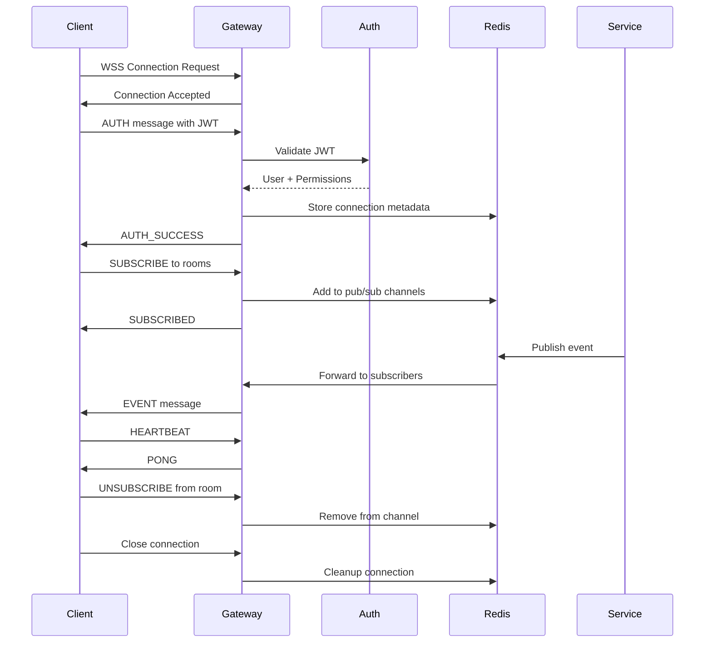

# WebSocket Event Specifications

## Table of Contents
1. [Overview](#overview)
2. [Connection Management](#connection-management)
3. [Authentication](#authentication)
4. [Event Categories](#event-categories)
5. [Event Schemas](#event-schemas)
6. [Error Handling](#error-handling)
7. [Rate Limiting](#rate-limiting)
8. [Client Implementation](#client-implementation)

---

## Overview

The LIS/LIMS system uses WebSocket connections for real-time bidirectional communication between clients and the backend. This enables instant updates for critical events like sample status changes, result verification, critical value alerts, and equipment status updates.

### Technology Stack
- **Backend**: `tokio-tungstenite` (Rust WebSocket library)
- **Protocol**: WSS (WebSocket Secure over TLS)
- **Format**: JSON-encoded messages
- **Fallback**: Server-Sent Events (SSE) for restricted networks

### Design Principles
- **Event-Driven**: All state changes emit events
- **Room-Based**: Clients subscribe to specific rooms (organization, department, user)
- **Guaranteed Delivery**: Missed events stored in Redis for reconnection
- **Type-Safe**: Strongly typed event payloads
- **Scalable**: Redis pub/sub for multi-instance deployment

---

## Connection Management

### Connection Lifecycle



### Connection Endpoint

```
wss://api.lismodern.com/ws
```

### Connection States

| State | Description | Next States |
|-------|-------------|-------------|
| `CONNECTING` | Initial connection attempt | `CONNECTED`, `FAILED` |
| `CONNECTED` | WebSocket open, not authenticated | `AUTHENTICATED`, `DISCONNECTED` |
| `AUTHENTICATED` | JWT validated, ready for subscriptions | `SUBSCRIBED`, `DISCONNECTED` |
| `SUBSCRIBED` | Subscribed to one or more rooms | `SUBSCRIBED`, `DISCONNECTED` |
| `DISCONNECTED` | Connection closed | `CONNECTING` |

---

## Authentication

### Initial Authentication

After establishing the WebSocket connection, clients must authenticate within 10 seconds or the connection will be closed.

**Client → Server: AUTH Message**

```json
{
  "type": "AUTH",
  "payload": {
    "token": "eyJhbGciOiJIUzI1NiIsInR5cCI6IkpXVCJ9...",
    "deviceId": "web-chrome-uuid-1234",
    "platform": "web"
  }
}
```

**Server → Client: AUTH_SUCCESS**

```json
{
  "type": "AUTH_SUCCESS",
  "payload": {
    "userId": "usr_123",
    "organizationId": "org_456",
    "roles": ["TECHNICIAN", "RESULT_ENTRY"],
    "permissions": ["READ_SAMPLES", "WRITE_RESULTS"],
    "sessionId": "ws_session_789"
  },
  "timestamp": "2025-11-05T10:30:00Z"
}
```

**Server → Client: AUTH_FAILED**

```json
{
  "type": "AUTH_FAILED",
  "payload": {
    "reason": "INVALID_TOKEN",
    "message": "JWT token has expired"
  },
  "timestamp": "2025-11-05T10:30:00Z"
}
```

### Token Refresh

Clients should refresh their JWT before expiry and send a new AUTH message without closing the connection.

---

## Event Categories

### 1. Sample Events
- `SAMPLE_CREATED`: New sample collected
- `SAMPLE_STATUS_CHANGED`: Sample moved between states
- `SAMPLE_ROUTED`: Sample assigned to equipment
- `SAMPLE_REJECTED`: Sample rejected with reason
- `SAMPLE_ALIQUOT_CREATED`: Aliquot created from parent sample

### 2. Order Events
- `ORDER_CREATED`: New test order placed
- `ORDER_MODIFIED`: Tests added/removed from order
- `ORDER_CANCELLED`: Order cancelled
- `ORDER_COMPLETED`: All tests in order completed

### 3. Result Events
- `RESULT_ENTERED`: Raw result data entered
- `RESULT_VERIFIED`: Result passed verification
- `RESULT_AMENDED`: Result corrected after release
- `CRITICAL_VALUE_DETECTED`: Result exceeds critical threshold
- `DELTA_CHECK_FAILED`: Significant change from previous result

### 4. Report Events
- `REPORT_GENERATED`: PDF report created
- `REPORT_SIGNED`: Digital signature applied
- `REPORT_DELIVERED`: Report sent via WhatsApp/Email/SMS
- `REPORT_VIEWED`: Patient viewed report on portal

### 5. Quality Control Events
- `QC_RUN_COMPLETED`: IQC/EQC run finished
- `QC_VIOLATION_DETECTED`: Westgard rule violation
- `QC_LOT_EXPIRING`: QC material expiring soon
- `CALIBRATION_DUE`: Equipment calibration required

### 6. Equipment Events
- `EQUIPMENT_STATUS_CHANGED`: Online/Offline/Maintenance
- `EQUIPMENT_ERROR`: Equipment error detected
- `EQUIPMENT_MESSAGE_RECEIVED`: HL7/ASTM message from analyzer

### 7. Billing Events
- `INVOICE_GENERATED`: Invoice created
- `PAYMENT_RECEIVED`: Payment processed successfully
- `PAYMENT_FAILED`: Payment transaction failed
- `INSURANCE_CLAIM_UPDATED`: Claim status changed

### 8. System Events
- `NOTIFICATION_CREATED`: New notification for user
- `USER_SESSION_EXPIRED`: User logged out elsewhere
- `SYSTEM_MAINTENANCE`: Planned maintenance alert

---

## Event Schemas

### Base Event Structure

All events follow this base structure:

```typescript
interface BaseEvent {
  type: EventType;
  payload: Record<string, any>;
  metadata: {
    eventId: string;          // Unique event ID (UUID)
    organizationId: string;   // Organization scope
    userId?: string;          // User who triggered (if applicable)
    timestamp: string;        // ISO 8601 timestamp
    version: string;          // Event schema version (e.g., "1.0")
  };
}
```

### Sample Events

#### SAMPLE_CREATED

```typescript
{
  "type": "SAMPLE_CREATED",
  "payload": {
    "sampleId": "smp_123456",
    "barcode": "2025110500001",
    "patientId": "pat_789",
    "patientName": "Rajesh Kumar",
    "sampleType": "SERUM",
    "collectedAt": "2025-11-05T09:15:00Z",
    "collectedBy": {
      "userId": "usr_456",
      "name": "Dr. Priya Sharma"
    },
    "orderId": "ord_999",
    "testCount": 5,
    "priority": "ROUTINE",
    "status": "COLLECTED"
  },
  "metadata": {
    "eventId": "evt_abc123",
    "organizationId": "org_456",
    "userId": "usr_456",
    "timestamp": "2025-11-05T09:15:30Z",
    "version": "1.0"
  }
}
```

#### SAMPLE_STATUS_CHANGED

```typescript
{
  "type": "SAMPLE_STATUS_CHANGED",
  "payload": {
    "sampleId": "smp_123456",
    "barcode": "2025110500001",
    "previousStatus": "COLLECTED",
    "newStatus": "IN_PROGRESS",
    "statusChangedAt": "2025-11-05T09:30:00Z",
    "changedBy": {
      "userId": "usr_789",
      "name": "Lab Tech Kumar"
    },
    "equipmentId": "eqp_001",
    "equipmentName": "Cobas 6000",
    "notes": "Loaded on analyzer"
  },
  "metadata": {
    "eventId": "evt_def456",
    "organizationId": "org_456",
    "userId": "usr_789",
    "timestamp": "2025-11-05T09:30:05Z",
    "version": "1.0"
  }
}
```

#### SAMPLE_REJECTED

```typescript
{
  "type": "SAMPLE_REJECTED",
  "payload": {
    "sampleId": "smp_123456",
    "barcode": "2025110500001",
    "patientId": "pat_789",
    "patientName": "Rajesh Kumar",
    "rejectionReason": "HEMOLYZED",
    "rejectionReasonText": "Sample shows visible hemolysis",
    "rejectedAt": "2025-11-05T09:20:00Z",
    "rejectedBy": {
      "userId": "usr_789",
      "name": "Lab Tech Kumar"
    },
    "requiresRecollection": true,
    "notificationSent": true
  },
  "metadata": {
    "eventId": "evt_ghi789",
    "organizationId": "org_456",
    "userId": "usr_789",
    "timestamp": "2025-11-05T09:20:05Z",
    "version": "1.0"
  }
}
```

### Result Events

#### RESULT_VERIFIED

```typescript
{
  "type": "RESULT_VERIFIED",
  "payload": {
    "resultId": "res_456789",
    "sampleId": "smp_123456",
    "orderId": "ord_999",
    "patientId": "pat_789",
    "patientName": "Rajesh Kumar",
    "testId": "tst_001",
    "testName": "Glucose, Fasting",
    "value": "105",
    "unit": "mg/dL",
    "referenceRange": "70-100",
    "flag": "HIGH",
    "verificationMethod": "AUTO",
    "autoVerificationConfidence": 0.92,
    "verifiedAt": "2025-11-05T10:00:00Z",
    "verifiedBy": {
      "userId": "system",
      "name": "AI Auto-Verification Engine"
    },
    "canGenerateReport": true
  },
  "metadata": {
    "eventId": "evt_jkl012",
    "organizationId": "org_456",
    "userId": "system",
    "timestamp": "2025-11-05T10:00:02Z",
    "version": "1.0"
  }
}
```

#### CRITICAL_VALUE_DETECTED

```typescript
{
  "type": "CRITICAL_VALUE_DETECTED",
  "payload": {
    "resultId": "res_456790",
    "sampleId": "smp_123457",
    "orderId": "ord_1000",
    "patientId": "pat_790",
    "patientName": "Meera Patel",
    "patientMobile": "+919876543210",
    "testId": "tst_002",
    "testName": "Glucose, Random",
    "value": "450",
    "unit": "mg/dL",
    "referenceRange": "70-140",
    "criticalLow": null,
    "criticalHigh": 400,
    "severity": "HIGH",
    "detectedAt": "2025-11-05T10:15:00Z",
    "notificationsSent": [
      {
        "type": "SMS",
        "recipient": "+919876543210",
        "status": "SENT"
      },
      {
        "type": "WHATSAPP",
        "recipient": "+919876543210",
        "status": "DELIVERED"
      },
      {
        "type": "EMAIL",
        "recipient": "pathologist@lab.com",
        "status": "SENT"
      }
    ],
    "requiresImmediateReview": true
  },
  "metadata": {
    "eventId": "evt_mno345",
    "organizationId": "org_456",
    "timestamp": "2025-11-05T10:15:05Z",
    "version": "1.0"
  }
}
```

#### DELTA_CHECK_FAILED

```typescript
{
  "type": "DELTA_CHECK_FAILED",
  "payload": {
    "resultId": "res_456791",
    "sampleId": "smp_123458",
    "patientId": "pat_791",
    "patientName": "Amit Singh",
    "testId": "tst_003",
    "testName": "Hemoglobin",
    "currentValue": "8.5",
    "previousValue": "14.2",
    "previousTestDate": "2025-10-28T10:00:00Z",
    "unit": "g/dL",
    "deltaPercentage": -40.1,
    "deltaThreshold": 20.0,
    "daysBetweenTests": 8,
    "requiresReview": true,
    "possibleReasons": [
      "Significant blood loss",
      "Sample mix-up",
      "Incorrect previous result"
    ],
    "detectedAt": "2025-11-05T10:20:00Z"
  },
  "metadata": {
    "eventId": "evt_pqr678",
    "organizationId": "org_456",
    "timestamp": "2025-11-05T10:20:05Z",
    "version": "1.0"
  }
}
```

### Report Events

#### REPORT_GENERATED

```typescript
{
  "type": "REPORT_GENERATED",
  "payload": {
    "reportId": "rpt_789012",
    "orderId": "ord_999",
    "sampleId": "smp_123456",
    "patientId": "pat_789",
    "patientName": "Rajesh Kumar",
    "reportType": "COMPREHENSIVE",
    "testCount": 5,
    "allTestsCompleted": true,
    "reportUrl": "https://cdn.lismodern.com/reports/rpt_789012.pdf",
    "reportFormat": "PDF",
    "generatedAt": "2025-11-05T10:30:00Z",
    "expiresAt": "2025-12-05T10:30:00Z",
    "requiresSignature": true,
    "signedBy": null,
    "deliveryChannels": ["WHATSAPP", "EMAIL", "PORTAL"]
  },
  "metadata": {
    "eventId": "evt_stu901",
    "organizationId": "org_456",
    "timestamp": "2025-11-05T10:30:05Z",
    "version": "1.0"
  }
}
```

#### REPORT_DELIVERED

```typescript
{
  "type": "REPORT_DELIVERED",
  "payload": {
    "reportId": "rpt_789012",
    "orderId": "ord_999",
    "patientId": "pat_789",
    "patientName": "Rajesh Kumar",
    "deliveryChannel": "WHATSAPP",
    "deliveryStatus": "DELIVERED",
    "deliveredAt": "2025-11-05T10:35:00Z",
    "recipientMobile": "+919876543210",
    "messageId": "wamid.HBgLOTE5ODc2NTQzMjEw",
    "deliveryTime": "5.2s",
    "readReceipt": false
  },
  "metadata": {
    "eventId": "evt_vwx234",
    "organizationId": "org_456",
    "timestamp": "2025-11-05T10:35:05Z",
    "version": "1.0"
  }
}
```

### Quality Control Events

#### QC_VIOLATION_DETECTED

```typescript
{
  "type": "QC_VIOLATION_DETECTED",
  "payload": {
    "qcRunId": "qc_345678",
    "equipmentId": "eqp_001",
    "equipmentName": "Cobas 6000",
    "testId": "tst_001",
    "testName": "Glucose",
    "qcLevel": "LEVEL_2",
    "qcLotNumber": "QC202501",
    "violatedRule": "2_2S",
    "ruleDescription": "Two consecutive QC results exceed 2 standard deviations",
    "qcValues": [
      { "value": 105.2, "mean": 100, "sd": 2.5, "zScore": 2.08 },
      { "value": 106.1, "mean": 100, "sd": 2.5, "zScore": 2.44 }
    ],
    "severity": "WARNING",
    "actionRequired": "REPEAT_QC",
    "detectedAt": "2025-11-05T08:30:00Z",
    "equipmentStatus": "OUT_OF_CONTROL",
    "affectedSamples": ["smp_123450", "smp_123451", "smp_123452"],
    "requiresReanalysis": true
  },
  "metadata": {
    "eventId": "evt_yza567",
    "organizationId": "org_456",
    "timestamp": "2025-11-05T08:30:10Z",
    "version": "1.0"
  }
}
```

#### CALIBRATION_DUE

```typescript
{
  "type": "CALIBRATION_DUE",
  "payload": {
    "equipmentId": "eqp_001",
    "equipmentName": "Cobas 6000",
    "lastCalibrationDate": "2025-10-05T10:00:00Z",
    "nextCalibrationDue": "2025-11-05T10:00:00Z",
    "daysOverdue": 0,
    "calibrationType": "FULL",
    "affectedTests": [
      { "testId": "tst_001", "testName": "Glucose" },
      { "testId": "tst_002", "testName": "Creatinine" },
      { "testId": "tst_003", "testName": "Urea" }
    ],
    "urgency": "HIGH",
    "equipmentStatus": "REQUIRES_CALIBRATION",
    "autoRouting": false
  },
  "metadata": {
    "eventId": "evt_bcd890",
    "organizationId": "org_456",
    "timestamp": "2025-11-05T06:00:00Z",
    "version": "1.0"
  }
}
```

### Equipment Events

#### EQUIPMENT_STATUS_CHANGED

```typescript
{
  "type": "EQUIPMENT_STATUS_CHANGED",
  "payload": {
    "equipmentId": "eqp_001",
    "equipmentName": "Cobas 6000",
    "equipmentType": "CHEMISTRY_ANALYZER",
    "previousStatus": "ONLINE",
    "newStatus": "OFFLINE",
    "statusChangedAt": "2025-11-05T11:45:00Z",
    "reason": "COMMUNICATION_ERROR",
    "errorCode": "ERR_CONN_TIMEOUT",
    "affectedTests": 12,
    "pendingSamples": 8,
    "reroutingRequired": true,
    "technicalContact": {
      "name": "Equipment Vendor Support",
      "phone": "+911234567890"
    }
  },
  "metadata": {
    "eventId": "evt_efg123",
    "organizationId": "org_456",
    "timestamp": "2025-11-05T11:45:05Z",
    "version": "1.0"
  }
}
```

#### EQUIPMENT_MESSAGE_RECEIVED

```typescript
{
  "type": "EQUIPMENT_MESSAGE_RECEIVED",
  "payload": {
    "equipmentId": "eqp_001",
    "equipmentName": "Cobas 6000",
    "messageType": "HL7_ORU",
    "sampleId": "smp_123456",
    "barcode": "2025110500001",
    "testResults": [
      {
        "testId": "tst_001",
        "testCode": "GLU",
        "value": "105",
        "unit": "mg/dL",
        "flag": "H"
      },
      {
        "testId": "tst_002",
        "testCode": "CREAT",
        "value": "1.2",
        "unit": "mg/dL",
        "flag": "N"
      }
    ],
    "receivedAt": "2025-11-05T10:00:00Z",
    "processingStatus": "PARSED",
    "rawMessage": "MSH|^~\\&|COBAS|LAB|LIS|...",
    "validationStatus": "PASSED"
  },
  "metadata": {
    "eventId": "evt_hij456",
    "organizationId": "org_456",
    "timestamp": "2025-11-05T10:00:02Z",
    "version": "1.0"
  }
}
```

### Billing Events

#### PAYMENT_RECEIVED

```typescript
{
  "type": "PAYMENT_RECEIVED",
  "payload": {
    "paymentId": "pay_567890",
    "invoiceId": "inv_123456",
    "orderId": "ord_999",
    "patientId": "pat_789",
    "patientName": "Rajesh Kumar",
    "amount": 1500.00,
    "currency": "INR",
    "paymentMethod": "UPI",
    "paymentProvider": "RAZORPAY",
    "transactionId": "txn_ABC123XYZ",
    "upiId": "rajesh@paytm",
    "status": "SUCCESS",
    "paidAt": "2025-11-05T09:10:00Z",
    "receiptUrl": "https://cdn.lismodern.com/receipts/pay_567890.pdf",
    "gstDetails": {
      "cgst": 135.00,
      "sgst": 135.00,
      "totalGst": 270.00,
      "gstNumber": "29ABCDE1234F1Z5"
    }
  },
  "metadata": {
    "eventId": "evt_klm789",
    "organizationId": "org_456",
    "timestamp": "2025-11-05T09:10:05Z",
    "version": "1.0"
  }
}
```

### System Events

#### NOTIFICATION_CREATED

```typescript
{
  "type": "NOTIFICATION_CREATED",
  "payload": {
    "notificationId": "notif_901234",
    "userId": "usr_456",
    "type": "CRITICAL_ALERT",
    "title": "Critical Value Detected",
    "message": "Patient Meera Patel has critical glucose level: 450 mg/dL",
    "priority": "HIGH",
    "actionUrl": "/results/res_456790",
    "actionText": "Review Result",
    "icon": "alert-triangle",
    "category": "RESULTS",
    "requiresAcknowledgment": true,
    "expiresAt": "2025-11-06T10:15:00Z",
    "createdAt": "2025-11-05T10:15:00Z"
  },
  "metadata": {
    "eventId": "evt_nop567",
    "organizationId": "org_456",
    "timestamp": "2025-11-05T10:15:05Z",
    "version": "1.0"
  }
}
```

---

## Room Subscriptions

Clients subscribe to specific "rooms" to receive only relevant events. Rooms are hierarchical and permission-based.

### Room Types

#### Organization Room
Receive all events for the organization (admin only)

**Subscribe:**
```json
{
  "type": "SUBSCRIBE",
  "payload": {
    "room": "org:org_456"
  }
}
```

#### Department Room
Receive events for a specific department

**Subscribe:**
```json
{
  "type": "SUBSCRIBE",
  "payload": {
    "room": "dept:dept_123"
  }
}
```

#### User Room
Receive personal notifications and assigned tasks

**Subscribe:**
```json
{
  "type": "SUBSCRIBE",
  "payload": {
    "room": "user:usr_456"
  }
}
```

#### Sample Room
Receive updates for a specific sample

**Subscribe:**
```json
{
  "type": "SUBSCRIBE",
  "payload": {
    "room": "sample:smp_123456"
  }
}
```

#### Order Room
Receive updates for a specific order

**Subscribe:**
```json
{
  "type": "SUBSCRIBE",
  "payload": {
    "room": "order:ord_999"
  }
}
```

#### Equipment Room
Receive updates from specific equipment

**Subscribe:**
```json
{
  "type": "SUBSCRIBE",
  "payload": {
    "room": "equipment:eqp_001"
  }
}
```

#### Patient Room (Secure)
Patients receive updates about their own tests only

**Subscribe:**
```json
{
  "type": "SUBSCRIBE",
  "payload": {
    "room": "patient:pat_789"
  }
}
```

### Subscription Response

**Success:**
```json
{
  "type": "SUBSCRIBED",
  "payload": {
    "room": "org:org_456",
    "subscribedAt": "2025-11-05T10:00:00Z",
    "missedEvents": 3
  },
  "timestamp": "2025-11-05T10:00:00Z"
}
```

**Failed:**
```json
{
  "type": "SUBSCRIBE_FAILED",
  "payload": {
    "room": "org:org_456",
    "reason": "INSUFFICIENT_PERMISSIONS",
    "message": "User does not have access to this organization"
  },
  "timestamp": "2025-11-05T10:00:00Z"
}
```

### Unsubscribe

```json
{
  "type": "UNSUBSCRIBE",
  "payload": {
    "room": "sample:smp_123456"
  }
}
```

**Response:**
```json
{
  "type": "UNSUBSCRIBED",
  "payload": {
    "room": "sample:smp_123456",
    "unsubscribedAt": "2025-11-05T10:30:00Z"
  },
  "timestamp": "2025-11-05T10:30:00Z"
}
```

---

## Error Handling

### Connection Errors

**Connection Timeout:**
```json
{
  "type": "ERROR",
  "payload": {
    "code": "CONNECTION_TIMEOUT",
    "message": "Failed to establish connection within 10 seconds",
    "retryable": true,
    "retryAfter": 5000
  },
  "timestamp": "2025-11-05T10:00:00Z"
}
```

**Authentication Required:**
```json
{
  "type": "ERROR",
  "payload": {
    "code": "AUTH_REQUIRED",
    "message": "Authentication required within 10 seconds of connection",
    "retryable": false
  },
  "timestamp": "2025-11-05T10:00:00Z"
}
```

### Message Errors

**Invalid Message Format:**
```json
{
  "type": "ERROR",
  "payload": {
    "code": "INVALID_MESSAGE_FORMAT",
    "message": "Message must be valid JSON with 'type' and 'payload' fields",
    "receivedMessage": "{invalid json}",
    "retryable": false
  },
  "timestamp": "2025-11-05T10:00:00Z"
}
```

**Unknown Event Type:**
```json
{
  "type": "ERROR",
  "payload": {
    "code": "UNKNOWN_EVENT_TYPE",
    "message": "Event type 'INVALID_TYPE' is not recognized",
    "retryable": false
  },
  "timestamp": "2025-11-05T10:00:00Z"
}
```

### Reconnection Strategy

Clients should implement exponential backoff for reconnection:

```typescript
class ReconnectionStrategy {
  private baseDelay = 1000; // 1 second
  private maxDelay = 30000; // 30 seconds
  private attempts = 0;

  getNextDelay(): number {
    const delay = Math.min(
      this.baseDelay * Math.pow(2, this.attempts),
      this.maxDelay
    );
    this.attempts++;
    return delay;
  }

  reset(): void {
    this.attempts = 0;
  }
}
```

**Reconnection Flow:**
1. Connection lost → Wait 1s → Reconnect attempt 1
2. Failed → Wait 2s → Reconnect attempt 2
3. Failed → Wait 4s → Reconnect attempt 3
4. Failed → Wait 8s → Reconnect attempt 4
5. Failed → Wait 16s → Reconnect attempt 5
6. Failed → Wait 30s → Reconnect attempt 6 (max)
7. Continue at 30s intervals

### Missed Events

When a client reconnects, the server sends missed events stored in Redis (up to 1 hour retention):

**Server → Client: MISSED_EVENTS**

```json
{
  "type": "MISSED_EVENTS",
  "payload": {
    "count": 5,
    "events": [
      {
        "type": "SAMPLE_STATUS_CHANGED",
        "payload": { ... },
        "metadata": { ... }
      },
      {
        "type": "RESULT_VERIFIED",
        "payload": { ... },
        "metadata": { ... }
      }
    ],
    "lastEventId": "evt_xyz789",
    "moreAvailable": false
  },
  "timestamp": "2025-11-05T11:00:00Z"
}
```

---

## Rate Limiting

To prevent abuse and ensure fair resource usage, WebSocket connections are rate-limited.

### Limits

| Metric | Limit | Action on Exceed |
|--------|-------|------------------|
| **Messages per minute** | 100 | Throttle (delay) |
| **Subscriptions per connection** | 50 | Reject new subscriptions |
| **Concurrent connections per user** | 5 | Close oldest connection |
| **Message size** | 1 MB | Reject message |
| **Idle timeout** | 5 minutes | Send PING, close if no PONG |

### Rate Limit Exceeded

```json
{
  "type": "RATE_LIMIT_EXCEEDED",
  "payload": {
    "limit": "MESSAGES_PER_MINUTE",
    "current": 100,
    "max": 100,
    "retryAfter": 60000,
    "message": "You have exceeded 100 messages per minute. Please slow down."
  },
  "timestamp": "2025-11-05T10:00:00Z"
}
```

---

## Heartbeat / Keep-Alive

To maintain connection health and detect disconnections, clients and servers exchange heartbeat messages.

### Client → Server: PING

```json
{
  "type": "PING",
  "payload": {
    "timestamp": "2025-11-05T10:00:00Z"
  }
}
```

### Server → Client: PONG

```json
{
  "type": "PONG",
  "payload": {
    "timestamp": "2025-11-05T10:00:00Z",
    "latency": 45
  }
}
```

**Heartbeat Interval:**
- Client sends PING every 30 seconds
- Server expects PING within 60 seconds
- Server sends PING if no activity for 60 seconds
- Connection closed if no PONG received within 90 seconds

---

## Client Implementation

### TypeScript/JavaScript Example

```typescript
import { io, Socket } from 'socket.io-client';

interface WebSocketMessage {
  type: string;
  payload: Record<string, any>;
  metadata?: {
    eventId: string;
    organizationId: string;
    timestamp: string;
    version: string;
  };
  timestamp: string;
}

class LISWebSocketClient {
  private socket: Socket | null = null;
  private reconnectionStrategy = new ReconnectionStrategy();
  private heartbeatInterval: NodeJS.Timeout | null = null;
  private eventHandlers = new Map<string, Array<(event: WebSocketMessage) => void>>();

  constructor(
    private url: string,
    private token: string
  ) {}

  connect(): Promise<void> {
    return new Promise((resolve, reject) => {
      this.socket = io(this.url, {
        transports: ['websocket'],
        auth: {
          token: this.token
        }
      });

      this.socket.on('connect', () => {
        console.log('WebSocket connected');
        this.authenticate();
        this.startHeartbeat();
        this.reconnectionStrategy.reset();
        resolve();
      });

      this.socket.on('disconnect', (reason) => {
        console.log('WebSocket disconnected:', reason);
        this.stopHeartbeat();
        this.handleReconnection();
      });

      this.socket.on('message', (message: WebSocketMessage) => {
        this.handleMessage(message);
      });

      this.socket.on('error', (error) => {
        console.error('WebSocket error:', error);
        reject(error);
      });
    });
  }

  private authenticate(): void {
    this.send({
      type: 'AUTH',
      payload: {
        token: this.token,
        deviceId: this.getDeviceId(),
        platform: 'web'
      }
    });
  }

  private handleReconnection(): void {
    const delay = this.reconnectionStrategy.getNextDelay();
    console.log(`Reconnecting in ${delay}ms...`);
    setTimeout(() => this.connect(), delay);
  }

  private startHeartbeat(): void {
    this.heartbeatInterval = setInterval(() => {
      this.send({
        type: 'PING',
        payload: {
          timestamp: new Date().toISOString()
        }
      });
    }, 30000); // 30 seconds
  }

  private stopHeartbeat(): void {
    if (this.heartbeatInterval) {
      clearInterval(this.heartbeatInterval);
      this.heartbeatInterval = null;
    }
  }

  subscribe(room: string): void {
    this.send({
      type: 'SUBSCRIBE',
      payload: { room }
    });
  }

  unsubscribe(room: string): void {
    this.send({
      type: 'UNSUBSCRIBE',
      payload: { room }
    });
  }

  on(eventType: string, handler: (event: WebSocketMessage) => void): void {
    if (!this.eventHandlers.has(eventType)) {
      this.eventHandlers.set(eventType, []);
    }
    this.eventHandlers.get(eventType)!.push(handler);
  }

  off(eventType: string, handler: (event: WebSocketMessage) => void): void {
    const handlers = this.eventHandlers.get(eventType);
    if (handlers) {
      const index = handlers.indexOf(handler);
      if (index !== -1) {
        handlers.splice(index, 1);
      }
    }
  }

  private handleMessage(message: WebSocketMessage): void {
    const handlers = this.eventHandlers.get(message.type);
    if (handlers) {
      handlers.forEach(handler => handler(message));
    }

    // Global handler
    const globalHandlers = this.eventHandlers.get('*');
    if (globalHandlers) {
      globalHandlers.forEach(handler => handler(message));
    }
  }

  private send(message: Omit<WebSocketMessage, 'timestamp'>): void {
    if (this.socket && this.socket.connected) {
      this.socket.emit('message', {
        ...message,
        timestamp: new Date().toISOString()
      });
    } else {
      console.error('Cannot send message: WebSocket not connected');
    }
  }

  private getDeviceId(): string {
    let deviceId = localStorage.getItem('deviceId');
    if (!deviceId) {
      deviceId = `web-${crypto.randomUUID()}`;
      localStorage.setItem('deviceId', deviceId);
    }
    return deviceId;
  }

  disconnect(): void {
    this.stopHeartbeat();
    if (this.socket) {
      this.socket.disconnect();
      this.socket = null;
    }
  }
}

// Usage Example
const client = new LISWebSocketClient(
  'wss://api.lismodern.com/ws',
  'eyJhbGciOiJIUzI1NiIsInR5cCI6IkpXVCJ9...'
);

await client.connect();

// Subscribe to organization events
client.subscribe('org:org_456');

// Subscribe to user notifications
client.subscribe('user:usr_456');

// Listen for critical value alerts
client.on('CRITICAL_VALUE_DETECTED', (event) => {
  console.log('Critical value detected:', event.payload);
  // Show notification to user
  showCriticalAlert(event.payload);
});

// Listen for sample status changes
client.on('SAMPLE_STATUS_CHANGED', (event) => {
  console.log('Sample status changed:', event.payload);
  // Update UI
  updateSampleStatus(event.payload.sampleId, event.payload.newStatus);
});

// Listen for QC violations
client.on('QC_VIOLATION_DETECTED', (event) => {
  console.log('QC violation:', event.payload);
  // Alert technician
  showQCAlert(event.payload);
});

// Global event listener
client.on('*', (event) => {
  console.log('Event received:', event.type, event);
});
```

### React Hook Example

```typescript
import { useEffect, useState } from 'react';
import { LISWebSocketClient } from './websocket-client';

export function useWebSocket(token: string) {
  const [client, setClient] = useState<LISWebSocketClient | null>(null);
  const [connected, setConnected] = useState(false);

  useEffect(() => {
    const wsClient = new LISWebSocketClient(
      process.env.NEXT_PUBLIC_WS_URL!,
      token
    );

    wsClient.connect().then(() => {
      setConnected(true);
      setClient(wsClient);
    });

    return () => {
      wsClient.disconnect();
    };
  }, [token]);

  return { client, connected };
}

export function useWebSocketEvent<T>(
  client: LISWebSocketClient | null,
  eventType: string,
  handler: (event: T) => void
) {
  useEffect(() => {
    if (!client) return;

    const wrappedHandler = (event: any) => handler(event.payload as T);
    client.on(eventType, wrappedHandler);

    return () => {
      client.off(eventType, wrappedHandler);
    };
  }, [client, eventType, handler]);
}

// Usage in Component
function SampleTracking({ sampleId }: { sampleId: string }) {
  const { client, connected } = useWebSocket(getAuthToken());
  const [status, setStatus] = useState<string>('UNKNOWN');

  useWebSocketEvent(client, 'SAMPLE_STATUS_CHANGED', (event: any) => {
    if (event.sampleId === sampleId) {
      setStatus(event.newStatus);
    }
  });

  useEffect(() => {
    if (client && connected) {
      client.subscribe(`sample:${sampleId}`);
    }
  }, [client, connected, sampleId]);

  return (
    <div>
      <h3>Sample Status</h3>
      <Badge variant={getStatusVariant(status)}>{status}</Badge>
    </div>
  );
}
```

### Rust Backend Implementation (tokio-tungstenite)

```rust
use tokio::sync::mpsc;
use tokio_tungstenite::{accept_async, tungstenite::Message};
use futures_util::{StreamExt, SinkExt};
use serde::{Deserialize, Serialize};
use std::collections::HashMap;
use std::sync::Arc;
use tokio::sync::RwLock;

#[derive(Debug, Clone, Serialize, Deserialize)]
struct WebSocketMessage {
    #[serde(rename = "type")]
    msg_type: String,
    payload: serde_json::Value,
    timestamp: String,
}

#[derive(Clone)]
struct ConnectionManager {
    connections: Arc<RwLock<HashMap<String, mpsc::UnboundedSender<Message>>>>,
    subscriptions: Arc<RwLock<HashMap<String, Vec<String>>>>, // room -> user_ids
}

impl ConnectionManager {
    fn new() -> Self {
        Self {
            connections: Arc::new(RwLock::new(HashMap::new())),
            subscriptions: Arc::new(RwLock::new(HashMap::new())),
        }
    }

    async fn add_connection(&self, user_id: String, tx: mpsc::UnboundedSender<Message>) {
        let mut conns = self.connections.write().await;
        conns.insert(user_id, tx);
    }

    async fn remove_connection(&self, user_id: &str) {
        let mut conns = self.connections.write().await;
        conns.remove(user_id);

        // Cleanup subscriptions
        let mut subs = self.subscriptions.write().await;
        for users in subs.values_mut() {
            users.retain(|id| id != user_id);
        }
    }

    async fn subscribe(&self, room: String, user_id: String) {
        let mut subs = self.subscriptions.write().await;
        subs.entry(room).or_insert_with(Vec::new).push(user_id);
    }

    async fn broadcast_to_room(&self, room: &str, message: WebSocketMessage) {
        let subs = self.subscriptions.read().await;
        let conns = self.connections.read().await;

        if let Some(user_ids) = subs.get(room) {
            let json = serde_json::to_string(&message).unwrap();
            let ws_message = Message::Text(json);

            for user_id in user_ids {
                if let Some(tx) = conns.get(user_id) {
                    let _ = tx.send(ws_message.clone());
                }
            }
        }
    }
}

async fn handle_connection(
    stream: tokio::net::TcpStream,
    manager: ConnectionManager,
) -> Result<(), Box<dyn std::error::Error>> {
    let ws_stream = accept_async(stream).await?;
    let (mut ws_sender, mut ws_receiver) = ws_stream.split();

    let (tx, mut rx) = mpsc::unbounded_channel();
    let user_id = "usr_123".to_string(); // Get from JWT auth

    manager.add_connection(user_id.clone(), tx).await;

    // Send task
    let send_task = tokio::spawn(async move {
        while let Some(message) = rx.recv().await {
            if ws_sender.send(message).await.is_err() {
                break;
            }
        }
    });

    // Receive task
    while let Some(Ok(message)) = ws_receiver.next().await {
        if let Message::Text(text) = message {
            let msg: WebSocketMessage = serde_json::from_str(&text)?;

            match msg.msg_type.as_str() {
                "SUBSCRIBE" => {
                    if let Some(room) = msg.payload.get("room").and_then(|r| r.as_str()) {
                        manager.subscribe(room.to_string(), user_id.clone()).await;
                    }
                }
                "PING" => {
                    // Send PONG
                }
                _ => {}
            }
        }
    }

    manager.remove_connection(&user_id).await;
    send_task.abort();

    Ok(())
}
```

---

## Security Considerations

### Authentication & Authorization
- **JWT tokens** validated on connection and subscription
- **Role-Based Access Control** (RBAC) for room subscriptions
- **Organization isolation** - users can only subscribe to their organization's rooms
- **PHI protection** - patient data encrypted and access-logged

### Data Protection
- **TLS 1.3** mandatory for all WebSocket connections
- **Message signing** for critical events (results, reports)
- **Audit logging** for all sensitive events
- **Rate limiting** to prevent DoS attacks

### Compliance
- **NABL ISO 15189:2022** - Audit trails for all critical events
- **DPDP 2023** - Data minimization, consent tracking
- **HIPAA** - PHI encryption, access controls

---

## Performance Metrics

### Target Latency
- **Connection establishment**: <500ms
- **Authentication**: <200ms
- **Event delivery**: <100ms (P95)
- **Subscription**: <50ms

### Scalability
- **Concurrent connections per instance**: 50,000
- **Events per second**: 100,000
- **Redis pub/sub channels**: Unlimited
- **Horizontal scaling**: Load balancer + multiple instances

---

## Monitoring & Observability

### Prometheus Metrics

```
# Connection metrics
websocket_active_connections{organization_id}
websocket_total_connections{organization_id}
websocket_connection_duration_seconds{organization_id}

# Event metrics
websocket_events_sent_total{event_type, organization_id}
websocket_event_delivery_duration_seconds{event_type}
websocket_events_dropped_total{reason}

# Error metrics
websocket_errors_total{error_type}
websocket_auth_failures_total{reason}
websocket_rate_limit_exceeded_total{limit_type}

# Subscription metrics
websocket_active_subscriptions{room_type}
websocket_subscription_duration_seconds{room_type}
```

### Distributed Tracing (Jaeger)

All WebSocket events include trace IDs for end-to-end tracking:

```json
{
  "type": "SAMPLE_STATUS_CHANGED",
  "payload": { ... },
  "metadata": {
    "eventId": "evt_def456",
    "traceId": "4bf92f3577b34da6a3ce929d0e0e4736",
    "spanId": "00f067aa0ba902b7",
    "organizationId": "org_456",
    "timestamp": "2025-11-05T09:30:05Z",
    "version": "1.0"
  }
}
```

---

## Testing

### WebSocket Testing Tools

**wscat (CLI):**
```bash
npm install -g wscat
wscat -c wss://api.lismodern.com/ws
```

**Postman** supports WebSocket connections for manual testing

**Automated Testing (Rust):**
```rust
#[tokio::test]
async fn test_websocket_authentication() {
    let (mut ws, _) = connect_async("ws://localhost:8080/ws")
        .await
        .expect("Failed to connect");

    let auth_msg = json!({
        "type": "AUTH",
        "payload": {
            "token": "test_jwt_token",
            "deviceId": "test_device",
            "platform": "test"
        }
    });

    ws.send(Message::Text(auth_msg.to_string())).await.unwrap();

    let response = ws.next().await.unwrap().unwrap();
    assert!(response.to_text().unwrap().contains("AUTH_SUCCESS"));
}
```

---

## Appendix: Complete Event Type Registry

| Event Type | Category | Priority | Retention |
|------------|----------|----------|-----------|
| `SAMPLE_CREATED` | Sample | NORMAL | 7 days |
| `SAMPLE_STATUS_CHANGED` | Sample | NORMAL | 7 days |
| `SAMPLE_ROUTED` | Sample | NORMAL | 7 days |
| `SAMPLE_REJECTED` | Sample | HIGH | 30 days |
| `ORDER_CREATED` | Order | NORMAL | 7 days |
| `ORDER_MODIFIED` | Order | NORMAL | 7 days |
| `ORDER_CANCELLED` | Order | HIGH | 30 days |
| `RESULT_ENTERED` | Result | NORMAL | 7 days |
| `RESULT_VERIFIED` | Result | HIGH | 30 days |
| `RESULT_AMENDED` | Result | CRITICAL | 90 days |
| `CRITICAL_VALUE_DETECTED` | Result | CRITICAL | 90 days |
| `DELTA_CHECK_FAILED` | Result | HIGH | 30 days |
| `REPORT_GENERATED` | Report | NORMAL | 7 days |
| `REPORT_DELIVERED` | Report | HIGH | 30 days |
| `QC_RUN_COMPLETED` | QC | NORMAL | 30 days |
| `QC_VIOLATION_DETECTED` | QC | CRITICAL | 90 days |
| `CALIBRATION_DUE` | Equipment | HIGH | 30 days |
| `EQUIPMENT_STATUS_CHANGED` | Equipment | HIGH | 30 days |
| `EQUIPMENT_ERROR` | Equipment | CRITICAL | 90 days |
| `PAYMENT_RECEIVED` | Billing | HIGH | 30 days |
| `PAYMENT_FAILED` | Billing | HIGH | 30 days |
| `NOTIFICATION_CREATED` | System | NORMAL | 7 days |

---

**Document Version:** 1.0
**Last Updated:** 2025-11-05
**Author:** LIS Modern Development Team
**Status:** Complete
