# High-Level System Design (HLD)
## Cloud-Native LIS/LIMS for Indian Clinical Laboratories

**Version**: 1.0.0
**Last Updated**: 2024-11-05
**Status**: Active

---

## Table of Contents

1. [Executive Summary](#executive-summary)
2. [System Overview](#system-overview)
3. [Architecture Principles](#architecture-principles)
4. [System Architecture](#system-architecture)
5. [Component Architecture](#component-architecture)
6. [Data Architecture](#data-architecture)
7. [Integration Architecture](#integration-architecture)
8. [Security Architecture](#security-architecture)
9. [Deployment Architecture](#deployment-architecture)
10. [Scalability & Performance](#scalability--performance)
11. [India-Specific Adaptations](#india-specific-adaptations)
12. [Technology Stack](#technology-stack)
13. [Non-Functional Requirements](#non-functional-requirements)

---

## 1. Executive Summary

### 1.1 Purpose

This document describes the high-level architecture of a revolutionary cloud-native Laboratory Information System (LIS) optimized for the Indian clinical laboratory market. The system addresses the $150M market opportunity (growing to $350M by 2030) with 75-85% penetration gaps among 90,000+ independent laboratories.

### 1.2 Key Differentiators

| Aspect | Traditional LIS | LIS Modern |
|--------|----------------|------------|
| **Deployment Time** | 6-12 months | 30 days |
| **Pricing** | $10,000-200,000 | ₹999-1,999/month (small labs) |
| **Architecture** | Monolithic, On-premise | Cloud-native, Microservices |
| **Automation** | Manual verification | 30-60% AI auto-verification |
| **Offline Support** | None | 24+ hour offline capability |
| **Integration** | Custom, expensive | HL7/FHIR standard |
| **User Experience** | Complex, dated | Modern, intuitive |
| **India Optimization** | No | WhatsApp, multi-language, offline |

### 1.3 Target Market Segments

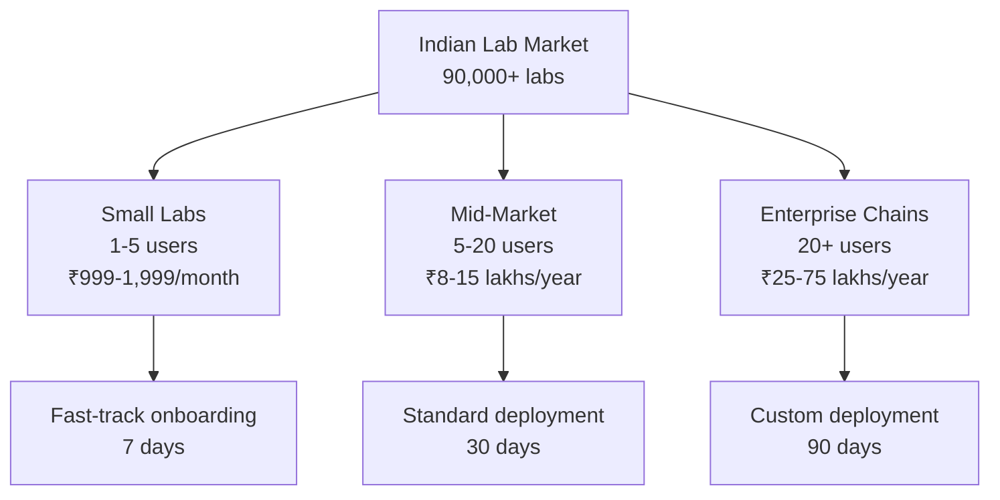

---

## 2. System Overview

### 2.1 Vision

Transform laboratory operations in India through:
- **Affordability**: 60-80% cost reduction vs. global vendors
- **Speed**: 30-day deployment vs. industry standard 6-12 months
- **Intelligence**: AI-powered 30-60% auto-verification
- **Compliance**: NABL-ready with automated workflows
- **Accessibility**: Offline-first, multi-language, WhatsApp-integrated

### 2.2 Core Capabilities

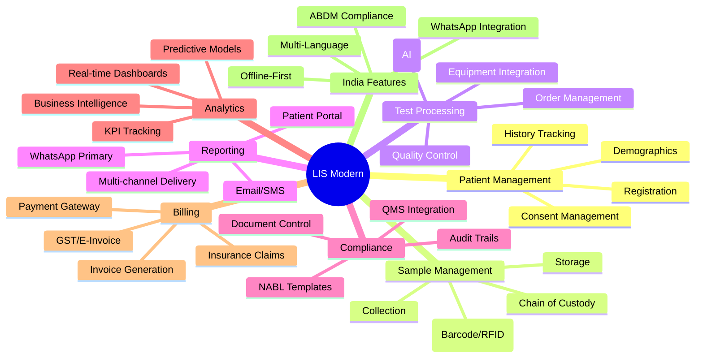

### 2.3 User Personas

| Persona | Primary Goals | Key Features Used |
|---------|--------------|-------------------|
| **Front Desk Staff** | Register patients, collect samples | Patient registration, sample collection, billing |
| **Lab Technician** | Process samples, enter results | Sample tracking, equipment integration, result entry |
| **Pathologist** | Verify results, authorize reports | Result verification, auto-verification queue, reporting |
| **Lab Director** | Monitor operations, ensure compliance | Analytics dashboard, NABL compliance, quality metrics |
| **Quality Manager** | Maintain quality, manage audits | QC monitoring, document control, audit trails |
| **IT Administrator** | Configure system, manage users | System configuration, user management, integrations |
| **Patient** | Access reports, book tests | Patient portal, WhatsApp reports, online booking |

---

## 3. Architecture Principles

### 3.1 Design Principles

#### 3.1.1 Cloud-Native First
- **Microservices architecture** for independent scaling and deployment
- **Containerization** with Docker for consistency
- **Orchestration** with Kubernetes for resilience
- **API-first** design for integration flexibility

#### 3.1.2 India-Optimized
- **Offline-first** architecture for connectivity challenges
- **Multi-language** support (Hindi + 5 regional languages)
- **WhatsApp-native** for primary communication channel
- **Mobile-first** responsive design
- **Progressive Web App** (PWA) for installability

#### 3.1.3 AI-Powered
- **Auto-verification** with ML models (30-60% automation)
- **Predictive analytics** for TAT, QC, maintenance
- **Anomaly detection** for quality control
- **Natural language** processing for voice entry

#### 3.1.4 Security & Compliance
- **NABL ISO 15189:2022** compliant by design
- **DPDP 2023** India data protection compliance
- **HIPAA-ready** for international expansion
- **Audit trails** immutable and comprehensive
- **Data localization** with Indian data centers

#### 3.1.5 Developer Experience
- **Type-safe** end-to-end (Rust + TypeScript)
- **GraphQL** for flexible API queries
- **Event-driven** for loose coupling
- **Well-documented** with examples
- **Test-driven** with high coverage

### 3.2 Architectural Patterns

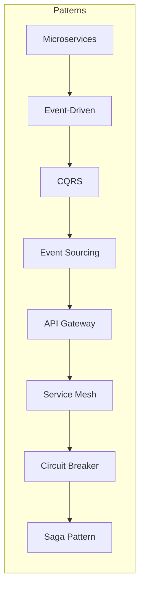

#### Key Patterns Used:

1. **Microservices**: Independent, loosely coupled services
2. **Event-Driven**: Asynchronous communication via Kafka
3. **CQRS**: Separate read and write models for performance
4. **Event Sourcing**: Audit trail through event log
5. **API Gateway**: Single entry point with routing
6. **Service Mesh**: Service-to-service communication (Istio)
7. **Circuit Breaker**: Fault tolerance and resilience
8. **Saga Pattern**: Distributed transactions

---

## 4. System Architecture

### 4.1 Overall Architecture

```mermaid
graph TB
    subgraph "Client Layer"
        WEB[Web App<br/>Next.js PWA]
        MOBILE[Mobile App<br/>React Native]
        WHATSAPP[WhatsApp Bot<br/>Business API]
        ANALYZER[Lab Analyzers<br/>HL7/ASTM]
    end

    subgraph "Edge Layer"
        CDN[CDN<br/>CloudFlare]
        LB[Load Balancer<br/>NGINX/Envoy]
        WAF[WAF<br/>Web Application Firewall]
    end

    subgraph "API Layer"
        GATEWAY[API Gateway<br/>GraphQL + REST]
        AUTH[Auth Service<br/>JWT + OAuth2]
        WS[WebSocket Gateway<br/>Real-time Events]
    end

    subgraph "Service Layer"
        PATIENT[Patient Service]
        SAMPLE[Sample Service]
        ORDER[Order Service]
        RESULT[Result Service]
        REPORT[Report Service]
        BILLING[Billing Service]
        QC[QC Service]
        EQUIPMENT[Equipment Service]
        COMPLIANCE[Compliance Service]
        ANALYTICS[Analytics Service]
        INVENTORY[Inventory Service]
        NOTIFICATION[Notification Service]
    end

    subgraph "Integration Layer"
        HL7[HL7/FHIR Middleware<br/>Mirth Connect]
        PAYMENT[Payment Gateway<br/>Razorpay/Stripe]
        SMS[SMS Gateway<br/>Twilio]
        EMAIL[Email Service<br/>SendGrid]
        ABDM[ABDM Integration<br/>Health Stack]
    end

    subgraph "Data Layer"
        PG[(PostgreSQL<br/>Relational Data)]
        MONGO[(MongoDB<br/>Flexible Schemas)]
        REDIS[(Redis<br/>Cache + Sessions)]
        S3[(S3/MinIO<br/>Object Storage)]
        SEARCH[Elasticsearch<br/>Full-text Search]
    end

    subgraph "Event Layer"
        KAFKA[Apache Kafka<br/>Event Streaming]
    end

    subgraph "AI/ML Layer"
        AUTOVERIFY[Auto-Verification<br/>ML Models]
        PREDICT[Predictive Analytics<br/>TAT/QC]
        ANOMALY[Anomaly Detection<br/>Quality Monitoring]
    end

    subgraph "Observability Layer"
        PROMETHEUS[Prometheus<br/>Metrics]
        GRAFANA[Grafana<br/>Dashboards]
        JAEGER[Jaeger<br/>Distributed Tracing]
        ELK[ELK Stack<br/>Logging]
    end

    WEB --> CDN
    MOBILE --> CDN
    WHATSAPP --> LB
    ANALYZER --> HL7

    CDN --> WAF
    WAF --> LB
    LB --> GATEWAY
    LB --> WS

    GATEWAY --> AUTH
    GATEWAY --> PATIENT
    GATEWAY --> SAMPLE
    GATEWAY --> ORDER
    GATEWAY --> RESULT
    GATEWAY --> REPORT
    GATEWAY --> BILLING
    GATEWAY --> QC
    GATEWAY --> EQUIPMENT
    GATEWAY --> COMPLIANCE
    GATEWAY --> ANALYTICS
    GATEWAY --> INVENTORY

    PATIENT --> PG
    SAMPLE --> PG
    ORDER --> PG
    RESULT --> PG
    REPORT --> MONGO
    BILLING --> PG
    QC --> PG
    EQUIPMENT --> PG
    COMPLIANCE --> MONGO
    ANALYTICS --> PG
    INVENTORY --> PG

    PATIENT --> KAFKA
    SAMPLE --> KAFKA
    ORDER --> KAFKA
    RESULT --> KAFKA

    RESULT --> AUTOVERIFY
    QC --> ANOMALY
    SAMPLE --> PREDICT

    NOTIFICATION --> WHATSAPP
    NOTIFICATION --> SMS
    NOTIFICATION --> EMAIL

    BILLING --> PAYMENT
    COMPLIANCE --> ABDM
    EQUIPMENT --> HL7

    PATIENT --> REDIS
    AUTH --> REDIS

    REPORT --> S3

    PATIENT --> SEARCH
    SAMPLE --> SEARCH
```

### 4.2 Layered Architecture

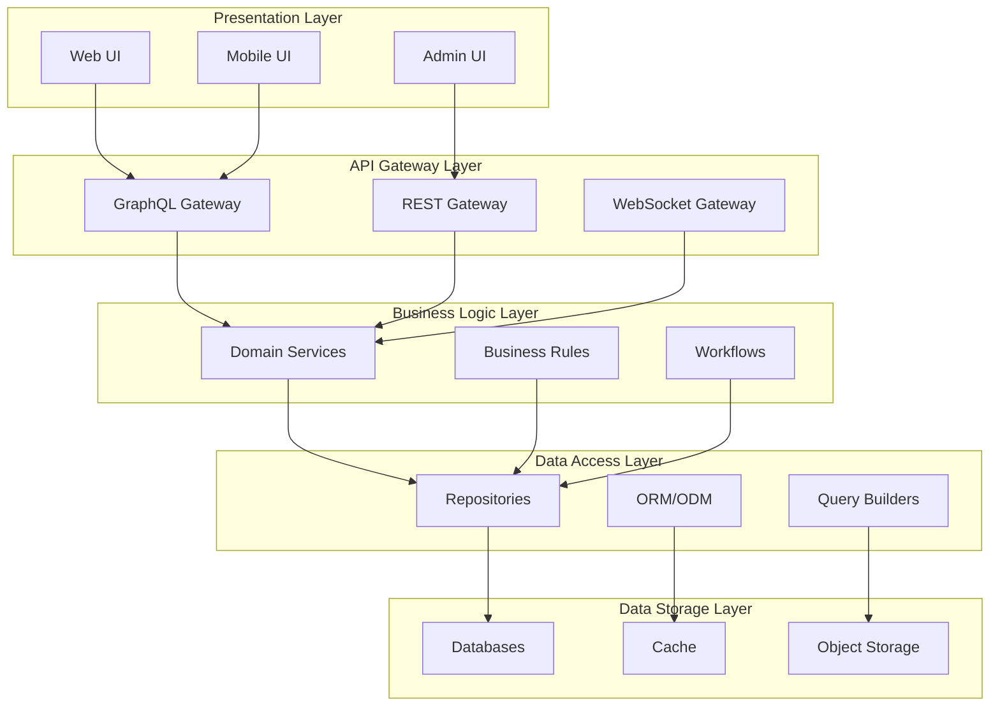

---

## 5. Component Architecture

### 5.1 Microservices Decomposition

#### 5.1.1 Core Domain Services

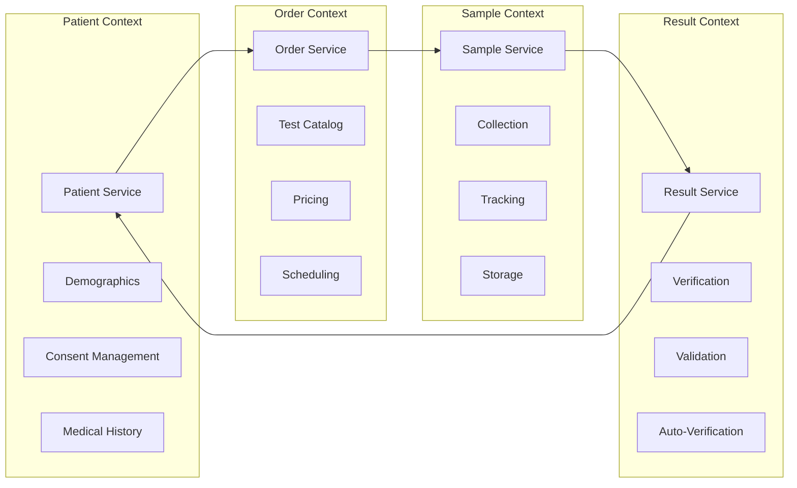

### 5.2 Service Details

#### 5.2.1 Patient Service

**Responsibilities:**
- Patient registration and demographics
- Consent management (DPDP 2023 compliant)
- Medical history tracking
- Patient search and retrieval
- Aadhaar integration (optional)

**Technology:**
- Rust (actix-web)
- PostgreSQL (patient records)
- Redis (session cache)
- Elasticsearch (search)

**API Endpoints:**
- `createPatient(input: PatientInput): Patient`
- `updatePatient(id: ID!, input: PatientInput): Patient`
- `getPatient(id: ID!): Patient`
- `searchPatients(query: SearchInput): [Patient]`
- `verifyAadhaar(aadhaarNumber: String!): VerificationResult`

**Events Published:**
- `PatientCreated`
- `PatientUpdated`
- `ConsentGranted`
- `ConsentRevoked`

#### 5.2.2 Sample Service

**Responsibilities:**
- Sample collection and registration
- Barcode/RFID label generation
- Sample tracking and lifecycle management
- Sample storage and retrieval
- Chain of custody blockchain

**Technology:**
- Rust (actix-web)
- PostgreSQL (sample metadata)
- Redis (tracking cache)
- Blockchain (chain of custody - optional)

**API Endpoints:**
- `collectSample(input: SampleInput): Sample`
- `trackSample(sampleId: ID!): SampleTracking`
- `updateSampleStatus(id: ID!, status: SampleStatus): Sample`
- `getSampleByBarcode(barcode: String!): Sample`

**Events Published:**
- `SampleCollected`
- `SampleReceived`
- `SampleProcessed`
- `SampleDiscarded`

#### 5.2.3 Order Service

**Responsibilities:**
- Test ordering and management
- Test catalog maintenance
- Pricing and package management
- Order scheduling and routing
- Corporate rate cards

**Technology:**
- Rust (actix-web)
- PostgreSQL (orders, catalog)
- Redis (pricing cache)
- MongoDB (flexible pricing rules)

**API Endpoints:**
- `createOrder(input: OrderInput): Order`
- `getOrder(id: ID!): Order`
- `cancelOrder(id: ID!): Order`
- `getTestCatalog(filter: CatalogFilter): [Test]`
- `calculatePrice(tests: [ID!], patientType: PatientType): Pricing`

**Events Published:**
- `OrderCreated`
- `OrderCancelled`
- `OrderCompleted`
- `PriceCalculated`

#### 5.2.4 Equipment Service

**Responsibilities:**
- Analyzer configuration and management
- HL7/ASTM bidirectional integration
- Equipment status monitoring
- QC sample processing
- Calibration tracking
- Maintenance scheduling

**Technology:**
- Rust (actix-web + tokio for async I/O)
- PostgreSQL (equipment metadata)
- Mirth Connect (HL7/FHIR middleware)
- Redis (real-time status)
- Time-series DB (equipment metrics)

**Integration Protocols:**
- HL7 v2.x (legacy)
- HL7 FHIR R4 (modern)
- ASTM E1381 (analyzers)
- LIS02-A2 (bidirectional)

**API Endpoints:**
- `configureEquipment(input: EquipmentConfig): Equipment`
- `getEquipmentStatus(id: ID!): EquipmentStatus`
- `sendSampleToAnalyzer(sampleId: ID!, analyzerId: ID!): AnalyzerRequest`
- `receiveResults(analyzerId: ID!): [AnalyzerResult]`
- `scheduleCalibration(id: ID!, scheduledAt: DateTime): Calibration`

**Events Published:**
- `EquipmentOnline`
- `EquipmentOffline`
- `QCResultReceived`
- `CalibrationDue`
- `MaintenanceRequired`

#### 5.2.5 Result Service

**Responsibilities:**
- Result entry (manual and automated)
- Validation rules (delta check, reference ranges)
- Auto-verification (AI-powered)
- Result amendments and corrections
- Critical value detection and alerting

**Technology:**
- Rust (actix-web)
- PostgreSQL (results)
- Python ML models (auto-verification)
- Redis (validation rules cache)

**API Endpoints:**
- `enterResult(input: ResultInput): Result`
- `verifyResult(id: ID!, pathologistId: ID!): Result`
- `autoVerify(sampleId: ID!): AutoVerificationResult`
- `amendResult(id: ID!, amendment: Amendment): Result`
- `detectCriticalValues(sampleId: ID!): [CriticalValue]`

**Events Published:**
- `ResultEntered`
- `ResultVerified`
- `ResultAmended`
- `CriticalValueDetected`
- `AutoVerificationComplete`

#### 5.2.6 Quality Control Service

**Responsibilities:**
- IQC (Internal Quality Control) management
- EQC/PT (External Quality Control/Proficiency Testing)
- Westgard rules application
- QC trend analysis
- Corrective action tracking

**Technology:**
- Rust (actix-web)
- PostgreSQL (QC data)
- Time-series DB (QC trends)
- Python (statistical analysis)

**API Endpoints:**
- `recordIQC(input: IQCInput): IQCResult`
- `applyWestgardRules(qcData: [QCData]): WestgardResult`
- `getQCTrends(testId: ID!, period: DateRange): QCTrends`
- `recordCorrectiveAction(input: CorrectiveActionInput): CorrectiveAction`

**Events Published:**
- `IQCRecorded`
- `QCRuleViolation`
- `CorrectiveActionRequired`
- `CorrectiveActionCompleted`

#### 5.2.7 Report Service

**Responsibilities:**
- Report generation from templates
- Multi-format support (PDF, HTML, WhatsApp)
- Digital signatures
- Report delivery (multi-channel)
- Report versioning and amendments

**Technology:**
- Rust (actix-web)
- MongoDB (report templates, configurations)
- S3/MinIO (generated reports)
- PDF generation library (headless Chrome)

**API Endpoints:**
- `generateReport(sampleId: ID!): Report`
- `getReportTemplate(testId: ID!): Template`
- `updateTemplate(id: ID!, template: TemplateInput): Template`
- `deliverReport(reportId: ID!, channels: [DeliveryChannel]): DeliveryStatus`
- `signReport(reportId: ID!, pathologistId: ID!): SignedReport`

**Events Published:**
- `ReportGenerated`
- `ReportDelivered`
- `ReportViewed`
- `ReportAmended`

#### 5.2.8 Billing Service

**Responsibilities:**
- Invoice generation
- Payment processing (UPI, cards, wallets)
- Insurance claim management
- GST calculation and e-invoice
- Revenue recognition
- Accounts receivable

**Technology:**
- Rust (actix-web)
- PostgreSQL (billing data)
- Payment gateway SDKs (Razorpay, Stripe)
- GST e-invoice API integration

**API Endpoints:**
- `generateInvoice(orderId: ID!): Invoice`
- `processPayment(input: PaymentInput): Payment`
- `recordPayment(invoiceId: ID!, payment: PaymentDetails): Payment`
- `generateGSTInvoice(invoiceId: ID!): GSTInvoice`
- `submitInsuranceClaim(invoiceId: ID!): Claim`

**Events Published:**
- `InvoiceGenerated`
- `PaymentReceived`
- `PaymentFailed`
- `ClaimSubmitted`
- `ClaimApproved`

#### 5.2.9 Compliance Service

**Responsibilities:**
- Document control (SOPs, policies)
- Audit trail management
- NABL compliance tracking
- Quality manual generation
- Corrective/Preventive action (CAPA)
- Training record management

**Technology:**
- Rust (actix-web)
- MongoDB (documents, audit logs)
- PostgreSQL (structured compliance data)
- Blockchain (immutable audit trail - optional)

**API Endpoints:**
- `uploadDocument(input: DocumentInput): Document`
- `getAuditTrail(entityType: String!, entityId: ID!): [AuditEntry]`
- `recordTraining(input: TrainingInput): Training`
- `initiateCAPa(input: CAPAInput): CAPA`
- `generateQualityManual(): QualityManual`

**Events Published:**
- `DocumentUploaded`
- `DocumentApproved`
- `AuditTrailCreated`
- `CAPAInitiated`
- `CAPAClosed`

#### 5.2.10 Analytics Service

**Responsibilities:**
- Real-time dashboards
- KPI calculation and tracking
- Custom report generation
- Predictive analytics
- Business intelligence

**Technology:**
- Rust (actix-web)
- PostgreSQL (OLTP data)
- Data warehouse (Snowflake/BigQuery)
- Apache Superset (dashboards)
- Python (ML models)

**API Endpoints:**
- `getDashboard(role: UserRole): Dashboard`
- `getKPIs(filter: KPIFilter): [KPI]`
- `generateCustomReport(input: ReportDefinition): Report`
- `predictTAT(orderId: ID!): TATprediction`
- `analyzeRevenue(period: DateRange): RevenueAnalysis`

**Events Consumed:**
- All domain events for analytics

#### 5.2.11 Notification Service

**Responsibilities:**
- Multi-channel notification orchestration
- WhatsApp Business API integration
- SMS delivery
- Email delivery
- Push notifications
- Notification templates

**Technology:**
- Rust (actix-web)
- Redis (notification queue)
- WhatsApp Business API
- SMS gateway (Twilio)
- Email service (SendGrid)
- FCM (push notifications)

**API Endpoints:**
- `sendNotification(input: NotificationInput): NotificationStatus`
- `sendWhatsApp(to: String!, template: String!, params: JSON): Status`
- `sendSMS(to: String!, message: String!): Status`
- `sendEmail(input: EmailInput): Status`
- `sendPushNotification(input: PushInput): Status`

**Events Consumed:**
- `ReportGenerated` → Send WhatsApp
- `CriticalValueDetected` → Send SMS
- `PaymentReceived` → Send Email
- `OrderCompleted` → Send Push

#### 5.2.12 Inventory Service

**Responsibilities:**
- Reagent and consumable tracking
- Stock management
- Expiry monitoring
- Procurement automation
- Vendor management
- Consumption analytics

**Technology:**
- Rust (actix-web)
- PostgreSQL (inventory data)
- Redis (real-time stock levels)

**API Endpoints:**
- `recordStock(input: StockInput): StockEntry`
- `consumeStock(itemId: ID!, quantity: Int!): Consumption`
- `getStockLevel(itemId: ID!): StockLevel`
- `checkExpiry(daysAhead: Int!): [ExpiringItem]`
- `createPurchaseOrder(input: POInput): PurchaseOrder`

**Events Published:**
- `StockLow`
- `StockExpiring`
- `StockConsumed`
- `PurchaseOrderCreated`

### 5.3 Supporting Services

#### 5.3.1 API Gateway

**Responsibilities:**
- Request routing
- Protocol transformation
- Rate limiting
- Request/response transformation
- API composition (GraphQL federation)

**Technology:**
- Rust (async-graphql for GraphQL)
- NGINX/Envoy (reverse proxy)

#### 5.3.2 Auth Service

**Responsibilities:**
- User authentication (JWT, OAuth2)
- Multi-factor authentication (MFA)
- Role-based access control (RBAC)
- Session management
- Single Sign-On (SSO)

**Technology:**
- Rust (jsonwebtoken, oauth2)
- Redis (session storage)
- PostgreSQL (user credentials)

#### 5.3.3 Sync Service (Offline Support)

**Responsibilities:**
- Offline data caching
- Conflict resolution
- Background synchronization
- Delta sync optimization

**Technology:**
- Service Worker (frontend)
- IndexedDB (client-side storage)
- Sync API (background sync)
- Rust backend for conflict resolution

---

## 6. Data Architecture

### 6.1 Database Strategy

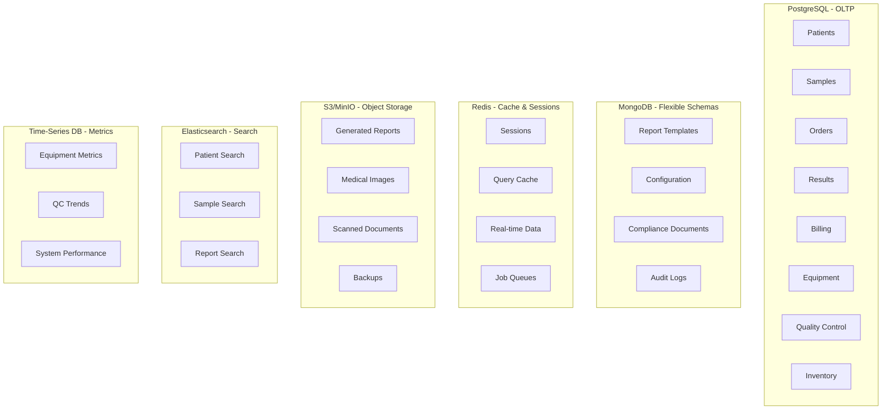

### 6.2 Data Flow

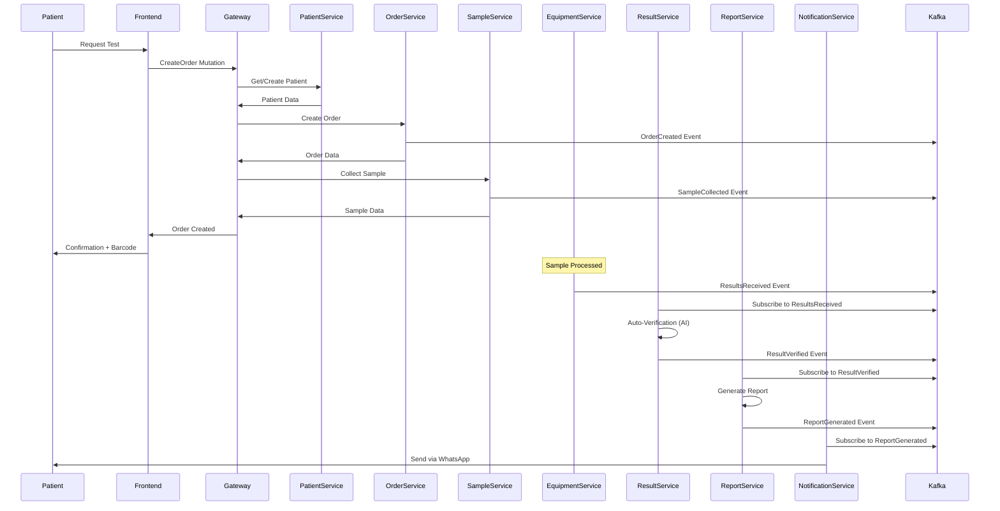

---

## 7. Integration Architecture

### 7.1 Integration Patterns

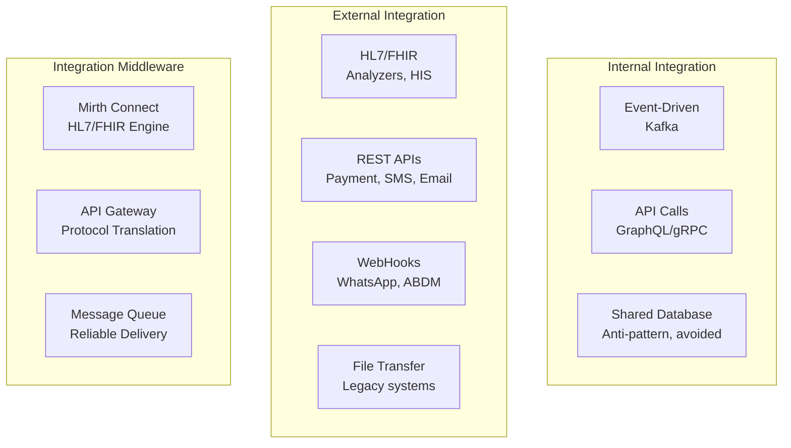

### 7.2 HL7/FHIR Integration

#### 7.2.1 HL7 v2.x Messages Supported

| Message Type | Purpose | Direction |
|--------------|---------|-----------|
| **ADT^A01** | Admit Patient | Inbound (HIS → LIS) |
| **ADT^A08** | Update Patient | Bidirectional |
| **ORM^O01** | Order Message | Inbound (HIS → LIS) |
| **ORU^R01** | Result Message | Outbound (LIS → HIS) |
| **QRY^A19** | Query Patient | Inbound (HIS → LIS) |
| **DSR^Q03** | Deferred Response | Outbound (LIS → HIS) |

#### 7.2.2 FHIR Resources Supported

| Resource | Purpose |
|----------|---------|
| **Patient** | Demographics |
| **ServiceRequest** | Test orders |
| **Specimen** | Sample information |
| **Observation** | Test results |
| **DiagnosticReport** | Complete report |
| **Organization** | Lab details |
| **Practitioner** | Pathologist/doctor |
| **Device** | Lab equipment |

### 7.3 WhatsApp Integration

**WhatsApp Business API Features:**
- Report delivery with PDF attachment
- Test status updates
- Appointment reminders
- Critical value alerts
- Chatbot for queries
- Template messages (pre-approved)

**Implementation:**
```
LIS → Notification Service → WhatsApp Business API → WhatsApp Servers → Patient
```

### 7.4 Payment Gateway Integration

**Supported Gateways:**
- Razorpay (Primary for India)
- Stripe (International)
- PayU
- CCAvenue

**Payment Methods:**
- UPI (Primary - 60%+ transactions)
- Credit/Debit Cards
- Net Banking
- Wallets (Paytm, PhonePe, GooglePay)
- BNPL (Buy Now Pay Later)

### 7.5 ABDM (Ayushman Bharat Digital Mission) Integration

**ABDM Components:**
- **Health ID**: Unique patient identifier
- **Health Records**: EHR exchange
- **Health Facility Registry**: Lab registration
- **Healthcare Professionals Registry**: Pathologist registration
- **Consent Manager**: Patient consent for data sharing

---

## 8. Security Architecture

### 8.1 Security Layers

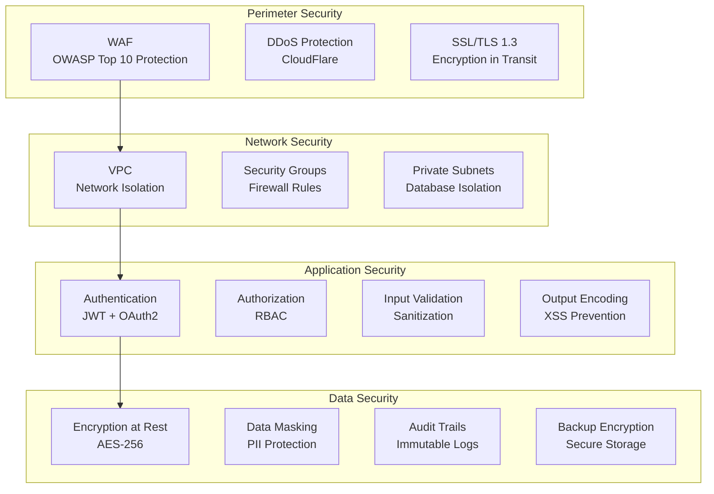

### 8.2 Authentication & Authorization

#### 8.2.1 Authentication Flow

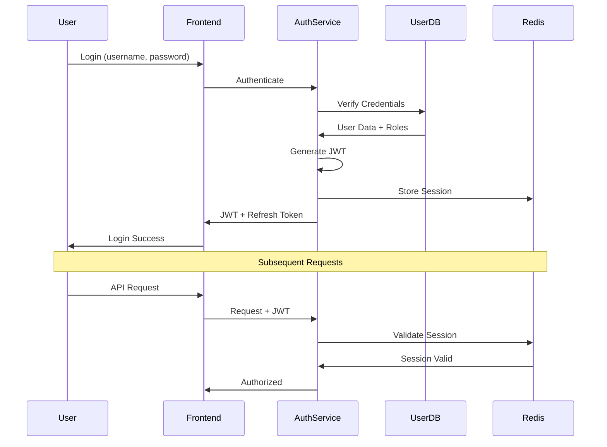

#### 8.2.2 Role-Based Access Control (RBAC)

| Role | Permissions |
|------|-------------|
| **Super Admin** | All system access, user management, configuration |
| **Lab Director** | All lab operations, analytics, compliance, user management |
| **Pathologist** | Result verification, report signing, quality review |
| **Lab Manager** | Day-to-day operations, equipment, inventory |
| **Lab Technician** | Sample processing, result entry, equipment operation |
| **Front Desk** | Patient registration, sample collection, billing |
| **Quality Manager** | QC, compliance, audit, document control |
| **Patient** | View own reports, book tests, make payments |

### 8.3 Data Protection

#### 8.3.1 Encryption

**In Transit:**
- TLS 1.3 for all external communication
- mTLS (mutual TLS) for service-to-service communication
- Perfect Forward Secrecy (PFS)

**At Rest:**
- AES-256 for database encryption
- Encrypted S3 buckets for object storage
- Encrypted backups
- Hardware Security Module (HSM) for key management

#### 8.3.2 Data Masking

**PII Fields Masked:**
- Aadhaar number (show only last 4 digits)
- Mobile number (show only last 4 digits)
- Email (mask username)
- Medical history (role-based access)

#### 8.3.3 Audit Trails

**Logged Activities:**
- User login/logout
- Data access (read sensitive data)
- Data modification (create, update, delete)
- Configuration changes
- Permission changes
- Report access
- Critical result viewing

**Audit Log Schema:**
```rust
struct AuditLog {
    id: Uuid,
    timestamp: DateTime<Utc>,
    user_id: Option<Uuid>,
    ip_address: String,
    user_agent: String,
    action: AuditAction,
    entity_type: String,
    entity_id: Uuid,
    changes: Option<JsonValue>, // Before/After
    reason: Option<String>,
}
```

### 8.4 Compliance Requirements

#### 8.4.1 NABL ISO 15189:2022

- **Clause 7.6.3**: Information systems verification
- **Clause 7.11**: Control of data and information management
- **Clause 8.3**: Release of results
- **Clause 8.4**: Management of information
- **Clause 8.5**: Laboratory information management system

#### 8.4.2 DPDP 2023 (Digital Personal Data Protection Act)

- **Consent Management**: Explicit, informed consent for data collection
- **Data Localization**: Primary copy in Indian data centers
- **Right to Access**: Patients can request their data
- **Right to Correction**: Patients can correct their data
- **Right to Erasure**: Patients can request data deletion (with legal exceptions)
- **Data Breach Notification**: 72-hour notification requirement

#### 8.4.3 HIPAA Readiness (for international expansion)

- **Privacy Rule**: PHI protection
- **Security Rule**: Administrative, physical, technical safeguards
- **Breach Notification Rule**: Patient notification within 60 days
- **Enforcement Rule**: Compliance audits

---

## 9. Deployment Architecture

### 9.1 Multi-Region Deployment

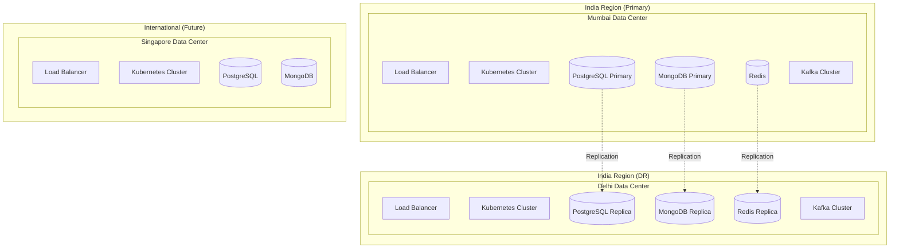

### 9.2 Kubernetes Architecture

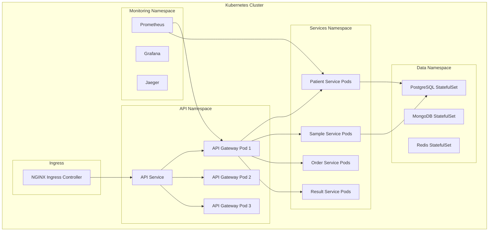

### 9.3 Container Orchestration

**Kubernetes Features Used:**
- **Deployments**: Stateless services
- **StatefulSets**: Databases (Postgres, MongoDB, Redis)
- **DaemonSets**: Monitoring agents, log collectors
- **Jobs**: Database migrations, batch processing
- **CronJobs**: Scheduled reports, cleanup tasks
- **ConfigMaps**: Configuration management
- **Secrets**: Credentials, API keys
- **Horizontal Pod Autoscaler (HPA)**: Auto-scaling based on CPU/memory
- **Vertical Pod Autoscaler (VPA)**: Resource optimization
- **Ingress**: External access routing
- **NetworkPolicies**: Service-to-service communication rules

### 9.4 Service Mesh (Istio)

**Features:**
- **Traffic Management**: Intelligent routing, load balancing
- **Security**: mTLS between services
- **Observability**: Distributed tracing, metrics
- **Resilience**: Circuit breaking, retries, timeouts

---

## 10. Scalability & Performance

### 10.1 Scaling Strategy

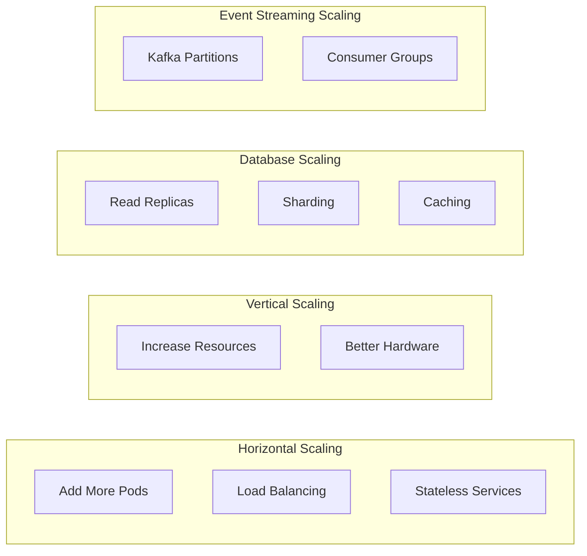

### 10.2 Performance Targets

| Metric | Target | Measurement |
|--------|--------|-------------|
| **API Response Time** | <100ms (P95) | 95th percentile |
| **GraphQL Query** | <200ms (P95) | Complex queries |
| **Database Query** | <50ms (P95) | Indexed queries |
| **Report Generation** | <5 seconds | PDF generation |
| **Page Load Time** | <2 seconds | FCP (First Contentful Paint) |
| **Throughput** | 10,000+ req/sec | Peak load |
| **Concurrent Users** | 10,000+ | Simultaneous |
| **Database Connections** | 1,000+ | Connection pooling |

### 10.3 Caching Strategy

**Multi-Level Caching:**

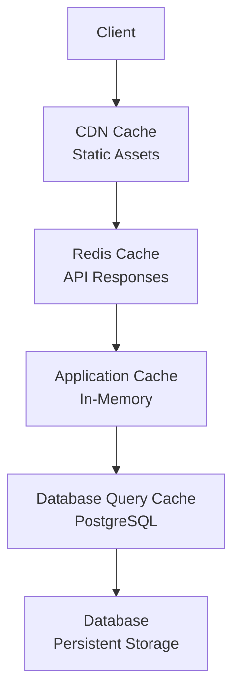

**Cache Invalidation:**
- **Event-based**: Invalidate on domain events
- **TTL-based**: Time-to-live for different data types
- **LRU**: Least Recently Used for memory management

### 10.4 Database Optimization

**PostgreSQL:**
- **Indexes**: B-tree, GiST, GIN for different query patterns
- **Partitioning**: Time-based partitioning for results, audit logs
- **Connection Pooling**: PgBouncer for connection management
- **Read Replicas**: Separate read and write workloads
- **Vacuuming**: Regular maintenance

**MongoDB:**
- **Indexes**: Compound indexes for common queries
- **Sharding**: Horizontal partitioning for scalability
- **Replica Sets**: High availability

---

## 11. India-Specific Adaptations

### 11.1 Offline-First Architecture

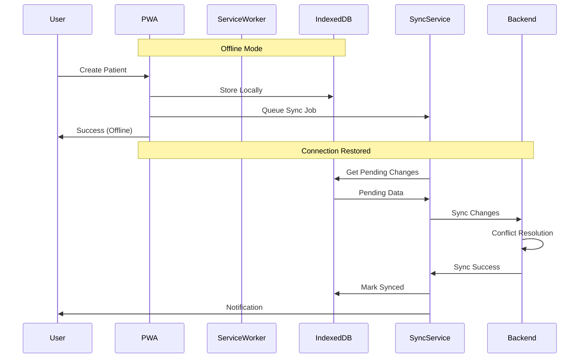

**Offline Capabilities:**
- Patient registration
- Sample collection
- Result entry (manual)
- Report viewing (cached)
- Billing (offline mode)

**Sync Strategy:**
- **Background Sync**: Automatic when connection restored
- **Conflict Resolution**: Last-write-wins with manual resolution UI
- **Delta Sync**: Only send changed data
- **Bandwidth Optimization**: Compress payloads

### 11.2 Multi-Language Support

**Languages Supported:**
1. English (default)
2. Hindi (हिंदी)
3. Tamil (தமிழ்)
4. Telugu (తెలుగు)
5. Marathi (मराठी)
6. Bengali (বাংলা)
7. Kannada (ಕನ್ನಡ)

**Implementation:**
- i18n library (next-i18next for frontend)
- Database-level translations for dynamic content
- Voice input support (Google Speech API)
- RTL (Right-to-Left) support for future

### 11.3 WhatsApp-First Communication

**Use Cases:**
- Test status updates
- Report delivery (PDF attachment)
- Critical value alerts
- Appointment reminders
- Payment links
- Chatbot for common queries
- NABL compliance notifications

**WhatsApp Template Examples:**
```
Template: report_ready
Your lab report is ready! View and download: {{report_link}}
- {{lab_name}}

Template: critical_value_alert
URGENT: {{test_name}} result for {{patient_name}} is {{value}} (Critical).
Immediate action required. Contact: {{phone}}

Template: payment_reminder
Hi {{patient_name}}, your payment of ₹{{amount}} is pending for order {{order_id}}.
Pay now: {{payment_link}}
```

### 11.4 Payment Integration (India)

**Payment Modes:**
1. **UPI** (60%+ transactions)
   - Direct UPI ID
   - QR Code
   - Intent-based (GPay, PhonePe, Paytm)

2. **Cards**
   - Credit Cards
   - Debit Cards
   - Saved cards (tokenization)

3. **Net Banking**
   - 50+ banks supported

4. **Wallets**
   - Paytm, PhonePe, Amazon Pay, etc.

5. **BNPL (Buy Now Pay Later)**
   - Simpl, LazyPay, ZestMoney

6. **Cash**
   - Offline reconciliation

**GST & E-Invoice:**
- Automatic GST calculation (5%, 12%, 18%)
- E-invoice generation (GSTN API)
- TDS handling for corporate clients
- Audit-ready financial reports

### 11.5 ABDM Integration

**Health ID Creation:**
```rust
async fn create_health_id(
    aadhaar: String,
    mobile: String,
) -> Result<HealthID, Error> {
    // ABDM API integration
    // 1. Verify Aadhaar
    // 2. Send OTP
    // 3. Verify OTP
    // 4. Create Health ID
    // 5. Link to patient record
}
```

**Health Records Exchange:**
- Push lab reports to ABDM
- Consent-based data sharing
- FHIR-based interoperability

---

## 12. Technology Stack

### 12.1 Backend Stack

| Component | Technology | Version | Purpose |
|-----------|-----------|---------|---------|
| **Language** | Rust | 1.75+ | High performance, memory safety |
| **Web Framework** | actix-web / axum | 4.x / 0.7.x | Async HTTP framework |
| **GraphQL** | async-graphql | 7.x | GraphQL server |
| **ORM** | sqlx | 0.7.x | Database access (compile-time checked) |
| **Serialization** | serde | 1.x | JSON/MessagePack serialization |
| **Async Runtime** | tokio | 1.x | Async I/O |
| **Authentication** | jsonwebtoken | 9.x | JWT implementation |
| **Validation** | validator | 0.16.x | Data validation |
| **Logging** | tracing | 0.1.x | Structured logging |
| **Error Handling** | thiserror, anyhow | - | Error types |

### 12.2 Frontend Stack

| Component | Technology | Version | Purpose |
|-----------|-----------|---------|---------|
| **Framework** | Next.js | 14+ | React framework (App Router) |
| **Language** | TypeScript | 5.x | Type safety |
| **Styling** | Tailwind CSS | 3.x | Utility-first CSS |
| **Components** | shadcn/ui | Latest | Component library |
| **State Management** | Zustand / Jotai | Latest | Lightweight state |
| **GraphQL Client** | Apollo Client / urql | Latest | GraphQL queries |
| **Forms** | React Hook Form | 7.x | Form management |
| **Validation** | Zod | 3.x | Schema validation |
| **Tables** | TanStack Table | 8.x | Data tables |
| **Charts** | Recharts / Tremor | Latest | Data visualization |
| **Date/Time** | date-fns | 3.x | Date utilities |
| **Internationalization** | next-i18next | Latest | i18n support |

### 12.3 Database Stack

| Component | Technology | Version | Purpose |
|-----------|-----------|---------|---------|
| **OLTP** | PostgreSQL | 16+ | Transactional data |
| **Document Store** | MongoDB | 7+ | Flexible schemas |
| **Cache** | Redis | 7+ | Caching, sessions, queues |
| **Object Storage** | MinIO / S3 | Latest | Files, reports, images |
| **Search** | Elasticsearch | 8.x | Full-text search |
| **Time-Series** | TimescaleDB | 2.x | Equipment metrics, QC trends |

### 12.4 Event Streaming

| Component | Technology | Version | Purpose |
|-----------|-----------|---------|---------|
| **Message Broker** | Apache Kafka | 3.6+ | Event streaming |
| **Stream Processing** | Kafka Streams | - | Event processing |
| **Schema Registry** | Confluent Schema Registry | - | Event schemas |

### 12.5 Integration

| Component | Technology | Version | Purpose |
|-----------|-----------|---------|---------|
| **HL7/FHIR Engine** | Mirth Connect | Latest | Healthcare integration |
| **API Gateway** | Custom (Rust) | - | Request routing |
| **Service Mesh** | Istio / Linkerd | Latest | Service communication |

### 12.6 AI/ML Stack

| Component | Technology | Version | Purpose |
|-----------|-----------|---------|---------|
| **Language** | Python | 3.11+ | ML development |
| **Framework** | TensorFlow / PyTorch | Latest | Deep learning |
| **Tabular ML** | XGBoost, LightGBM | Latest | Gradient boosting |
| **Model Versioning** | MLflow | Latest | Experiment tracking |
| **Serving** | FastAPI | Latest | Model inference APIs |
| **Computer Vision** | OpenCV | Latest | Image processing |

### 12.7 Infrastructure

| Component | Technology | Version | Purpose |
|-----------|-----------|---------|---------|
| **Containerization** | Docker | 24+ | Application packaging |
| **Orchestration** | Kubernetes | 1.28+ | Container orchestration |
| **IaC** | Terraform | 1.6+ | Infrastructure as code |
| **CI/CD** | GitHub Actions | - | Automation pipelines |
| **Monitoring** | Prometheus | Latest | Metrics collection |
| **Visualization** | Grafana | Latest | Metrics dashboards |
| **Tracing** | Jaeger | Latest | Distributed tracing |
| **Logging** | ELK Stack / Loki | Latest | Log aggregation |
| **APM** | OpenTelemetry | Latest | Application performance |

### 12.8 Cloud Providers

**Primary: AWS (India Regions)**
- EC2 for compute
- EKS for Kubernetes
- RDS for PostgreSQL
- DocumentDB for MongoDB
- ElastiCache for Redis
- S3 for object storage
- CloudFront for CDN
- Route 53 for DNS

**Alternative: Azure (India Regions)**
- AKS for Kubernetes
- Azure Database for PostgreSQL
- Cosmos DB for MongoDB
- Azure Cache for Redis
- Blob Storage for objects

**Alternative: GCP (India Regions)**
- GKE for Kubernetes
- Cloud SQL for PostgreSQL
- Cloud Memorystore for Redis
- Cloud Storage for objects

---

## 13. Non-Functional Requirements

### 13.1 Performance

| Requirement | Target | Measurement |
|-------------|--------|-------------|
| API Response Time | <100ms (P95) | 95th percentile |
| Page Load Time | <2 seconds | FCP |
| Database Query | <50ms (P95) | Indexed queries |
| Report Generation | <5 seconds | PDF |
| Throughput | 10,000+ req/sec | Peak load |
| Concurrent Users | 10,000+ | Simultaneous |

### 13.2 Availability

| Component | Target | Strategy |
|-----------|--------|----------|
| System Uptime | 99.9% | Multi-region, auto-failover |
| Planned Downtime | <4 hours/year | Blue-green deployment |
| Recovery Time (RTO) | <1 hour | Automated disaster recovery |
| Recovery Point (RPO) | <15 minutes | Continuous replication |

### 13.3 Scalability

| Aspect | Capability |
|--------|-----------|
| Vertical Scaling | Up to 128 vCPU, 512GB RAM per pod |
| Horizontal Scaling | Auto-scale to 100+ pods per service |
| Database Scaling | Read replicas, sharding, partitioning |
| Storage Scaling | Unlimited (S3), 100TB+ (databases) |
| Geographic Scaling | Multi-region deployment |

### 13.4 Security

| Requirement | Implementation |
|-------------|----------------|
| Data Encryption (Transit) | TLS 1.3, mTLS for services |
| Data Encryption (Rest) | AES-256 |
| Authentication | JWT, OAuth2, MFA |
| Authorization | RBAC with fine-grained permissions |
| Audit Logging | Comprehensive, immutable |
| Penetration Testing | Quarterly |
| Vulnerability Scanning | Continuous (Snyk, Dependabot) |

### 13.5 Compliance

| Regulation | Status |
|------------|--------|
| NABL ISO 15189:2022 | Compliant by design |
| DPDP 2023 | Fully compliant |
| HIPAA | Readiness (for international) |
| SOC 2 Type II | Certification planned (Year 1) |
| ISO 27001 | Certification planned (Year 2) |

### 13.6 Usability

| Aspect | Target |
|--------|--------|
| User Onboarding | <30 minutes for basic features |
| Training Time | <2 hours for complete system |
| Accessibility | WCAG 2.1 AA compliant |
| Mobile Responsiveness | 100% features on mobile |
| Offline Support | 24+ hours offline operation |
| Multi-Language | 7 languages supported |

### 13.7 Maintainability

| Aspect | Target |
|--------|--------|
| Code Coverage | >80% unit tests |
| Documentation | Comprehensive (code + user) |
| Deployment Frequency | Multiple times per day (CI/CD) |
| Mean Time to Repair (MTTR) | <30 minutes |
| Technical Debt Ratio | <5% |

### 13.8 Reliability

| Metric | Target |
|--------|--------|
| Mean Time Between Failures (MTBF) | >720 hours (30 days) |
| Error Rate | <0.1% of requests |
| Data Loss | Zero tolerance |
| Backup Frequency | Every 4 hours, retained 30 days |
| Backup Testing | Monthly |

---

## Conclusion

This High-Level Design provides the architectural foundation for a revolutionary, cloud-native LIS/LIMS optimized for the Indian clinical laboratory market. The architecture emphasizes:

1. **Scalability**: Microservices, Kubernetes, event-driven
2. **Performance**: <100ms API responses, caching, optimization
3. **Reliability**: 99.9% uptime, multi-region, disaster recovery
4. **Security**: End-to-end encryption, RBAC, audit trails
5. **Compliance**: NABL, DPDP 2023, HIPAA-ready
6. **India Optimization**: Offline-first, WhatsApp, multi-language
7. **AI-Powered**: 30-60% auto-verification, predictive analytics
8. **Developer-Friendly**: Modern tech stack, well-documented

The next steps include detailed Low-Level Design (LLD), database schema design, API specifications, and implementation planning.

---

**Document Status**: ✅ Approved
**Next Review Date**: 2025-02-05
**Owned By**: Architecture Team
