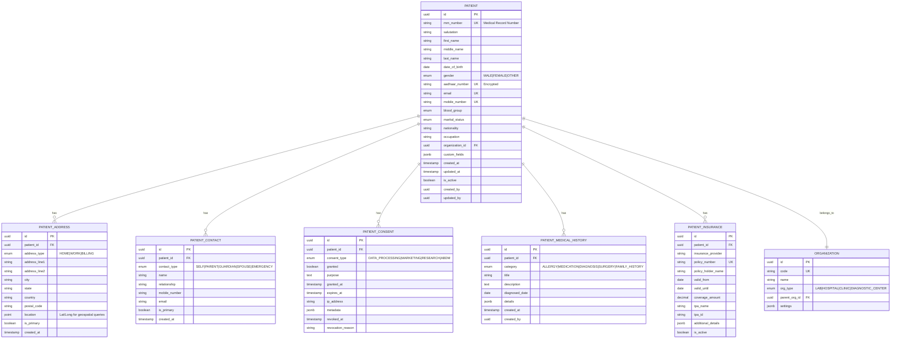
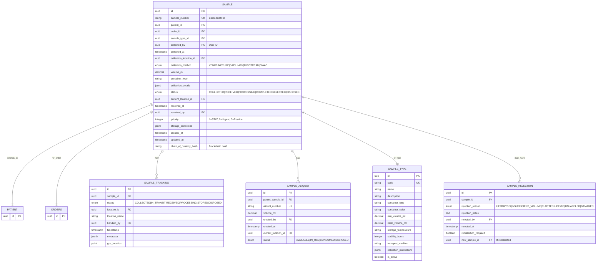
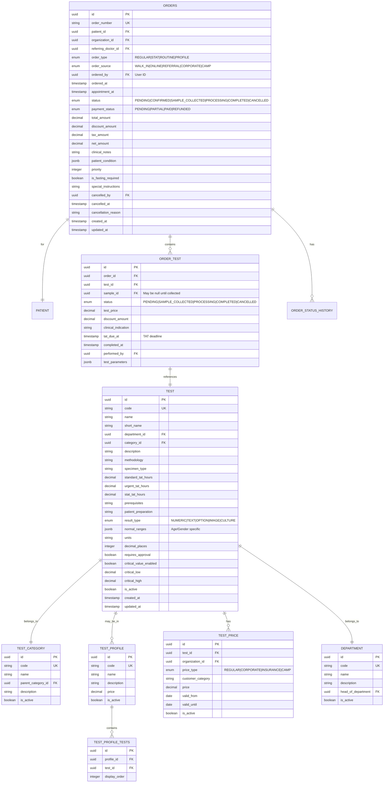
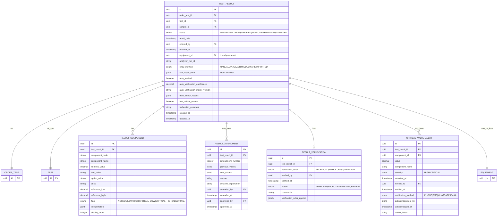
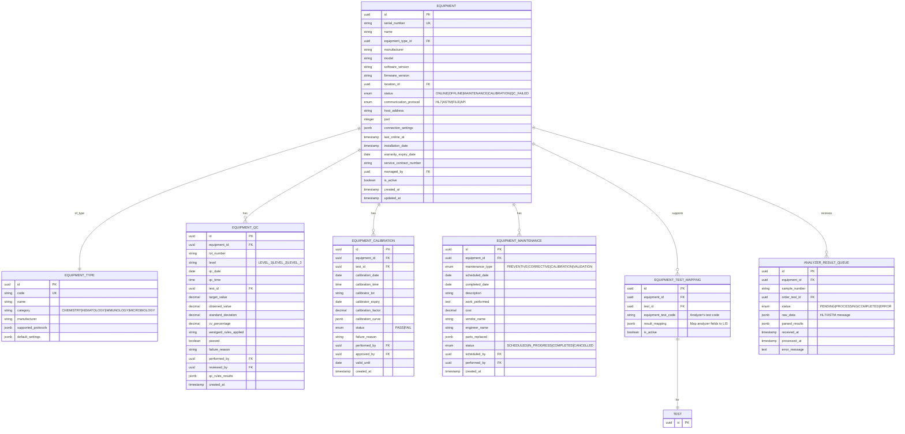
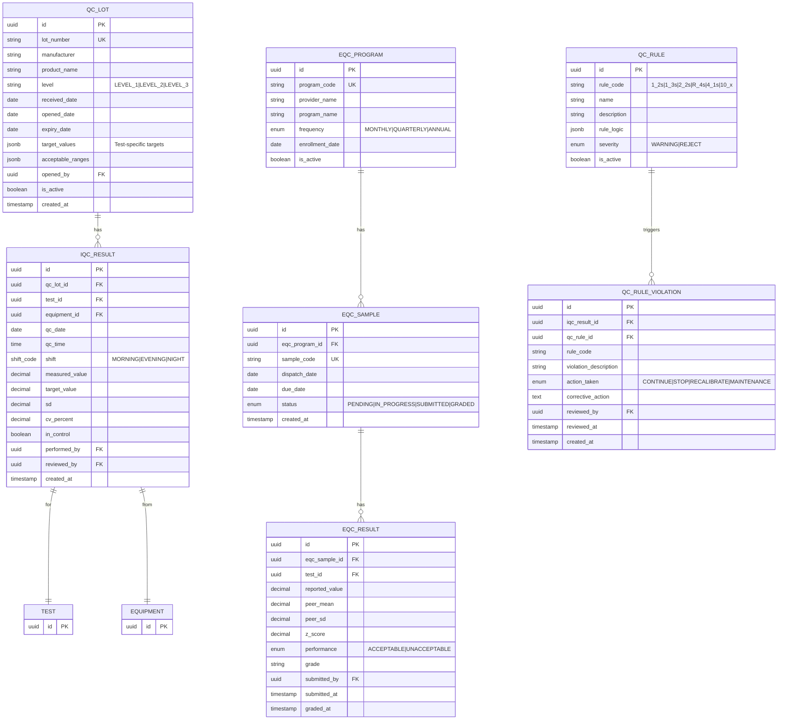
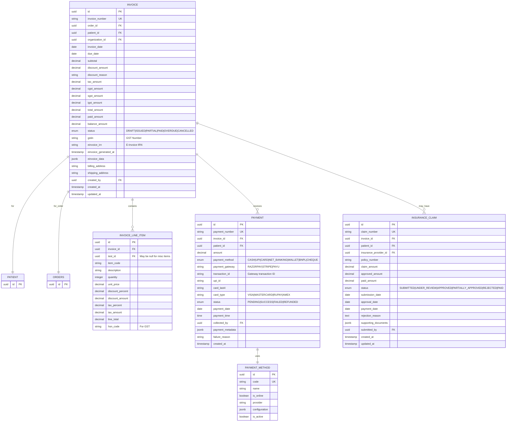
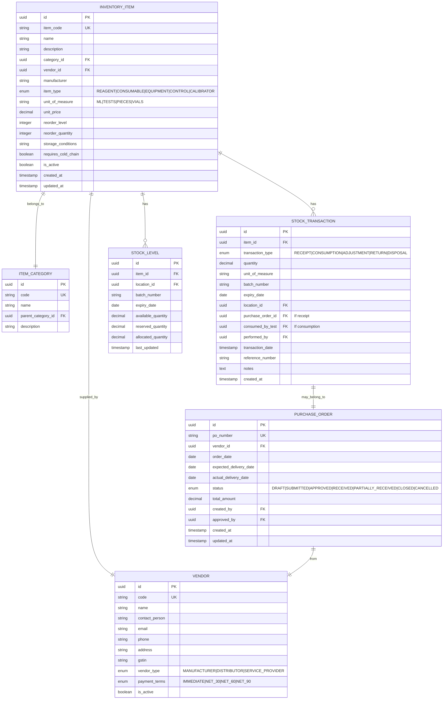
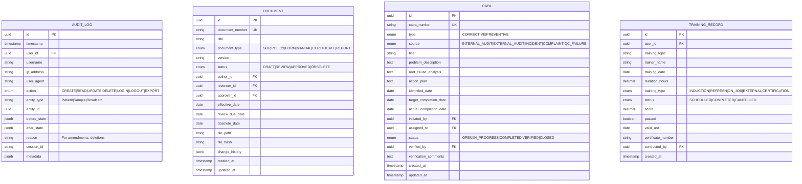
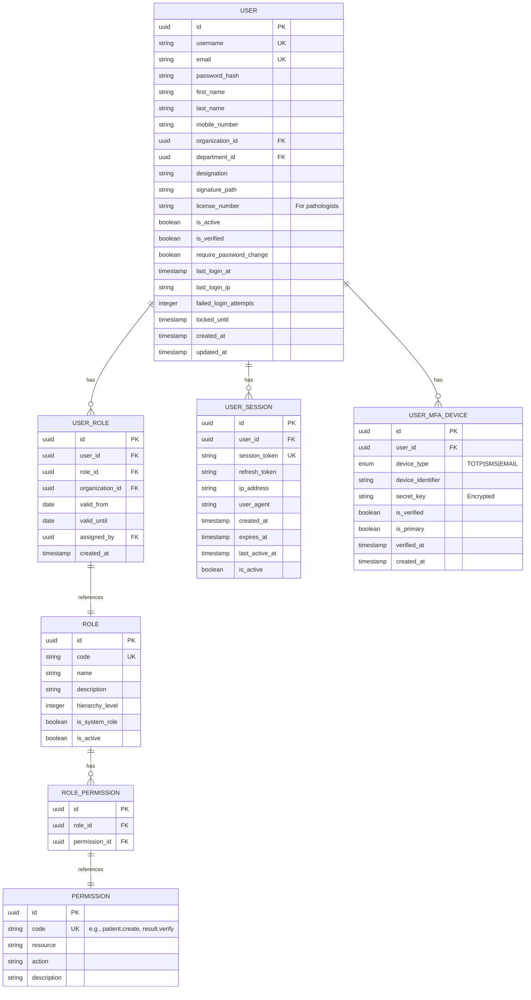

# Entity-Relationship Diagrams
## Cloud-Native LIS/LIMS Database Schema

**Version**: 1.0.0
**Last Updated**: 2024-11-05
**Database**: PostgreSQL 16+ (Primary), MongoDB 7+ (Secondary)

---

## Table of Contents

1. [Overview](#overview)
2. [Database Strategy](#database-strategy)
3. [Core Domain ER Diagrams](#core-domain-er-diagrams)
4. [Data Relationships](#data-relationships)
5. [Indexing Strategy](#indexing-strategy)
6. [Partitioning Strategy](#partitioning-strategy)
7. [Data Retention](#data-retention)

---

## 1. Overview

### 1.1 Database Distribution

| Domain | Database | Rationale |
|--------|----------|-----------|
| **Patients** | PostgreSQL | ACID transactions, relational integrity |
| **Samples** | PostgreSQL | Strong consistency, referential integrity |
| **Orders** | PostgreSQL | Transactional data, complex queries |
| **Results** | PostgreSQL | Critical data, ACID compliance |
| **Billing** | PostgreSQL | Financial data, audit requirements |
| **Equipment** | PostgreSQL | Structured data, relationships |
| **Quality Control** | PostgreSQL | Statistical analysis, trends |
| **Inventory** | PostgreSQL | Stock management, transactions |
| **Reports** | MongoDB | Flexible templates, document storage |
| **Configuration** | MongoDB | Dynamic schemas, versioning |
| **Compliance Documents** | MongoDB | Unstructured documents |
| **Audit Logs** | MongoDB + Blockchain | Immutable logs, append-only |

---

## 2. Database Strategy

### 2.1 ACID Compliance

All PostgreSQL tables follow ACID principles:
- **Atomicity**: Transactions complete fully or not at all
- **Consistency**: Data integrity constraints enforced
- **Isolation**: Concurrent transactions don't interfere
- **Durability**: Committed data persists

### 2.2 Normalization

- **Core tables**: 3NF (Third Normal Form)
- **Performance-critical**: Denormalized for read optimization
- **Audit tables**: Append-only, no updates/deletes

---

## 3. Core Domain ER Diagrams

### 3.1 Patient Domain



### 3.2 Sample Domain



### 3.3 Order Domain



### 3.4 Result Domain



### 3.5 Equipment Integration Domain



### 3.6 Quality Control Domain



### 3.7 Billing Domain



### 3.8 Inventory Domain



### 3.9 Compliance & Audit Domain



### 3.10 User & Security Domain



---

## 4. Data Relationships

### 4.1 Key Relationships

| From | To | Relationship | Cardinality |
|------|-----|--------------|-------------|
| PATIENT | ORDERS | Places orders | 1:N |
| ORDERS | ORDER_TEST | Contains tests | 1:N |
| ORDERS | SAMPLE | Requires samples | 1:N |
| SAMPLE | TEST_RESULT | Produces results | 1:N |
| TEST_RESULT | REPORT | Generates reports | N:1 |
| ORDER | INVOICE | Billed via | 1:1 |
| INVOICE | PAYMENT | Receives payments | 1:N |
| EQUIPMENT | TEST_RESULT | Produces results | 1:N |
| TEST | ORDER_TEST | Ordered as | N:N |

### 4.2 Referential Integrity

**Cascade Delete Rules:**
- `PATIENT` deletion → Soft delete (mark inactive)
- `SAMPLE` deletion → Not allowed (audit requirement)
- `TEST_RESULT` deletion → Not allowed (regulatory)
- `ORDER` cancellation → Mark as cancelled, preserve data

**Orphan Prevention:**
- Foreign keys with `ON DELETE RESTRICT`
- Application-level validation
- Database triggers for complex rules

---

## 5. Indexing Strategy

### 5.1 Primary Indexes

Every table has:
- **Primary Key**: UUID (B-tree index)
- **Unique Constraints**: Natural keys (e.g., MRN, sample number)

### 5.2 Secondary Indexes

#### Patient Indexes
```sql
CREATE INDEX idx_patient_mrn ON patient(mrn_number);
CREATE INDEX idx_patient_mobile ON patient(mobile_number);
CREATE INDEX idx_patient_email ON patient(email);
CREATE INDEX idx_patient_aadhaar ON patient(aadhaar_number); -- Encrypted
CREATE INDEX idx_patient_org ON patient(organization_id);
CREATE INDEX idx_patient_search ON patient USING gin(to_tsvector('english', first_name || ' ' || last_name));
```

#### Sample Indexes
```sql
CREATE INDEX idx_sample_number ON sample(sample_number);
CREATE INDEX idx_sample_patient ON sample(patient_id);
CREATE INDEX idx_sample_order ON sample(order_id);
CREATE INDEX idx_sample_status ON sample(status);
CREATE INDEX idx_sample_collected_at ON sample(collected_at);
CREATE INDEX idx_sample_composite ON sample(patient_id, collected_at DESC);
```

#### Result Indexes
```sql
CREATE INDEX idx_result_order_test ON test_result(order_test_id);
CREATE INDEX idx_result_sample ON test_result(sample_id);
CREATE INDEX idx_result_status ON test_result(status);
CREATE INDEX idx_result_date ON test_result(result_date);
CREATE INDEX idx_result_critical ON test_result(has_critical_values) WHERE has_critical_values = true;
```

#### Audit Log Indexes
```sql
CREATE INDEX idx_audit_user ON audit_log(user_id);
CREATE INDEX idx_audit_entity ON audit_log(entity_type, entity_id);
CREATE INDEX idx_audit_timestamp ON audit_log(timestamp DESC);
CREATE INDEX idx_audit_action ON audit_log(action);
```

### 5.3 Partial Indexes

For performance optimization:
```sql
-- Only index active patients
CREATE INDEX idx_active_patients ON patient(id) WHERE is_active = true;

-- Only index pending results
CREATE INDEX idx_pending_results ON test_result(id) WHERE status = 'PENDING';

-- Only index critical values
CREATE INDEX idx_critical_alerts ON critical_value_alert(test_result_id)
WHERE acknowledged_at IS NULL;
```

---

## 6. Partitioning Strategy

### 6.1 Time-Based Partitioning

**Audit Logs** (Monthly Partitions):
```sql
CREATE TABLE audit_log (
    id UUID PRIMARY KEY,
    timestamp TIMESTAMP NOT NULL,
    -- other columns
) PARTITION BY RANGE (timestamp);

CREATE TABLE audit_log_2024_11 PARTITION OF audit_log
FOR VALUES FROM ('2024-11-01') TO ('2024-12-01');
```

**Test Results** (Yearly Partitions):
```sql
CREATE TABLE test_result (
    id UUID PRIMARY KEY,
    result_date TIMESTAMP NOT NULL,
    -- other columns
) PARTITION BY RANGE (result_date);

CREATE TABLE test_result_2024 PARTITION OF test_result
FOR VALUES FROM ('2024-01-01') TO ('2025-01-01');
```

### 6.2 Hash Partitioning

**Large Tables** (e.g., Samples):
```sql
CREATE TABLE sample (
    id UUID PRIMARY KEY,
    -- other columns
) PARTITION BY HASH (id);

CREATE TABLE sample_p0 PARTITION OF sample FOR VALUES WITH (MODULUS 4, REMAINDER 0);
CREATE TABLE sample_p1 PARTITION OF sample FOR VALUES WITH (MODULUS 4, REMAINDER 1);
CREATE TABLE sample_p2 PARTITION OF sample FOR VALUES WITH (MODULUS 4, REMAINDER 2);
CREATE TABLE sample_p3 PARTITION OF sample FOR VALUES WITH (MODULUS 4, REMAINDER 3);
```

---

## 7. Data Retention

### 7.1 Retention Periods (NABL Compliance)

| Data Type | Retention Period | Storage Tier |
|-----------|-----------------|--------------|
| **Patient Demographics** | Indefinite | Hot |
| **Test Results** | 5+ years | Hot → Warm → Cold |
| **Audit Logs** | 7+ years | Hot → Warm → Archive |
| **Quality Control** | 5+ years | Warm |
| **Equipment Logs** | 5+ years | Warm |
| **Financial Records** | 7+ years | Warm → Archive |
| **Compliance Documents** | Indefinite | Archive |
| **Report PDFs** | 5+ years | Cold storage (S3) |

### 7.2 Archival Strategy

**Tiered Storage:**
```
Hot Storage (PostgreSQL) → 0-1 year
Warm Storage (Compressed PostgreSQL) → 1-5 years
Cold Storage (S3 Glacier) → 5+ years
```

**Automated Archival:**
- Monthly job to move old data
- Compressed and encrypted archives
- Indexed metadata for retrieval
- Restore process for legal/audit requests

---

## Summary

This ER diagram documentation provides:
1. **Comprehensive schema** for all 12 core modules
2. **Relational integrity** with proper foreign keys
3. **Indexing strategy** for performance
4. **Partitioning strategy** for scalability
5. **Data retention** policy (NABL compliant)
6. **Audit trail** for regulatory compliance

The schema supports:
- **High performance** through indexing and partitioning
- **Data integrity** through constraints and transactions
- **Regulatory compliance** through audit trails and retention
- **Scalability** through partitioning and archiving
- **Flexibility** through JSON fields where appropriate

---

**Next Steps:**
1. Review with domain experts
2. Create migration scripts
3. Setup development/staging databases
4. Load test with realistic data volumes
5. Document data access patterns for optimization

---

**Document Status**: ✅ Approved
**Next Review Date**: 2025-02-05
**Owned By**: Database Architecture Team
