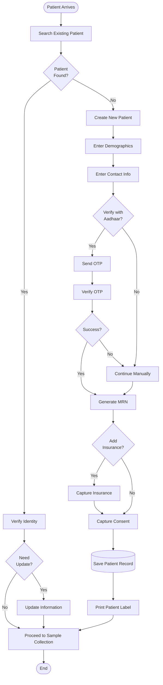
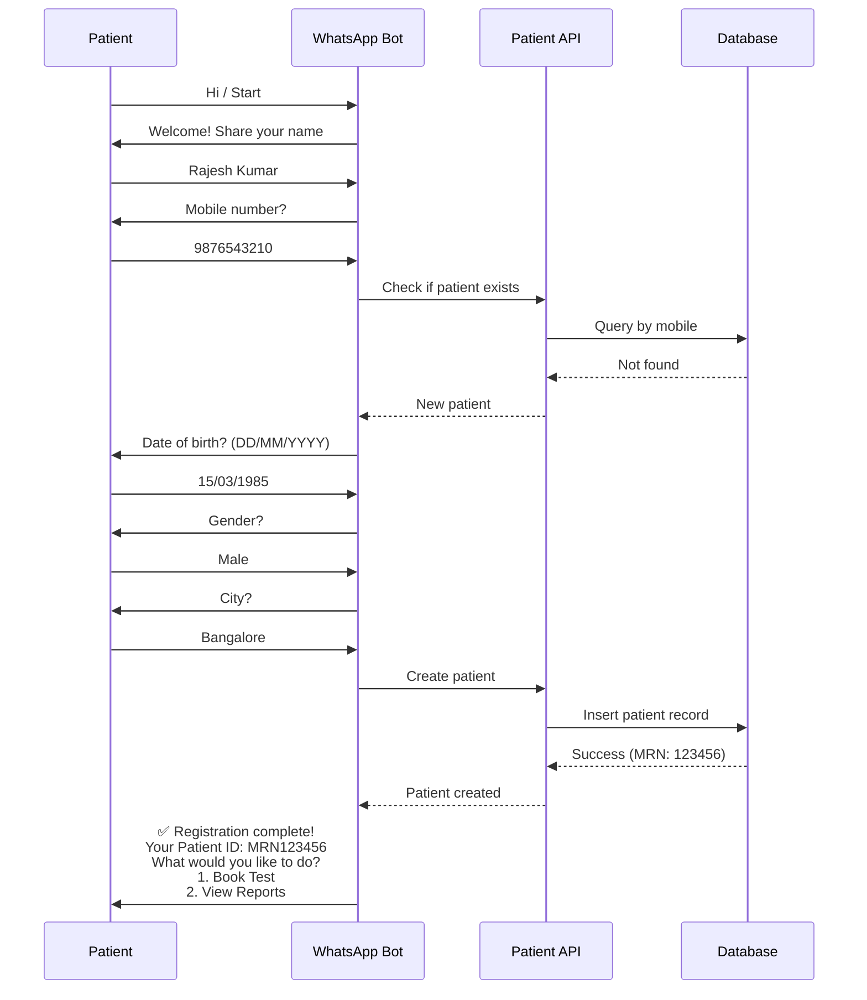
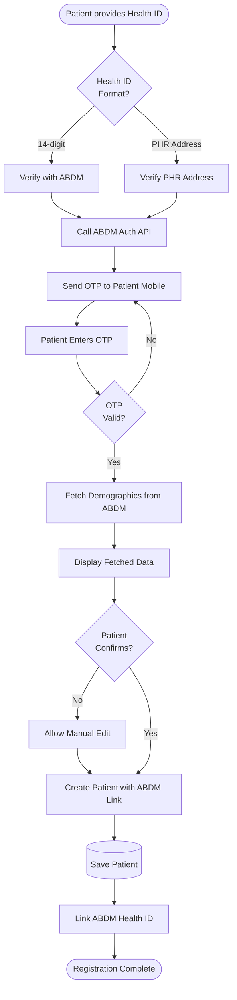

# Patient Management Module

## Overview

The Patient Management Module is the foundation of the LIS/LIMS system, handling complete patient lifecycle management from registration to long-term record maintenance. It ensures accurate patient identification, consent management, and demographic data handling while maintaining compliance with Indian data protection regulations (DPDP 2023) and NABL requirements.

### Purpose

- **Primary**: Maintain accurate, unique patient records with complete demographic and contact information
- **Secondary**: Enable seamless patient identification across multiple visits and integrate with national health infrastructure (ABDM)
- **Tertiary**: Support patient engagement through self-service portals and WhatsApp integration

### Scope

- Multi-channel patient registration (Web, Mobile, WhatsApp, Walk-in)
- Aadhaar-based identity verification
- ABDM (Ayushman Bharat Digital Mission) Health ID integration
- Consent management (DPDP 2023 compliant)
- Patient search and duplicate detection
- Medical history tracking
- Insurance information management
- Patient data export and portability

---

## User Personas

### 1. Front Desk Staff
**Responsibilities:**
- Register new patients
- Update patient information
- Search and retrieve patient records
- Verify patient identity
- Print patient labels and documents

**Permissions:**
- `CREATE_PATIENT`
- `READ_PATIENT`
- `UPDATE_PATIENT`
- `SEARCH_PATIENT`

### 2. Lab Technician
**Responsibilities:**
- Verify patient identity during sample collection
- View patient information
- Access medical history for context

**Permissions:**
- `READ_PATIENT`
- `SEARCH_PATIENT`

### 3. Pathologist
**Responsibilities:**
- Access patient medical history
- View previous test results
- Add clinical notes

**Permissions:**
- `READ_PATIENT`
- `SEARCH_PATIENT`
- `ADD_PATIENT_NOTES`

### 4. Patient (Self-Service)
**Responsibilities:**
- Register via portal/WhatsApp
- Update contact information
- View own medical records
- Manage consent preferences
- Download health records

**Permissions:**
- `READ_OWN_DATA`
- `UPDATE_OWN_CONTACT`
- `MANAGE_OWN_CONSENT`
- `DOWNLOAD_OWN_RECORDS`

### 5. Admin
**Responsibilities:**
- Merge duplicate records
- Archive inactive patients
- Configure patient fields
- Manage consent templates

**Permissions:**
- `ALL_PATIENT_OPERATIONS`
- `MERGE_PATIENTS`
- `ARCHIVE_PATIENT`

---

## Key Features

### 1. Multi-Channel Registration

#### Walk-in Registration
Traditional front desk registration with full data entry.

**Workflow:**
1. Patient arrives at reception
2. Staff searches for existing record
3. If not found, creates new patient
4. Collects demographics, contact info, insurance
5. Optional: Aadhaar verification
6. Assigns unique MRN (Medical Record Number)
7. Prints patient label/card

**Forms:**
- Basic Demographics Form
- Address Form
- Contact Information Form
- Insurance Details Form
- Emergency Contact Form
- Consent Form

#### WhatsApp Registration
Conversational registration via WhatsApp chatbot.

**Flow:**
```
Bot: Welcome to [Lab Name]! 👋
     I can help you register for lab tests.

Bot: Please share your full name

User: Rajesh Kumar

Bot: Thank you Rajesh! What's your mobile number?

User: 9876543210

Bot: Please share your date of birth (DD/MM/YYYY)

User: 15/03/1985

Bot: Are you Male or Female?

User: Male

Bot: Great! Registration complete ✅
     Your Patient ID: MRN123456

     You can now:
     - Book tests
     - View reports
     - Get test results
```

#### Self-Service Web Portal
Patient-initiated registration with email verification.

**Features:**
- Step-by-step form wizard
- Real-time validation
- Address autocomplete (Google Maps API)
- Insurance lookup
- Aadhaar integration
- Profile photo upload

#### ABDM Health ID Registration
One-click registration using ABDM Health ID.

**Process:**
1. Patient provides Health ID (@abdm or 14-digit)
2. System fetches demographic data from ABDM
3. Auto-populates patient form
4. Patient reviews and confirms
5. Creates linked LIS patient record

### 2. Aadhaar-Based Verification

#### Features
- Aadhaar number collection (optional, encrypted)
- OTP-based verification via UIDAI
- Demographic authentication
- Biometric authentication (for kiosks)
- Masked Aadhaar display

#### Security
- AES-256 encryption at rest
- Never store raw Aadhaar in logs
- Access logged for audit
- UIDAI compliance

#### API Integration
```rust
pub async fn verify_aadhaar(
    aadhaar_number: &str,
    otp: &str,
) -> Result<AadhaarVerificationResult, Error> {
    let encrypted_aadhaar = encrypt_aadhaar(aadhaar_number)?;

    let request = AadhaarOTPRequest {
        aadhaar: encrypted_aadhaar,
        otp,
        txn_id: generate_transaction_id(),
    };

    let response = uidai_client
        .verify_otp(request)
        .await?;

    Ok(AadhaarVerificationResult {
        verified: response.status == "SUCCESS",
        name: response.name,
        dob: response.dob,
        gender: response.gender,
        address: response.address,
    })
}
```

### 3. Duplicate Detection

#### Algorithm
Uses fuzzy matching on:
- Name (Jaro-Winkler distance)
- Date of birth (exact match)
- Mobile number (exact match)
- Aadhaar (exact match, if available)

**Matching Thresholds:**
- **High Confidence (>90%)**: Automatic suggestion
- **Medium Confidence (70-90%)**: Manual review required
- **Low Confidence (<70%)**: Ignored

#### Implementation
```rust
pub async fn detect_duplicates(
    patient: &CreatePatientInput,
) -> Result<Vec<PotentialDuplicate>, Error> {
    let mut matches = Vec::new();

    // Exact mobile match
    if let Some(existing) = find_by_mobile(&patient.mobile_number).await? {
        matches.push(PotentialDuplicate {
            patient_id: existing.id,
            confidence: 0.95,
            match_reason: "Exact mobile number match".to_string(),
        });
    }

    // Fuzzy name + DOB match
    let name_matches = fuzzy_search_name(&patient.full_name).await?;
    for candidate in name_matches {
        if candidate.date_of_birth == patient.date_of_birth {
            let name_similarity = jaro_winkler(
                &patient.full_name.to_lowercase(),
                &candidate.full_name.to_lowercase(),
            );

            if name_similarity > 0.7 {
                matches.push(PotentialDuplicate {
                    patient_id: candidate.id,
                    confidence: name_similarity,
                    match_reason: format!("Name similarity: {:.1}%, Same DOB", name_similarity * 100.0),
                });
            }
        }
    }

    Ok(matches)
}
```

### 4. Consent Management (DPDP 2023)

#### Consent Types
1. **Data Processing Consent**: Store and process personal data
2. **Communication Consent**: Send reports and notifications
3. **Marketing Consent**: Promotional communications
4. **Data Sharing Consent**: Share with ABDM, insurance, EMRs
5. **Research Consent**: De-identified data for research

#### Features
- Granular consent preferences
- Consent version tracking
- Withdrawal capability
- Audit trail of all consent changes
- Multilingual consent forms

#### Data Model
```rust
pub struct PatientConsent {
    pub id: Uuid,
    pub patient_id: Uuid,
    pub consent_type: ConsentType,
    pub status: ConsentStatus, // GRANTED, WITHDRAWN, EXPIRED
    pub granted_at: DateTime<Utc>,
    pub withdrawn_at: Option<DateTime<Utc>>,
    pub expires_at: Option<DateTime<Utc>>,
    pub consent_text: String, // Full text shown to patient
    pub consent_version: String,
    pub ip_address: String,
    pub device_info: String,
}

pub enum ConsentType {
    DataProcessing,
    Communication,
    Marketing,
    DataSharing,
    Research,
}
```

### 5. Patient Search

#### Search Methods

**Quick Search (Header Bar):**
- MRN number (exact match)
- Mobile number (exact match)
- Name (fuzzy search)

**Advanced Search:**
- Name + DOB
- Age range
- Gender
- City
- Registration date range
- Insurance company
- Referring doctor

#### Performance
- PostgreSQL full-text search (tsvector)
- Indexed columns: MRN, mobile, name
- Response time: <100ms for single match, <300ms for multiple matches

#### Search API
```graphql
query SearchPatients($query: String!, $limit: Int = 10) {
  searchPatients(query: $query, limit: $limit) {
    id
    mrnNumber
    fullName
    dateOfBirth
    age
    gender
    mobileNumber
    lastVisit
    status
  }
}
```

### 6. Medical History

#### Captured Information
- Chronic conditions
- Allergies
- Current medications
- Previous surgeries
- Family history
- Lifestyle factors (smoking, alcohol)

#### Integration
- Auto-populated from previous test results
- Imported from ABDM PHR
- Manual entry by pathologist

### 7. Insurance Integration

#### Supported Insurance Types
- Health insurance (Cashless, Reimbursement)
- Corporate insurance
- Government schemes (CGHS, ECHS, Ayushman Bharat)

#### Features
- Insurance card upload
- Eligibility verification (API integration with TPAs)
- Pre-authorization management
- Claim submission

---

## Data Models

### Patient Entity

```rust
pub struct Patient {
    pub id: Uuid,
    pub mrn_number: String, // AUTO-GENERATED: LAB001, format configurable
    pub organization_id: Uuid,

    // Demographics
    pub salutation: Option<String>, // Mr, Mrs, Ms, Dr
    pub first_name: String,
    pub middle_name: Option<String>,
    pub last_name: String,
    pub full_name: String, // Computed
    pub date_of_birth: NaiveDate,
    pub age: i32, // Computed
    pub gender: Gender,
    pub blood_group: Option<BloodGroup>,

    // Identity
    pub aadhaar_number: Option<String>, // Encrypted
    pub aadhaar_verified: bool,
    pub pan_number: Option<String>,
    pub passport_number: Option<String>,
    pub abdm_health_id: Option<String>,
    pub abdm_phr_address: Option<String>,

    // Contact
    pub mobile_number: String,
    pub alternate_mobile: Option<String>,
    pub email: Option<String>,
    pub preferred_language: String, // hi, en, ta, te, etc.
    pub preferred_communication: CommunicationChannel, // WHATSAPP, SMS, EMAIL

    // Additional
    pub occupation: Option<String>,
    pub marital_status: Option<MaritalStatus>,
    pub nationality: String, // Default: "Indian"
    pub profile_photo_url: Option<String>,

    // Metadata
    pub registration_source: RegistrationSource,
    pub registration_date: DateTime<Utc>,
    pub created_at: DateTime<Utc>,
    pub updated_at: DateTime<Utc>,
    pub created_by: Uuid,
    pub updated_by: Uuid,
    pub is_active: bool,
    pub is_deleted: bool,
    pub deleted_at: Option<DateTime<Utc>>,
}

pub enum Gender {
    Male,
    Female,
    Other,
    PreferNotToSay,
}

pub enum RegistrationSource {
    WalkIn,
    WebPortal,
    MobileApp,
    WhatsApp,
    ABDM,
    Import,
}
```

### Patient Address

```rust
pub struct PatientAddress {
    pub id: Uuid,
    pub patient_id: Uuid,
    pub address_type: AddressType, // HOME, WORK, TEMPORARY
    pub is_primary: bool,

    pub address_line1: String,
    pub address_line2: Option<String>,
    pub landmark: Option<String>,
    pub city: String,
    pub district: Option<String>,
    pub state: String,
    pub country: String, // Default: "India"
    pub pincode: String,

    pub latitude: Option<f64>,
    pub longitude: Option<f64>,

    pub created_at: DateTime<Utc>,
    pub updated_at: DateTime<Utc>,
}
```

### Patient Contact Person

```rust
pub struct PatientContactPerson {
    pub id: Uuid,
    pub patient_id: Uuid,

    pub name: String,
    pub relationship: String, // Father, Mother, Spouse, Son, Daughter, Friend
    pub mobile_number: String,
    pub email: Option<String>,
    pub is_emergency_contact: bool,

    pub created_at: DateTime<Utc>,
}
```

### Patient Insurance

```rust
pub struct PatientInsurance {
    pub id: Uuid,
    pub patient_id: Uuid,

    pub insurance_company: String,
    pub policy_number: String,
    pub policy_holder_name: String,
    pub relationship_to_patient: String, // SELF, SPOUSE, PARENT, etc.
    pub
 valid_from: NaiveDate,
    pub valid_to: NaiveDate,
    pub coverage_amount: Decimal,
    pub copay_percentage: Option<Decimal>,

    pub tpa_name: Option<String>,
    pub tpa_id: Option<String>,
    pub card_front_url: Option<String>,
    pub card_back_url: Option<String>,

    pub is_active: bool,
    pub created_at: DateTime<Utc>,
}
```

---

## Business Rules

### Validation Rules

1. **MRN Generation**
   - Format: Configurable (e.g., LAB{YYMMDD}{SEQUENCE})
   - Uniqueness: Enforced at database level
   - Auto-increment: Per organization

2. **Mobile Number**
   - Must be valid Indian mobile (10 digits starting with 6-9)
   - Unique per organization (configurable)
   - OTP verification (optional but recommended)

3. **Date of Birth**
   - Cannot be future date
   - Age calculated from DOB
   - Age validation: Must be between 0-150 years

4. **Aadhaar Number**
   - Optional field
   - If provided, must be 12 digits
   - Encrypted before storage
   - Masked in UI (XXXX-XXXX-1234)

5. **Email**
   - Valid email format
   - Optional field
   - Verification email sent if provided

6. **Name Fields**
   - First name: Required, 2-100 characters
   - Last name: Optional
   - Full name: Auto-computed from first + middle + last
   - Sanitized (no special characters except .-')

### Business Logic

#### MRN Generation Algorithm
```rust
pub async fn generate_mrn(
    organization_id: Uuid,
    config: &MRNConfig,
) -> Result<String, Error> {
    let date_part = match config.include_date {
        true => Utc::now().format(&config.date_format).to_string(),
        false => String::new(),
    };

    let sequence = get_next_sequence(organization_id).await?;
    let sequence_str = format!("{:0width$}", sequence, width = config.sequence_length);

    let mrn = format!("{}{}{}", config.prefix, date_part, sequence_str);

    Ok(mrn)
}
```

#### Age Calculation
```rust
pub fn calculate_age(date_of_birth: NaiveDate) -> i32 {
    let today = Utc::now().naive_utc().date();
    let age = today.years_since(date_of_birth).unwrap_or(0) as i32;
    age
}
```

#### Duplicate Merge Logic
```rust
pub async fn merge_patients(
    primary_id: Uuid,
    duplicate_id: Uuid,
    user_id: Uuid,
) -> Result<Patient, Error> {
    // Transaction: Merge all related records
    let mut tx = db.begin().await?;

    // 1. Move all orders to primary
    sqlx::query("UPDATE orders SET patient_id = $1 WHERE patient_id = $2")
        .bind(primary_id)
        .bind(duplicate_id)
        .execute(&mut tx)
        .await?;

    // 2. Move all samples
    sqlx::query("UPDATE samples SET patient_id = $1 WHERE patient_id = $2")
        .bind(primary_id)
        .bind(duplicate_id)
        .execute(&mut tx)
        .await?;

    // 3. Merge addresses (keep unique)
    // 4. Merge insurance records
    // 5. Merge medical history
    // 6. Create audit log entry

    // 7. Soft delete duplicate record
    sqlx::query("UPDATE patient SET is_deleted = true, deleted_at = NOW(), merged_into = $1 WHERE id = $2")
        .bind(primary_id)
        .bind(duplicate_id)
        .execute(&mut tx)
        .await?;

    tx.commit().await?;

    // Return merged patient
    get_patient_by_id(primary_id).await
}
```

---

## Workflows

### 1. New Patient Registration (Walk-in)



### 2. WhatsApp Self-Registration



### 3. ABDM Health ID Integration



---

## API Reference

### GraphQL Queries

```graphql
type Query {
  # Get single patient by ID
  patient(id: ID!): Patient

  # Get patient by MRN
  patientByMRN(mrnNumber: String!): Patient

  # Get patient by mobile
  patientByMobile(mobileNumber: String!): Patient

  # List patients with filters
  patients(
    filter: PatientFilter
    pagination: PaginationInput!
  ): PatientConnection!

  # Search patients (fuzzy)
  searchPatients(
    query: String!
    limit: Int = 10
  ): [Patient!]!

  # Detect potential duplicates
  detectDuplicates(input: CreatePatientInput!): [PotentialDuplicate!]!

  # Verify Aadhaar
  verifyAadhaar(aadhaarNumber: String!): AadhaarVerificationRequest!
}

type Patient {
  id: ID!
  mrnNumber: String!
  fullName: String!
  firstName: String!
  lastName: String
  dateOfBirth: Date!
  age: Int!
  gender: Gender!
  bloodGroup: BloodGroup

  # Contact
  mobileNumber: PhoneNumber!
  email: Email
  preferredLanguage: String!

  # Identity
  aadhaarNumber: String # Masked
  aadhaarVerified: Boolean!
  abdmHealthId: String

  # Relations
  addresses: [PatientAddress!]!
  insurances: [PatientInsurance!]!
  consents: [PatientConsent!]!
  contactPersons: [PatientContactPerson!]!

  # Medical
  medicalHistory: PatientMedicalHistory
  chronicConditions: [String!]
  allergies: [String!]

  # Metadata
  registrationDate: DateTime!
  lastVisit: DateTime
  totalVisits: Int!
  isActive: Boolean!
}
```

### GraphQL Mutations

```graphql
type Mutation {
  # Create new patient
  createPatient(input: CreatePatientInput!): Patient!

  # Update existing patient
  updatePatient(id: ID!, input: UpdatePatientInput!): Patient!

  # Register via ABDM Health ID
  registerWithABDM(healthId: String!, otp: String!): Patient!

  # Merge duplicate patients
  mergePatients(primaryId: ID!, duplicateId: ID!): Patient!

  # Update consent
  updateConsent(patientId: ID!, input: UpdateConsentInput!): PatientConsent!

  # Add insurance
  addInsurance(patientId: ID!, input: AddInsuranceInput!): PatientInsurance!

  # Deactivate patient
  deactivatePatient(id: ID!, reason: String!): Patient!
}

input CreatePatientInput {
  firstName: String!
  middleName: String
  lastName: String
  dateOfBirth: Date!
  gender: Gender!
  mobileNumber: PhoneNumber!
  email: Email
  aadhaarNumber: String
  preferredLanguage: String
  addresses: [AddressInput!]!
  consents: [ConsentInput!]!
}
```

---

## Events Published

### PATIENT_CREATED
```json
{
  "type": "PATIENT_CREATED",
  "payload": {
    "patientId": "pat_123",
    "mrnNumber": "MRN123456",
    "fullName": "Rajesh Kumar",
    "mobileNumber": "+919876543210",
    "registrationSource": "WALK_IN",
    "organizationId": "org_456"
  }
}
```

### PATIENT_UPDATED
```json
{
  "type": "PATIENT_UPDATED",
  "payload": {
    "patientId": "pat_123",
    "updatedFields": ["mobileNumber", "email"],
    "updatedBy": "usr_789"
  }
}
```

### PATIENT_MERGED
```json
{
  "type": "PATIENT_MERGED",
  "payload": {
    "primaryPatientId": "pat_123",
    "duplicatePatientId": "pat_456",
    "mergedBy": "usr_admin"
  }
}
```

### CONSENT_UPDATED
```json
{
  "type": "CONSENT_UPDATED",
  "payload": {
    "patientId": "pat_123",
    "consentType": "COMMUNICATION",
    "status": "GRANTED"
  }
}
```

---

## UI Components

### Patient Registration Form
```tsx
<PatientRegistrationForm
  onSubmit={handlePatientCreate}
  onDuplicateDetected={handleDuplicates}
  enableAadhaarVerification={true}
  enableABDMIntegration={true}
/>
```

### Patient Search Bar
```tsx
<PatientSearchBar
  onSelect={(patient) => setSelectedPatient(patient)}
  placeholder="Search by MRN, Name, or Mobile"
  showAdvancedSearch={true}
/>
```

### Patient Card
```tsx
<PatientCard
  patient={patient}
  showMedicalHistory={true}
  showLastVisit={true}
  actions={[
    { label: "Edit", onClick: handleEdit },
    { label: "View History", onClick: handleHistory }
  ]}
/>
```

---

## Integration Points

### External Systems

1. **UIDAI (Aadhaar)**
   - OTP generation and verification
   - Demographics fetch
   - e-KYC integration

2. **ABDM (Ayushman Bharat Digital Mission)**
   - Health ID creation
   - Health ID verification
   - PHR linking
   - FHIR Patient resource exchange

3. **WhatsApp Business API**
   - Registration chatbot
   - Profile updates
   - Notifications

4. **SMS Gateway**
   - OTP delivery
   - Registration confirmation

5. **Email Service**
   - Email verification
   - Welcome email
   - Profile update notifications

---

## Security

### Data Protection

1. **Aadhaar Encryption**
   - AES-256-GCM encryption at rest
   - Encrypted field separate from demographics
   - Decryption only for authorized operations

2. **Access Control**
   - RBAC enforced at API level
   - Row-level security (RLS) in PostgreSQL
   - Organization isolation

3. **Audit Logging**
   - All patient access logged
   - PHI access tracked
   - Consent change history

4. **Data Masking**
   - Aadhaar: XXXX-XXXX-1234
   - Mobile: XXXXXX3210
   - Email: r****h@gmail.com

### Compliance

- **DPDP 2023**: Consent management, data portability, right to erasure
- **NABL ISO 15189:2022**: Patient identification (Clause 5.4.2)
- **HIPAA Ready**: PHI protection, access controls

---

## Performance

### SLAs

| Operation | Target (P95) | Max (P99) |
|-----------|--------------|-----------|
| Patient Search | <100ms | <200ms |
| Patient Create | <200ms | <500ms |
| Duplicate Detection | <300ms | <600ms |
| Aadhaar Verification | <2s | <5s |
| ABDM Integration | <3s | <7s |

### Optimization

- Indexed fields: MRN, mobile, name (tsvector)
- Redis caching for frequently accessed patients
- Database read replicas for search operations

---

## Testing

### Test Scenarios

1. **Registration Tests**
   - New patient registration (all channels)
   - Duplicate detection accuracy
   - MRN generation uniqueness
   - Aadhaar verification flow

2. **Validation Tests**
   - Invalid mobile number
   - Future date of birth
   - Invalid Aadhaar format
   - Duplicate MRN prevention

3. **Integration Tests**
   - ABDM Health ID registration
   - WhatsApp bot registration
   - Aadhaar OTP flow

4. **Security Tests**
   - Unauthorized patient access
   - PHI data masking
   - Aadhaar encryption verification

---

## Deployment

### Environment Variables

```bash
# Aadhaar/UIDAI
UIDAI_API_URL=https://api.uidai.gov.in
UIDAI_CLIENT_ID=your_client_id
UIDAI_CLIENT_SECRET=your_secret

# ABDM
ABDM_API_URL=https://healthidsbx.abdm.gov.in
ABDM_CLIENT_ID=your_client_id
ABDM_CLIENT_SECRET=your_secret

# Encryption
AADHAAR_ENCRYPTION_KEY=base64_encoded_key

# MRN Configuration
MRN_PREFIX=LAB
MRN_INCLUDE_DATE=true
MRN_DATE_FORMAT=%y%m%d
MRN_SEQUENCE_LENGTH=4
```

### Dependencies

- PostgreSQL 16+ (patient data)
- Redis 7+ (caching)
- Kafka (event publishing)
- UIDAI API (Aadhaar)
- ABDM API (Health ID)

---

**Module Version:** 1.0
**Last Updated:** 2025-11-05
**Status:** Production Ready
