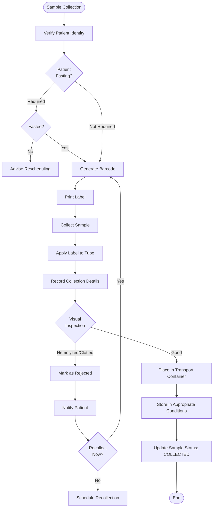

# Sample Management Module

## Overview

The Sample Management Module handles the complete lifecycle of laboratory samples from collection through disposal, ensuring proper identification, tracking, and chain of custody compliance. It is critical for maintaining sample integrity and meeting NABL accreditation requirements.

### Purpose

- **Primary**: Track samples from collection to disposal with complete chain of custody
- **Secondary**: Ensure sample integrity through proper storage, handling, and routing
- **Tertiary**: Enable blockchain-backed immutable audit trails for regulatory compliance

### Scope

- Sample collection and labeling
- Barcode generation and printing
- Chain of custody tracking (blockchain-backed)
- Sample routing and assignment to equipment
- Aliquot management
- Sample rejection and recollection workflows
- Storage location tracking
- Sample disposal management
- Centrifugation and processing tracking

---

## User Personas

### 1. Phlebotomist / Sample Collector
**Responsibilities:**
- Collect samples from patients
- Generate and apply barcodes
- Record collection details
- Handle sample rejection
- Update sample status

**Permissions:**
- `COLLECT_SAMPLE`
- `PRINT_BARCODE`
- `UPDATE_SAMPLE_STATUS`
- `REJECT_SAMPLE`

### 2. Lab Technician
**Responsibilities:**
- Receive and verify samples
- Process samples (centrifugation, aliquoting)
- Load samples on analyzers
- Track sample location
- Create aliquots

**Permissions:**
- `RECEIVE_SAMPLE`
- `PROCESS_SAMPLE`
- `CREATE_ALIQUOT`
- `ASSIGN_TO_EQUIPMENT`
- `UPDATE_STORAGE_LOCATION`

### 3. Lab Supervisor
**Responsibilities:**
- Review rejected samples
- Approve sample disposal
- Monitor sample turnaround times
- Handle exceptional cases

**Permissions:**
- All technician permissions
- `APPROVE_REJECTION`
- `APPROVE_DISPOSAL`
- `OVERRIDE_SAMPLE_STATUS`

### 4. Quality Manager
**Responsibilities:**
- Audit chain of custody
- Review sample handling incidents
- Monitor pre-analytical quality indicators

**Permissions:**
- `READ_ALL_SAMPLES`
- `VIEW_CHAIN_OF_CUSTODY`
- `VIEW_QUALITY_INDICATORS`

---

## Key Features

### 1. Barcode Generation & Printing

#### Barcode Formats Supported
- **Code 128**: High-density, alphanumeric
- **Code 39**: Backward compatible
- **DataMatrix**: 2D barcode for small labels
- **QR Code**: Mobile scanning support

#### Barcode Structure
```
Format: {ORG_CODE}{YYYYMMDD}{SEQUENCE}{CHECK_DIGIT}
Example: LAB20251105000012
```

#### Generation Algorithm
```rust
pub async fn generate_sample_barcode(
    organization_id: Uuid,
    sample_type: SampleType,
) -> Result<String, Error> {
    let org_code = get_org_code(organization_id).await?;
    let date_part = Utc::now().format("%Y%m%d").to_string();
    let sequence = get_next_sample_sequence(organization_id).await?;

    let base_code = format!("{}{}{:06}", org_code, date_part, sequence);
    let check_digit = calculate_check_digit(&base_code);

    let barcode = format!("{}{}", base_code, check_digit);

    Ok(barcode)
}

// Luhn algorithm for check digit
fn calculate_check_digit(code: &str) -> char {
    let sum: u32 = code.chars()
        .rev()
        .enumerate()
        .map(|(i, c)| {
            let digit = c.to_digit(10).unwrap();
            if i % 2 == 0 {
                digit * 2
            } else {
                digit
            }
        })
        .map(|n| if n > 9 { n - 9 } else { n })
        .sum();

    let check = (10 - (sum % 10)) % 10;
    char::from_digit(check, 10).unwrap()
}
```

#### Label Printing
```rust
pub async fn print_sample_label(
    sample: &Sample,
    printer_id: &str,
) -> Result<PrintJob, Error> {
    let label = SampleLabel {
        barcode: &sample.barcode,
        patient_name: &sample.patient_name,
        mrn: &sample.patient_mrn,
        sample_type: &sample.sample_type.to_string(),
        collected_at: &sample.collected_at.format("%d/%m/%Y %H:%M").to_string(),
        tests: sample.tests.join(", "),
    };

    let zpl_command = generate_zpl_label(&label);

    let print_job = printer_service
        .print(printer_id, zpl_command)
        .await?;

    Ok(print_job)
}

// ZPL (Zebra Programming Language) for label printers
fn generate_zpl_label(label: &SampleLabel) -> String {
    format!(
        r#"
^XA
^FO50,50^BY2
^BCN,100,Y,N,N
^FD{}^FS
^FO50,180^A0N,30,30^FD{}^FS
^FO50,220^A0N,25,25^FDMRN: {}^FS
^FO50,250^A0N,25,25^FDType: {}^FS
^FO50,280^A0N,20,20^FD{}^FS
^XZ
        "#,
        label.barcode,
        label.patient_name,
        label.mrn,
        label.sample_type,
        label.collected_at
    )
}
```

### 2. Sample Collection Workflow

#### Collection Process


#### Pre-Collection Validation
```rust
pub async fn validate_pre_collection(
    patient_id: Uuid,
    order_id: Uuid,
    tests: &[Test],
) -> Result<PreCollectionValidation, Error> {
    let mut validations = PreCollectionValidation::default();

    // Check fasting requirement
    let fasting_tests: Vec<&Test> = tests
        .iter()
        .filter(|t| t.requires_fasting)
        .collect();

    if !fasting_tests.is_empty() {
        validations.fasting_required = true;
        validations.fasting_duration_hours = fasting_tests
            .iter()
            .map(|t| t.fasting_hours)
            .max()
            .unwrap_or(8);
    }

    // Check timing requirements (e.g., cortisol at 8 AM)
    for test in tests {
        if let Some(timing) = &test.collection_timing {
            validations.timing_requirements.push(timing.clone());
        }
    }

    // Check medication conflicts
    let patient = get_patient(patient_id).await?;
    if let Some(medications) = &patient.current_medications {
        for test in tests {
            if let Some(conflicts) = test.medication_conflicts {
                let has_conflict = medications
                    .iter()
                    .any(|m| conflicts.contains(&m.name));

                if has_conflict {
                    validations.medication_warnings.push(format!(
                        "{} may be affected by current medications",
                        test.name
                    ));
                }
            }
        }
    }

    Ok(validations)
}
```

### 3. Chain of Custody Tracking

#### Blockchain Integration
Immutable audit trail using private blockchain (Hyperledger Fabric).

```rust
pub struct ChainOfCustodyEvent {
    pub sample_id: Uuid,
    pub event_type: CustodyEventType,
    pub from_person: Option<String>,
    pub to_person: Option<String>,
    pub from_location: Option<String>,
    pub to_location: Option<String>,
    pub timestamp: DateTime<Utc>,
    pub device_info: String,
    pub gps_coordinates: Option<(f64, f64)>,
    pub signature_hash: String,
    pub previous_hash: String,
}

pub enum CustodyEventType {
    Collected,
    Transferred,
    Received,
    Stored,
    Retrieved,
    Processed,
    Analyzed,
    Disposed,
}

pub async fn record_custody_event(
    event: ChainOfCustodyEvent,
) -> Result<BlockchainTransaction, Error> {
    // Serialize event
    let event_json = serde_json::to_string(&event)?;

    // Calculate hash
    let hash = calculate_sha256(&event_json);

    // Submit to blockchain
    let tx = blockchain_client
        .submit_transaction("recordCustody", vec![
            event.sample_id.to_string(),
            event_json,
            hash,
        ])
        .await?;

    // Also store in PostgreSQL for quick querying
    save_custody_event_to_db(&event, &hash).await?;

    Ok(tx)
}

pub async fn verify_chain_integrity(
    sample_id: Uuid,
) -> Result<bool, Error> {
    let events = get_custody_events(sample_id).await?;

    for i in 1..events.len() {
        let prev_event = &events[i - 1];
        let curr_event = &events[i];

        // Verify hash chain
        let prev_hash = calculate_event_hash(prev_event);
        if curr_event.previous_hash != prev_hash {
            return Ok(false);
        }
    }

    // Verify with blockchain
    let blockchain_valid = blockchain_client
        .verify_sample_chain(sample_id)
        .await?;

    Ok(blockchain_valid)
}
```

### 4. Sample Routing & Assignment

#### Smart Routing Algorithm
Automatically assigns samples to optimal equipment based on:
- Equipment availability
- Current workload
- Test priority
- Equipment capabilities
- Reagent levels
- Maintenance status

```rust
pub struct SampleRouter {
    equipment_repo: Arc<EquipmentRepository>,
    workload_tracker: Arc<WorkloadTracker>,
}

impl SampleRouter {
    pub async fn route_sample(
        &self,
        sample: &Sample,
        test: &Test,
    ) -> Result<EquipmentAssignment, Error> {
        // Get all equipment capable of performing this test
        let capable_equipment = self.equipment_repo
            .find_by_test_capability(&test.id)
            .await?;

        if capable_equipment.is_empty() {
            return Err(Error::NoSuitableEquipment);
        }

        // Filter by availability
        let available: Vec<_> = capable_equipment
            .into_iter()
            .filter(|e| e.status == EquipmentStatus::Online)
            .collect();

        if available.is_empty() {
            return Err(Error::NoAvailableEquipment);
        }

        // Score each equipment
        let mut scores = Vec::new();
        for equipment in available {
            let score = self.calculate_routing_score(
                &equipment,
                sample,
                test,
            ).await?;
            scores.push((equipment, score));
        }

        // Sort by score (descending)
        scores.sort_by(|a, b| b.1.partial_cmp(&a.1).unwrap());

        // Select best equipment
        let (best_equipment, score) = scores.first()
            .ok_or(Error::NoSuitableEquipment)?;

        Ok(EquipmentAssignment {
            sample_id: sample.id,
            test_id: test.id,
            equipment_id: best_equipment.id,
            assigned_at: Utc::now(),
            routing_score: *score,
        })
    }

    async fn calculate_routing_score(
        &self,
        equipment: &Equipment,
        sample: &Sample,
        test: &Test,
    ) -> Result<f64, Error> {
        let mut score = 100.0;

        // Factor 1: Current workload (40% weight)
        let workload = self.workload_tracker
            .get_current_workload(equipment.id)
            .await?;
        let workload_factor = 1.0 - (workload as f64 / equipment.max_capacity as f64);
        score += workload_factor * 40.0;

        // Factor 2: Sample priority (30% weight)
        let priority_score = match sample.priority {
            Priority::STAT => 30.0,
            Priority::URGENT => 20.0,
            Priority::ROUTINE => 10.0,
        };
        score += priority_score;

        // Factor 3: Reagent levels (20% weight)
        let reagent_level = equipment.get_reagent_level_for_test(&test.id).await?;
        score += (reagent_level / 100.0) * 20.0;

        // Factor 4: Distance from sample location (10% weight)
        // Prefer equipment closer to sample storage
        let distance_score = 10.0; // Simplified
        score += distance_score;

        Ok(score)
    }
}
```

### 5. Sample Rejection & Recollection

#### Rejection Reasons
- `HEMOLYZED`: Visible hemolysis
- `CLOTTED`: Sample clotted
- `INSUFFICIENT_QUANTITY`: Not enough sample volume
- `INCORRECT_CONTAINER`: Wrong tube type
- `UNLABELED`: Missing or incorrect label
- `CONTAMINATED`: Visible contamination
- `LIPEMIC`: Lipemia detected
- `DAMAGED_CONTAINER`: Broken or leaking tube

#### Rejection Workflow
```rust
pub async fn reject_sample(
    sample_id: Uuid,
    rejection: SampleRejection,
) -> Result<Sample, Error> {
    let mut sample = get_sample(sample_id).await?;

    // Update sample status
    sample.status = SampleStatus::Rejected;
    sample.rejection_reason = Some(rejection.reason);
    sample.rejection_notes = Some(rejection.notes);
    sample.rejected_at = Some(Utc::now());
    sample.rejected_by = Some(rejection.rejected_by);

    save_sample(&sample).await?;

    // Determine if recollection required
    let requires_recollection = match rejection.reason {
        RejectionReason::Hemolyzed => true,
        RejectionReason::Clotted => true,
        RejectionReason::InsufficientQuantity => true,
        RejectionReason::IncorrectContainer => true,
        _ => false,
    };

    if requires_recollection {
        // Create recollection request
        create_recollection_request(&sample, &rejection).await?;

        // Notify patient
        notify_patient_recollection_required(&sample).await?;

        // Notify sample collector
        notify_collector_recollection_required(&sample).await?;
    }

    // Publish event
    publish_event(Event::SampleRejected {
        sample_id,
        reason: rejection.reason,
        requires_recollection,
    }).await?;

    Ok(sample)
}
```

### 6. Aliquot Management

#### Aliquot Creation
```rust
pub struct Aliquot {
    pub id: Uuid,
    pub parent_sample_id: Uuid,
    pub aliquot_number: i32,
    pub barcode: String,
    pub volume_ml: f64,
    pub container_type: ContainerType,
    pub created_at: DateTime<Utc>,
    pub created_by: Uuid,
    pub status: SampleStatus,
}

pub async fn create_aliquot(
    parent_sample_id: Uuid,
    volume_ml: f64,
    created_by: Uuid,
) -> Result<Aliquot, Error> {
    let parent = get_sample(parent_sample_id).await?;

    // Validate sufficient volume
    let total_aliquot_volume: f64 = get_aliquots(parent_sample_id)
        .await?
        .iter()
        .map(|a| a.volume_ml)
        .sum();

    let remaining_volume = parent.volume_ml - total_aliquot_volume;
    if volume_ml > remaining_volume {
        return Err(Error::InsufficientVolume);
    }

    // Get next aliquot number
    let aliquot_number = get_next_aliquot_number(parent_sample_id).await?;

    // Generate aliquot barcode (parent barcode + suffix)
    let barcode = format!("{}-A{}", parent.barcode, aliquot_number);

    let aliquot = Aliquot {
        id: Uuid::new_v4(),
        parent_sample_id,
        aliquot_number,
        barcode,
        volume_ml,
        container_type: parent.container_type,
        created_at: Utc::now(),
        created_by,
        status: SampleStatus::Available,
    };

    save_aliquot(&aliquot).await?;

    // Record in chain of custody
    record_custody_event(ChainOfCustodyEvent {
        sample_id: aliquot.id,
        event_type: CustodyEventType::Created,
        from_person: Some(parent.barcode.clone()),
        to_person: Some(aliquot.barcode.clone()),
        ..Default::default()
    }).await?;

    Ok(aliquot)
}
```

### 7. Storage Location Tracking

#### Storage System
```rust
pub struct StorageLocation {
    pub id: Uuid,
    pub location_type: StorageType,
    pub name: String,
    pub temperature_range: (f32, f32),
    pub capacity: i32,
    pub current_occupancy: i32,

    // For freezer/fridge
    pub shelf: Option<String>,
    pub rack: Option<String>,
    pub position: Option<String>,
}

pub enum StorageType {
    RoomTemperature,   // 15-25°C
    Refrigerated,      // 2-8°C
    Frozen,            // -20°C
    DeepFrozen,        // -80°C
    LiquidNitrogen,    // -196°C
}

pub async fn store_sample(
    sample_id: Uuid,
    location_id: Uuid,
    stored_by: Uuid,
) -> Result<(), Error> {
    let sample = get_sample(sample_id).await?;
    let location = get_storage_location(location_id).await?;

    // Validate temperature requirements
    let required_storage = get_storage_requirement_for_sample(&sample).await?;
    if !location.is_suitable_for(&required_storage) {
        return Err(Error::InappropriateStorage);
    }

    // Check capacity
    if location.current_occupancy >= location.capacity {
        return Err(Error::StorageFull);
    }

    // Update sample
    update_sample_location(sample_id, location_id).await?;

    // Record in chain of custody
    record_custody_event(ChainOfCustodyEvent {
        sample_id,
        event_type: CustodyEventType::Stored,
        to_location: Some(location.name.clone()),
        timestamp: Utc::now(),
        ..Default::default()
    }).await?;

    Ok(())
}
```

### 8. Sample Disposal

#### Disposal Workflow
```rust
pub async fn dispose_sample(
    sample_id: Uuid,
    disposal: SampleDisposal,
) -> Result<(), Error> {
    let sample = get_sample(sample_id).await?;

    // Validate retention period
    let retention_days = get_retention_policy(&sample.sample_type).await?;
    let days_since_collection = (Utc::now() - sample.collected_at).num_days();

    if days_since_collection < retention_days {
        return Err(Error::RetentionPeriodNotMet);
    }

    // Update sample status
    update_sample_status(sample_id, SampleStatus::Disposed).await?;

    // Record disposal
    let disposal_record = DisposalRecord {
        sample_id,
        disposed_at: Utc::now(),
        disposed_by: disposal.disposed_by,
        disposal_method: disposal.method,
        disposal_batch: disposal.batch_id,
        witness: disposal.witness,
    };

    save_disposal_record(&disposal_record).await?;

    // Record in chain of custody (final event)
    record_custody_event(ChainOfCustodyEvent {
        sample_id,
        event_type: CustodyEventType::Disposed,
        from_person: Some(disposal.disposed_by.to_string()),
        timestamp: Utc::now(),
        ..Default::default()
    }).await?;

    // Publish event
    publish_event(Event::SampleDisposed {
        sample_id,
        disposal_method: disposal.method,
    }).await?;

    Ok(())
}
```

---

## Data Models

### Sample Entity

```rust
pub struct Sample {
    pub id: Uuid,
    pub barcode: String, // Unique identifier
    pub organization_id: Uuid,

    // Patient & Order
    pub patient_id: Uuid,
    pub patient_name: String, // Denormalized for quick access
    pub patient_mrn: String,
    pub order_id: Uuid,

    // Sample Details
    pub sample_type: SampleType,
    pub container_type: ContainerType,
    pub volume_ml: f64,
    pub quantity: Option<i32>, // For non-liquid samples

    // Collection
    pub collected_at: DateTime<Utc>,
    pub collected_by: Uuid,
    pub collection_site: Option<String>,
    pub collection_method: Option<String>,

    // Status
    pub status: SampleStatus,
    pub priority: Priority,

    // Tracking
    pub current_location_id: Option<Uuid>,
    pub assigned_equipment_id: Option<Uuid>,
    pub parent_sample_id: Option<Uuid>, // For aliquots

    // Quality
    pub visual_appearance: Option<String>,
    pub rejection_reason: Option<RejectionReason>,
    pub rejection_notes: Option<String>,
    pub rejected_at: Option<DateTime<Utc>>,
    pub rejected_by: Option<Uuid>,

    // Tests
    pub tests: Vec<String>, // Test names for quick display

    // Metadata
    pub created_at: DateTime<Utc>,
    pub updated_at: DateTime<Utc>,
}

pub enum SampleType {
    Serum,
    Plasma,
    WholeBlood,
    Urine,
    Stool,
    CSF,           // Cerebrospinal Fluid
    SynovialFluid,
    PleuralFluid,
    Sputum,
    Tissue,
    Swab,
    Other(String),
}

pub enum SampleStatus {
    Pending,        // Ordered, not yet collected
    Collected,      // Collected, in transit
    Received,       // Received at lab
    Processing,     // Being processed (centrifuged, etc.)
    Available,      // Ready for testing
    InProgress,     // On analyzer
    Tested,         // All tests complete
    Rejected,       // Rejected sample
    Disposed,       // Disposed
}

pub enum Priority {
    STAT,           // Immediate (<1 hour)
    URGENT,         // Priority (<4 hours)
    ROUTINE,        // Normal TAT
}
```

---

## API Reference

### GraphQL Schema

```graphql
type Sample {
  id: ID!
  barcode: String!
  patient: Patient!
  order: Order!

  sampleType: SampleType!
  containerType: ContainerType!
  volumeMl: Float!

  collectedAt: DateTime!
  collectedBy: User!

  status: SampleStatus!
  priority: Priority!

  currentLocation: StorageLocation
  assignedEquipment: Equipment

  aliquots: [Sample!]!
  parentSample: Sample

  chainOfCustody: [CustodyEvent!]!

  createdAt: DateTime!
  updatedAt: DateTime!
}

type Mutation {
  # Collect sample
  collectSample(input: CollectSampleInput!): Sample!

  # Generate barcode
  generateBarcode(sampleType: SampleType!): String!

  # Update status
  updateSampleStatus(
    sampleId: ID!
    status: SampleStatus!
  ): Sample!

  # Reject sample
  rejectSample(
    sampleId: ID!
    input: RejectSampleInput!
  ): Sample!

  # Create aliquot
  createAliquot(
    parentSampleId: ID!
    volumeMl: Float!
  ): Sample!

  # Store sample
  storeSample(
    sampleId: ID!
    locationId: ID!
  ): Sample!

  # Route to equipment
  routeSample(
    sampleId: ID!
    testId: ID!
  ): EquipmentAssignment!

  # Dispose sample
  disposeSample(
    sampleId: ID!
    input: DisposeSampleInput!
  ): Boolean!
}
```

---

## Events Published

### SAMPLE_COLLECTED
```json
{
  "type": "SAMPLE_COLLECTED",
  "payload": {
    "sampleId": "smp_123",
    "barcode": "LAB20251105000012",
    "patientId": "pat_456",
    "orderId": "ord_789",
    "sampleType": "SERUM",
    "collectedAt": "2025-11-05T09:30:00Z"
  }
}
```

### SAMPLE_ROUTED
```json
{
  "type": "SAMPLE_ROUTED",
  "payload": {
    "sampleId": "smp_123",
    "equipmentId": "eqp_001",
    "testId": "tst_456",
    "routingScore": 87.5
  }
}
```

### SAMPLE_REJECTED
```json
{
  "type": "SAMPLE_REJECTED",
  "payload": {
    "sampleId": "smp_123",
    "reason": "HEMOLYZED",
    "requiresRecollection": true
  }
}
```

---

## Security

- **Chain of Custody Integrity**: Blockchain-backed immutable audit trail
- **Barcode Uniqueness**: Database constraint + check digit validation
- **Access Control**: Only authorized personnel can modify samples
- **Data Retention**: Compliant with NABL 5-year requirement

---

## Performance

| Operation | Target | Max |
|-----------|--------|-----|
| Barcode Generation | <50ms | <100ms |
| Sample Search | <100ms | <200ms |
| Chain of Custody Query | <200ms | <500ms |
| Routing Algorithm | <300ms | <600ms |

---

**Module Version:** 1.0
**Last Updated:** 2025-11-05
**Status:** Production Ready
