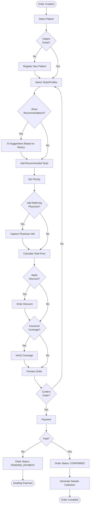

# Order Management Module

## Overview

The Order Management Module handles the complete lifecycle of laboratory test orders from creation through completion, including test catalog management, order prioritization, TAT tracking, and intelligent test recommendations.

### Purpose

- **Primary**: Manage test orders with accurate test selection and pricing
- **Secondary**: Optimize test utilization through smart recommendations
- **Tertiary**: Track and predict turnaround times (TAT) for better customer service

### Scope

- Test catalog management (tests, profiles, panels)
- Order creation and modification
- Smart test recommendations based on patient history
- Order prioritization (STAT, URGENT, ROUTINE)
- TAT tracking and prediction (ML-based)
- Order cancellation and refund management
- Test add-on functionality
- Referring physician management

---

## Key Features

### 1. Test Catalog Management

#### Test Hierarchy
```
Test Catalog
├── Test Categories (e.g., Hematology, Biochemistry)
│   ├── Individual Tests (e.g., CBC, Glucose)
│   └── Test Profiles (e.g., Diabetes Profile)
│       └── Component Tests (Glucose, HbA1c, Lipids)
```

#### Test Entity
```rust
pub struct Test {
    pub id: Uuid,
    pub code: String,              // Unique test code
    pub name: String,
    pub short_name: String,
    pub category_id: Uuid,
    pub loinc_code: Option<String>, // LOINC mapping

    // Sample Requirements
    pub sample_type: SampleType,
    pub sample_volume_ml: f64,
    pub container_type: ContainerType,
    pub special_instructions: Option<String>,

    // Pre-analytical Requirements
    pub requires_fasting: bool,
    pub fasting_hours: Option<i32>,
    pub collection_timing: Option<String>, // "8 AM" for cortisol
    pub medication_conflicts: Option<Vec<String>>,

    // TAT
    pub standard_tat_hours: i32,
    pub urgent_tat_hours: Option<i32>,
    pub stat_tat_minutes: Option<i32>,

    // Pricing
    pub base_price: Decimal,
    pub urgent_surcharge: Decimal,
    pub stat_surcharge: Decimal,

    // Analytical
    pub method: String,             // Test methodology
    pub equipment_ids: Vec<Uuid>,   // Compatible equipment
    pub reference_ranges: Vec<ReferenceRange>,

    // Status
    pub is_active: bool,
    pub is_outsourced: bool,
    pub outsource_lab: Option<String>,
}

pub struct TestProfile {
    pub id: Uuid,
    pub name: String,
    pub code: String,
    pub description: String,
    pub category_id: Uuid,
    pub component_test_ids: Vec<Uuid>,
    pub price: Decimal,              // Usually discounted vs sum of tests
    pub requires_fasting: bool,
    pub standard_tat_hours: i32,
}
```

### 2. Order Creation Workflow



### 3. Smart Test Recommendations

ML-based recommendation engine using patient history, demographics, and common test patterns.

```rust
pub struct TestRecommendationEngine {
    ml_client: Arc<MLClient>,
    analytics_service: Arc<AnalyticsService>,
}

impl TestRecommendationEngine {
    pub async fn recommend_tests(
        &self,
        patient_id: Uuid,
        current_tests: &[Uuid],
    ) -> Result<Vec<TestRecommendation>, Error> {
        // 1. Get patient history
        let history = self.analytics_service
            .get_patient_test_history(patient_id)
            .await?;

        // 2. Common combinations
        let common_combos = self.get_common_combinations(current_tests).await?;

        // 3. ML predictions
        let ml_features = TestRecommendationFeatures {
            patient_age: history.age,
            gender: history.gender,
            previous_tests: history.test_ids,
            current_selection: current_tests.to_vec(),
            time_since_last_visit_days: history.days_since_last_visit,
        };

        let ml_predictions = self.ml_client
            .predict_test_recommendations(ml_features)
            .await?;

        // 4. Combine and rank
        let mut recommendations = Vec::new();

        // Rule-based recommendations
        for test_id in current_tests {
            if let Some(profile) = self.get_profile_for_test(*test_id).await? {
                if !current_tests.contains(&profile.id) {
                    recommendations.push(TestRecommendation {
                        test_id: profile.id,
                        reason: format!("Often ordered as part of {}", profile.name),
                        confidence: 0.9,
                        discount_available: true,
                    });
                }
            }
        }

        // ML-based recommendations
        for pred in ml_predictions {
            if pred.confidence > 0.7 {
                recommendations.push(TestRecommendation {
                    test_id: pred.test_id,
                    reason: "Based on patient history".to_string(),
                    confidence: pred.confidence,
                    discount_available: false,
                });
            }
        }

        Ok(recommendations)
    }

    async fn get_common_combinations(
        &self,
        test_ids: &[Uuid],
    ) -> Result<Vec<Uuid>, Error> {
        // Query: Tests frequently ordered together
        let query = r#"
            SELECT
                ot2.test_id,
                COUNT(*) as frequency
            FROM order_test ot1
            JOIN order_test ot2 ON ot1.order_id = ot2.order_id
            WHERE ot1.test_id = ANY($1)
              AND ot2.test_id != ALL($1)
            GROUP BY ot2.test_id
            HAVING COUNT(*) > 100
            ORDER BY frequency DESC
            LIMIT 5
        "#;

        let rows = sqlx::query_as::<_, (Uuid, i64)>(query)
            .bind(test_ids)
            .fetch_all(&self.db)
            .await?;

        Ok(rows.into_iter().map(|(id, _)| id).collect())
    }
}
```

### 4. TAT Tracking & Prediction

#### TAT Calculation
```rust
pub struct TATCalculator {
    ml_predictor: Arc<MLPredictor>,
}

impl TATCalculator {
    pub async fn predict_tat(
        &self,
        order: &Order,
    ) -> Result<TATEstimate, Error> {
        let mut max_tat_hours = 0;

        // Get standard TAT for each test
        for test_id in &order.test_ids {
            let test = get_test(*test_id).await?;
            let test_tat = match order.priority {
                Priority::STAT => test.stat_tat_minutes.unwrap_or(60) / 60,
                Priority::URGENT => test.urgent_tat_hours.unwrap_or(test.standard_tat_hours),
                Priority::ROUTINE => test.standard_tat_hours,
            };
            max_tat_hours = max_tat_hours.max(test_tat);
        }

        let base_estimate = Utc::now() + Duration::hours(max_tat_hours as i64);

        // ML-based adjustment
        let features = TATFeatures {
            organization_id: order.organization_id,
            test_ids: order.test_ids.clone(),
            priority: order.priority,
            current_time: Utc::now(),
            day_of_week: Utc::now().weekday(),
            current_workload: get_current_lab_workload().await?,
        };

        let ml_adjustment = self.ml_predictor
            .predict_tat_adjustment(features)
            .await?;

        let predicted_completion = base_estimate + Duration::minutes(ml_adjustment.minutes);

        Ok(TATEstimate {
            estimated_completion_at: predicted_completion,
            base_tat_hours: max_tat_hours,
            ml_adjustment_minutes: ml_adjustment.minutes,
            confidence: ml_adjustment.confidence,
            factors: ml_adjustment.factors,
        })
    }

    pub async fn check_tat_compliance(
        &self,
        order_id: Uuid,
    ) -> Result<TATCompliance, Error> {
        let order = get_order(order_id).await?;
        let estimate = self.predict_tat(&order).await?;

        let now = Utc::now();
        let elapsed = now - order.created_at;
        let deadline = order.created_at + Duration::hours(estimate.base_tat_hours as i64);

        let status = if now > deadline {
            TATStatus::Breached
        } else if now > (deadline - Duration::hours(1)) {
            TATStatus::AtRisk
        } else {
            TATStatus::OnTrack
        };

        Ok(TATCompliance {
            order_id,
            status,
            elapsed_hours: elapsed.num_hours() as i32,
            deadline,
            remaining_hours: (deadline - now).num_hours() as i32,
        })
    }
}
```

### 5. Order Modification & Add-ons

```rust
pub async fn add_tests_to_order(
    order_id: Uuid,
    test_ids: Vec<Uuid>,
    user_id: Uuid,
) -> Result<Order, Error> {
    let mut order = get_order(order_id).await?;

    // Validate order status
    if !matches!(order.status, OrderStatus::Confirmed | OrderStatus::SampleCollected) {
        return Err(Error::CannotModifyOrder);
    }

    // Check if sample collected
    let sample_collected = has_sample_collected(order_id).await?;

    for test_id in test_ids {
        let test = get_test(test_id).await?;

        // Check if new sample required
        if sample_collected {
            let existing_sample = get_order_sample(order_id).await?;
            if test.sample_type != existing_sample.sample_type {
                return Err(Error::DifferentSampleRequired);
            }
        }

        // Add test to order
        add_test_to_order(order_id, test_id).await?;

        // Update pricing
        order.total_amount += test.base_price;
    }

    // Record modification
    record_order_modification(OrderModification {
        order_id,
        modification_type: ModificationType::TestsAdded,
        test_ids,
        modified_by: user_id,
        modified_at: Utc::now(),
    }).await?;

    // Publish event
    publish_event(Event::OrderModified {
        order_id,
        added_tests: test_ids,
    }).await?;

    save_order(&order).await
}
```

### 6. Order Cancellation & Refund

```rust
pub async fn cancel_order(
    order_id: Uuid,
    cancellation: OrderCancellation,
) -> Result<Order, Error> {
    let mut order = get_order(order_id).await?;

    // Check if cancellation allowed
    match order.status {
        OrderStatus::PendingPayment => {
            // Can cancel freely
        }
        OrderStatus::Confirmed => {
            // Can cancel, full refund
        }
        OrderStatus::SampleCollected => {
            // Can cancel, but may charge collection fee
        }
        OrderStatus::InProgress | OrderStatus::Completed => {
            return Err(Error::CannotCancelOrder);
        }
        _ => {}
    }

    // Update order
    order.status = OrderStatus::Cancelled;
    order.cancellation_reason = Some(cancellation.reason);
    order.cancelled_at = Some(Utc::now());
    order.cancelled_by = Some(cancellation.user_id);

    save_order(&order).await?;

    // Process refund if payment made
    if order.payment_status == PaymentStatus::Paid {
        let refund_amount = calculate_refund_amount(&order).await?;

        if refund_amount > Decimal::ZERO {
            initiate_refund(order_id, refund_amount).await?;
        }
    }

    // Update sample status if collected
    if order.status == OrderStatus::SampleCollected {
        let samples = get_samples_for_order(order_id).await?;
        for sample in samples {
            update_sample_status(sample.id, SampleStatus::Cancelled).await?;
        }
    }

    // Publish event
    publish_event(Event::OrderCancelled {
        order_id,
        reason: cancellation.reason,
    }).await?;

    Ok(order)
}
```

---

## Data Models

```rust
pub struct Order {
    pub id: Uuid,
    pub order_number: String,      // ORD20251105001
    pub organization_id: Uuid,

    // Patient
    pub patient_id: Uuid,
    pub patient_name: String,

    // Tests
    pub test_ids: Vec<Uuid>,
    pub profile_ids: Vec<Uuid>,

    // Ordering
    pub ordered_at: DateTime<Utc>,
    pub ordered_by: Uuid,
    pub referring_physician_id: Option<Uuid>,
    pub referring_physician_name: Option<String>,
    pub clinical_notes: Option<String>,

    // Priority & TAT
    pub priority: Priority,
    pub estimated_completion_at: DateTime<Utc>,
    pub actual_completion_at: Option<DateTime<Utc>>,

    // Status
    pub status: OrderStatus,
    pub completion_percentage: f64,

    // Pricing
    pub subtotal: Decimal,
    pub discount_amount: Decimal,
    pub discount_reason: Option<String>,
    pub tax_amount: Decimal,
    pub total_amount: Decimal,

    // Payment
    pub payment_status: PaymentStatus,
    pub payment_method: Option<String>,
    pub paid_at: Option<DateTime<Utc>>,

    // Insurance
    pub insurance_claim_id: Option<Uuid>,
    pub insurance_approved_amount: Option<Decimal>,

    // Cancellation
    pub cancellation_reason: Option<String>,
    pub cancelled_at: Option<DateTime<Utc>>,
    pub cancelled_by: Option<Uuid>,

    // Metadata
    pub created_at: DateTime<Utc>,
    pub updated_at: DateTime<Utc>,
}

pub enum OrderStatus {
    PendingPayment,
    Confirmed,
    SampleCollected,
    InProgress,
    PartiallyCompleted,
    Completed,
    Cancelled,
    OnHold,
}

pub enum PaymentStatus {
    Unpaid,
    PartiallyPaid,
    Paid,
    Refunded,
    PartiallyRefunded,
}
```

---

## API Reference

```graphql
type Order {
  id: ID!
  orderNumber: String!
  patient: Patient!
  tests: [Test!]!
  profiles: [TestProfile!]!

  priority: Priority!
  status: OrderStatus!
  paymentStatus: PaymentStatus!

  estimatedCompletionAt: DateTime!
  tatCompliance: TATCompliance!

  totalAmount: Decimal!
  paidAmount: Decimal!

  referringPhysician: Physician
  clinicalNotes: String

  samples: [Sample!]!
  results: [TestResult!]!

  createdAt: DateTime!
}

type Mutation {
  createOrder(input: CreateOrderInput!): Order!
  addTestsToOrder(orderId: ID!, testIds: [ID!]!): Order!
  cancelOrder(orderId: ID!, reason: String!): Order!
  updateOrderPriority(orderId: ID!, priority: Priority!): Order!
}

type Query {
  order(id: ID!): Order
  orders(filter: OrderFilter, pagination: PaginationInput!): OrderConnection!
  recommendTests(patientId: ID!, currentTests: [ID!]!): [TestRecommendation!]!
  predictTAT(orderId: ID!): TATEstimate!
}
```

---

## Events Published

```json
{
  "type": "ORDER_CREATED",
  "payload": {
    "orderId": "ord_123",
    "patientId": "pat_456",
    "testCount": 5,
    "priority": "ROUTINE",
    "totalAmount": 2500.00
  }
}
```

---

## Performance

| Operation | Target | Max |
|-----------|--------|-----|
| Order Creation | <200ms | <500ms |
| Test Recommendations | <300ms | <600ms |
| TAT Prediction | <150ms | <300ms |
| Order Search | <100ms | <200ms |

---

**Module Version:** 1.0
**Last Updated:** 2025-11-05
**Status:** Production Ready
