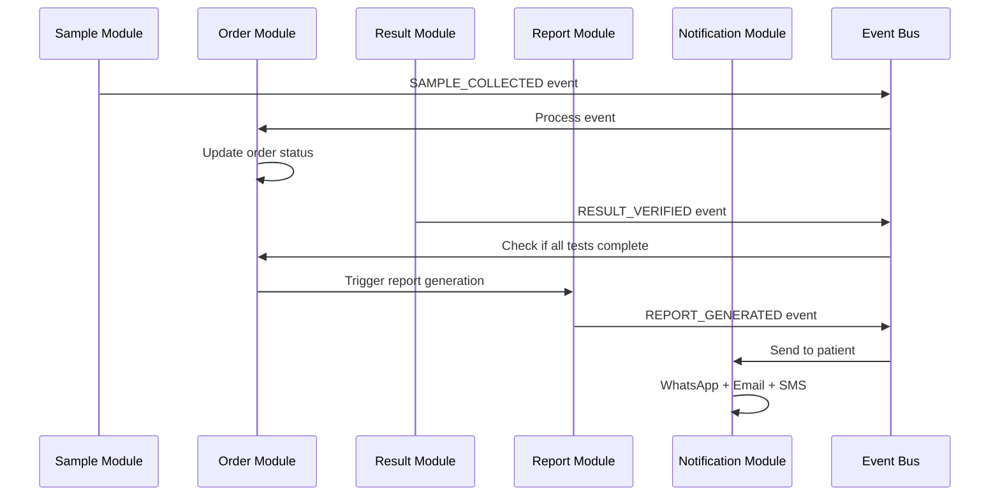
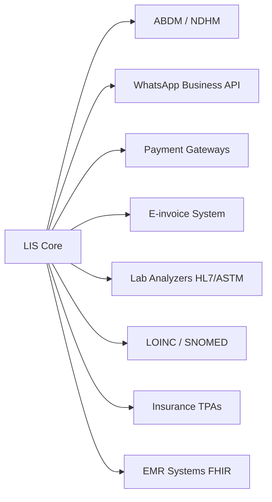

# Core Operational Modules Documentation

## Overview

This directory contains comprehensive documentation for all 12 core operational modules of the LIS/LIMS system. Each module is designed to handle specific functional areas while maintaining seamless integration with other modules through event-driven architecture.

---

## Module Index

### 1. [Patient Management Module](./01-patient-management.md)
Complete patient lifecycle management including registration, demographics, consent, and Aadhaar verification.

**Key Features:**
- Multi-channel patient registration (Web, Mobile, WhatsApp, Walk-in)
- Aadhaar-based identity verification
- ABDM (Ayushman Bharat Digital Mission) integration
- Consent management (DPDP 2023 compliant)
- Patient search and duplicate detection
- Medical history tracking
- Insurance information management

---

### 2. [Sample Management Module](./02-sample-management.md)
End-to-end sample lifecycle from collection to disposal with complete chain of custody tracking.

**Key Features:**
- Barcode generation and printing
- Sample collection workflow
- Chain of custody tracking (blockchain-backed)
- Sample routing and assignment
- Aliquot management
- Sample rejection and recollection
- Storage and retrieval tracking
- Sample disposal management

---

### 3. [Order Management Module](./03-order-management.md)
Test ordering, catalog management, and order lifecycle tracking.

**Key Features:**
- Test catalog management
- Profile/panel configuration
- Order creation and modification
- Smart test recommendations
- Order prioritization (STAT, URGENT, ROUTINE)
- Order cancellation and refund
- Test add-on management
- TAT tracking and prediction

---

### 4. [Equipment Management Module](./04-equipment-management.md)
Laboratory equipment integration, monitoring, and maintenance management.

**Key Features:**
- HL7/ASTM bidirectional integration
- Real-time equipment status monitoring
- Calibration scheduling and tracking
- Preventive maintenance management
- Equipment downtime tracking
- Performance analytics
- Reagent and consumable tracking
- Service request management

---

### 5. [Result Management Module](./05-result-management.md)
Result entry, validation, verification, and amendment with AI-powered auto-verification.

**Key Features:**
- Manual result entry with validation
- Automated result capture from equipment
- AI-powered auto-verification (30-60% automation)
- Multi-level review workflow
- Delta check algorithm
- Critical value detection and alerting
- Reference range validation
- Result amendment with audit trail

---

### 6. [Quality Control Module](./06-quality-control.md)
Comprehensive QC management including IQC, EQC, and statistical process control.

**Key Features:**
- Internal Quality Control (IQC) management
- External Quality Control (EQC) tracking
- Westgard rules implementation
- Levy-Jennings charts
- QC material and lot management
- Out-of-control investigation
- CAPA (Corrective and Preventive Action)
- QC report generation

---

### 7. [Report Management Module](./07-report-management.md)
Report generation, customization, digital signature, and multi-channel delivery.

**Key Features:**
- Template-based report generation
- Custom report designer
- Digital signature integration
- Multi-channel delivery (WhatsApp, Email, SMS, Portal)
- Delivery tracking and confirmation
- Report preview and approval
- Supplementary reports
- Report amendment tracking

---

### 8. [Billing & Payment Module](./08-billing-payment.md)
Complete billing, invoicing, payment processing, and insurance claim management.

**Key Features:**
- Dynamic pricing management
- Invoice generation with GST
- E-invoice integration
- Multiple payment modes (UPI, Card, Cash, Wallet)
- Payment gateway integration (Razorpay, Paytm)
- Insurance claim processing
- Credit management
- Payment reconciliation

---

### 9. [Compliance & Audit Module](./09-compliance-audit.md)
NABL compliance, document control, audit trails, and regulatory reporting.

**Key Features:**
- NABL ISO 15189:2022 compliance templates
- Daily checklist automation
- Document control system
- Version control and approval workflow
- Comprehensive audit trails
- CAPA management
- Training record management
- Regulatory reporting

---

### 10. [Analytics & Reporting Module](./10-analytics-reporting.md)
Business intelligence, dashboards, KPIs, and predictive analytics.

**Key Features:**
- Role-based dashboards
- Real-time KPI monitoring
- TAT analytics and prediction
- Revenue and financial reports
- Equipment utilization analytics
- Test volume trending
- Patient demographics analytics
- Custom report builder

---

### 11. [Notification & Communication Module](./11-notification-communication.md)
Multi-channel notification orchestration and communication management.

**Key Features:**
- WhatsApp Business API integration
- SMS gateway integration
- Email service integration
- Push notifications
- In-app notifications
- Notification templates
- Delivery tracking
- Communication preferences

---

### 12. [Inventory Management Module](./12-inventory-management.md)
Reagent, consumable, and equipment inventory tracking with automated reordering.

**Key Features:**
- Stock level monitoring
- Automated reorder point alerts
- Purchase order management
- Vendor management
- Stock consumption tracking
- Expiry management
- Stock transfer between departments
- Inventory valuation and reporting

---

## Module Architecture

### Common Design Patterns

All modules follow consistent architectural patterns:

```
┌─────────────────────────────────────────────────┐
│                 Module Structure                 │
├─────────────────────────────────────────────────┤
│                                                  │
│  ┌────────────┐  ┌────────────┐  ┌───────────┐ │
│  │   Domain   │  │  Use Cases │  │    API    │ │
│  │   Models   │→ │  (Business │→ │ (GraphQL) │ │
│  │            │  │    Logic)  │  │           │ │
│  └────────────┘  └────────────┘  └───────────┘ │
│         ↓               ↓               ↓       │
│  ┌────────────┐  ┌────────────┐  ┌───────────┐ │
│  │Repository  │  │   Events   │  │    UI     │ │
│  │  (Data     │  │ (Kafka     │  │Components │ │
│  │  Access)   │  │  Events)   │  │           │ │
│  └────────────┘  └────────────┘  └───────────┘ │
│                                                  │
└─────────────────────────────────────────────────┘
```

### Technology Stack by Layer

| Layer | Technologies |
|-------|-------------|
| **API Layer** | GraphQL (async-graphql), REST (actix-web) |
| **Business Logic** | Rust domain models, Use case services |
| **Data Access** | sqlx (PostgreSQL), mongodb driver, Redis |
| **Event Bus** | Apache Kafka with rdkafka |
| **Cache** | Redis with redis-rs |
| **Frontend** | Next.js 14+, TypeScript, shadcn/ui |

---

## Inter-Module Communication

Modules communicate through:

1. **Synchronous**: GraphQL queries/mutations for immediate responses
2. **Asynchronous**: Kafka events for eventual consistency
3. **Real-time**: WebSocket subscriptions for live updates

### Example Event Flow



---

## Security & Permissions

### Role-Based Access Control (RBAC)

Each module enforces permissions based on user roles:

| Role | Typical Permissions |
|------|---------------------|
| **Lab Director** | Full access to all modules |
| **Pathologist** | Result verification, report signing, QC review |
| **Lab Technician** | Sample collection, result entry, equipment operation |
| **Front Desk** | Patient registration, sample receipt, billing |
| **Quality Manager** | QC management, compliance, audit |
| **Admin** | System configuration, user management |
| **Patient** | View own reports, make payments |

### Data Access Patterns

- **Organization Isolation**: All data filtered by `organization_id`
- **Department Filtering**: Optional department-level access control
- **Patient PHI Protection**: Encryption + access logging
- **Audit Logging**: All sensitive operations logged

---

## Performance Requirements

### Response Time Targets

| Operation Type | Target (P95) | Max (P99) |
|---------------|--------------|-----------|
| **Read Query** | <100ms | <200ms |
| **Write Operation** | <200ms | <500ms |
| **Report Generation** | <3s | <5s |
| **Bulk Import** | <30s for 1000 records | <60s |
| **Search** | <150ms | <300ms |

### Scalability Targets

- **Concurrent Users**: 10,000+
- **Daily Samples**: 100,000+
- **API Throughput**: 10,000 req/s
- **Event Processing**: 50,000 events/s

---

## Data Retention & Archival

### Retention Policies by Module

| Module | Hot Storage | Warm Storage | Cold Archive | Purge |
|--------|-------------|--------------|--------------|-------|
| **Patient** | 2 years | 5 years | 7 years | Never (anonymize) |
| **Sample** | 6 months | 2 years | 5 years | 7 years |
| **Result** | 2 years | 5 years | 7 years | Never (NABL) |
| **Report** | 2 years | 5 years | 7 years | Never (NABL) |
| **QC** | 1 year | 5 years | 7 years | 10 years |
| **Billing** | 3 years | 7 years | 10 years | 15 years (tax) |
| **Audit** | 1 year | 5 years | 7 years | Never |

---

## Compliance Mapping

### NABL ISO 15189:2022 Clause Mapping

| NABL Clause | Relevant Modules |
|-------------|------------------|
| **5.4.2 Patient Identification** | Patient Management |
| **5.4.3 Test Request** | Order Management |
| **5.4.4 Sample Collection** | Sample Management |
| **5.4.5 Sample Transportation** | Sample Management |
| **5.4.6 Sample Receipt** | Sample Management |
| **5.5 Pre-examination Process** | Sample Management, Order Management |
| **5.6 Examination Process** | Equipment, Result Management |
| **5.7 Quality of Results** | QC Module |
| **5.8 Post-examination Process** | Report Management |
| **5.9 Result Release** | Report Management |
| **7.3 Document Control** | Compliance Module |
| **7.5 Training** | Compliance Module |
| **7.7 Equipment Management** | Equipment Module |
| **7.9 Quality Indicators** | Analytics Module |
| **7.11 CAPA** | Compliance Module |

---

## Integration Points

### External System Integrations



### Integration Modules

| Integration | Module | Protocol |
|-------------|--------|----------|
| **ABDM** | Patient Management | FHIR R4 |
| **WhatsApp** | Notification | WhatsApp Business API |
| **Payment Gateway** | Billing | REST API |
| **Lab Analyzers** | Equipment | HL7 v2.5, ASTM E1381 |
| **E-invoice** | Billing | REST API (NIC) |
| **EMR Systems** | Patient, Result | FHIR R4 |

---

## Testing Strategy

### Test Coverage by Module

Each module must maintain:

- **Unit Tests**: >80% code coverage
- **Integration Tests**: All API endpoints
- **E2E Tests**: Critical user workflows
- **Performance Tests**: Load testing for key operations
- **Security Tests**: OWASP Top 10 vulnerabilities

### Sample Test Structure

```rust
#[cfg(test)]
mod tests {
    use super::*;

    #[tokio::test]
    async fn test_patient_registration() {
        // Arrange
        let patient_input = CreatePatientInput { ... };

        // Act
        let result = create_patient(patient_input).await;

        // Assert
        assert!(result.is_ok());
        assert_eq!(result.unwrap().first_name, "Rajesh");
    }

    #[tokio::test]
    async fn test_duplicate_patient_detection() {
        // Test duplicate detection logic
    }
}
```

---

## Monitoring & Observability

### Module-Specific Metrics

Each module exposes Prometheus metrics:

```rust
// Example metrics
patient_registrations_total{organization_id}
sample_collection_duration_seconds
result_verification_duration_seconds{method="auto|manual"}
report_generation_failures_total
qc_violations_total{rule, severity}
payment_transactions_total{status, method}
```

### Health Checks

Each module exposes health check endpoints:

```
GET /health/patient
GET /health/sample
GET /health/result
...
```

Response:
```json
{
  "status": "healthy",
  "checks": {
    "database": "healthy",
    "cache": "healthy",
    "kafka": "healthy"
  },
  "timestamp": "2025-11-05T10:00:00Z"
}
```

---

## Module Documentation Structure

Each module documentation file follows this structure:

1. **Overview** - Purpose and scope
2. **User Personas** - Who uses this module
3. **Key Features** - Main capabilities
4. **Data Models** - Domain entities
5. **Business Rules** - Validation and logic
6. **Workflows** - Process flows
7. **API Reference** - GraphQL schema
8. **Events** - Published and consumed events
9. **UI Components** - Frontend components
10. **Integration Points** - External dependencies
11. **Security** - Access control and data protection
12. **Performance** - SLAs and optimization
13. **Testing** - Test scenarios
14. **Deployment** - Configuration and dependencies

---

## Quick Navigation

- [Patient Management](./01-patient-management.md)
- [Sample Management](./02-sample-management.md)
- [Order Management](./03-order-management.md)
- [Equipment Management](./04-equipment-management.md)
- [Result Management](./05-result-management.md)
- [Quality Control](./06-quality-control.md)
- [Report Management](./07-report-management.md)
- [Billing & Payment](./08-billing-payment.md)
- [Compliance & Audit](./09-compliance-audit.md)
- [Analytics & Reporting](./10-analytics-reporting.md)
- [Notification & Communication](./11-notification-communication.md)
- [Inventory Management](./12-inventory-management.md)

---

**Document Version:** 1.0
**Last Updated:** 2025-11-05
**Status:** Complete
