# User Flow Diagrams - All Personas

## Table of Contents
1. [Patient (Self-Service)](#1-patient-self-service)
2. [Front Desk Staff](#2-front-desk-staff)
3. [Phlebotomist / Sample Collector](#3-phlebotomist--sample-collector)
4. [Lab Technician](#4-lab-technician)
5. [Pathologist](#5-pathologist)
6. [Lab Director / Manager](#6-lab-director--manager)
7. [Quality Manager](#7-quality-manager)
8. [Billing Staff](#8-billing-staff)

---

# 1. Patient (Self-Service)

## 1.1 Patient Registration via WhatsApp

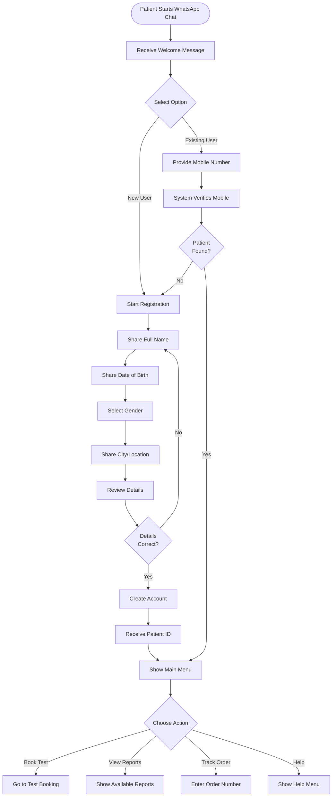

## 1.2 Test Booking via Web Portal

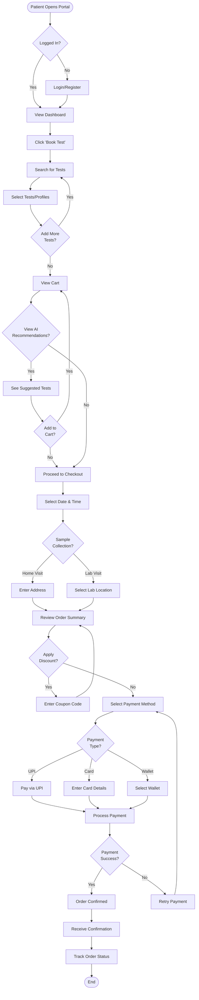

## 1.3 View & Download Reports

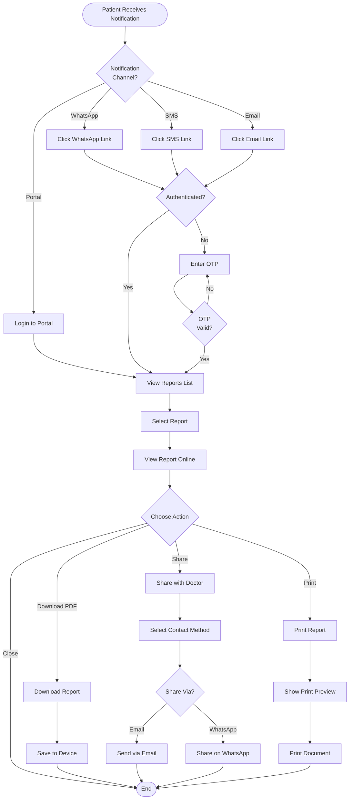

---

# 2. Front Desk Staff

## 2.1 Patient Check-in & Order Creation

```mermaid
flowchart TD
    START([Patient Arrives]) --> GREET[Greet Patient]
    GREET --> SEARCH[Search Patient Record]

    SEARCH --> EXISTS{Patient<br/>Exists?}
    EXISTS -->|Yes| VERIFY[Verify Identity]
    EXISTS -->|No| REGISTER[Register New Patient]

    REGISTER --> COLLECT_INFO[Collect Demographics]
    COLLECT_INFO --> PHOTO_ID{Has Photo<br/>ID?}
    PHOTO_ID -->|Yes| AADHAAR{Aadhaar<br/>Verification?}
    PHOTO_ID -->|No| MANUAL_ENTRY[Manual Entry]

    AADHAAR -->|Yes| SEND_OTP[Send Aadhaar OTP]
    SEND_OTP --> VERIFY_OTP{OTP<br/>Valid?}
    VERIFY_OTP -->|Yes| AUTO_FILL[Auto-fill Details]
    VERIFY_OTP -->|No| MANUAL_ENTRY
    AADHAAR -->|No| MANUAL_ENTRY

    AUTO_FILL --> ADDRESS[Capture Address]
    MANUAL_ENTRY --> ADDRESS
    ADDRESS --> CONTACT[Capture Contact Details]
    CONTACT --> SAVE_PATIENT[Save Patient Record]
    SAVE_PATIENT --> PRINT_LABEL[Print Patient Label]

    VERIFY --> ORDER_CREATE[Create New Order]
    PRINT_LABEL --> ORDER_CREATE

    ORDER_CREATE --> PRESCRIPTION{Has<br/>Prescription?}
    PRESCRIPTION -->|Yes| SCAN_SCRIPT[Scan Prescription]
    SCAN_SCRIPT --> SELECT_TESTS
    PRESCRIPTION -->|No| SELECT_TESTS[Select Tests Manually]

    SELECT_TESTS --> SEARCH_TEST[Search Test Catalog]
    SEARCH_TEST --> ADD_TEST[Add Tests to Order]
    ADD_TEST --> MORE{More<br/>Tests?}
    MORE -->|Yes| SEARCH_TEST
    MORE -->|No| PRIORITY[Set Priority]

    PRIORITY --> PHYSICIAN{Add Referring<br/>Physician?}
    PHYSICIAN -->|Yes| DOCTOR_INFO[Enter Doctor Details]
    PHYSICIAN -->|No| CALCULATE
    DOCTOR_INFO --> CALCULATE[Calculate Total]

    CALCULATE --> INSURANCE{Insurance<br/>Claim?}
    INSURANCE -->|Yes| VERIFY_INS[Verify Coverage]
    VERIFY_INS --> COPAY{Co-pay<br/>Required?}
    COPAY -->|Yes| APPLY_COPAY[Apply Co-payment]
    COPAY -->|No| COLLECT_PAYMENT
    INSURANCE -->|No| DISCOUNT{Apply<br/>Discount?}
    DISCOUNT -->|Yes| ENTER_DISC[Enter Discount]
    ENTER_DISC --> COLLECT_PAYMENT
    DISCOUNT -->|No| COLLECT_PAYMENT[Collect Payment]
    APPLY_COPAY --> COLLECT_PAYMENT

    COLLECT_PAYMENT --> PAY_METHOD{Payment<br/>Method?}
    PAY_METHOD -->|Cash| CASH_PAYMENT[Accept Cash]
    PAY_METHOD -->|Card| CARD_PAYMENT[Process Card]
    PAY_METHOD -->|UPI| UPI_PAYMENT[Scan UPI QR]
    PAY_METHOD -->|Credit| CREDIT_ACCOUNT[Add to Credit]

    CASH_PAYMENT --> PRINT_RECEIPT
    CARD_PAYMENT --> PRINT_RECEIPT
    UPI_PAYMENT --> PRINT_RECEIPT
    CREDIT_ACCOUNT --> PRINT_RECEIPT[Print Receipt]

    PRINT_RECEIPT --> SAMPLE_COLLECTION{Sample<br/>Collection?}
    SAMPLE_COLLECTION -->|Now| DIRECT_TO_PHLEBOTOMY[Direct to Phlebotomy]
    SAMPLE_COLLECTION -->|Later| SCHEDULE[Schedule Appointment]

    DIRECT_TO_PHLEBOTOMY --> END([End])
    SCHEDULE --> END
```

## 2.2 Handling Patient Queries

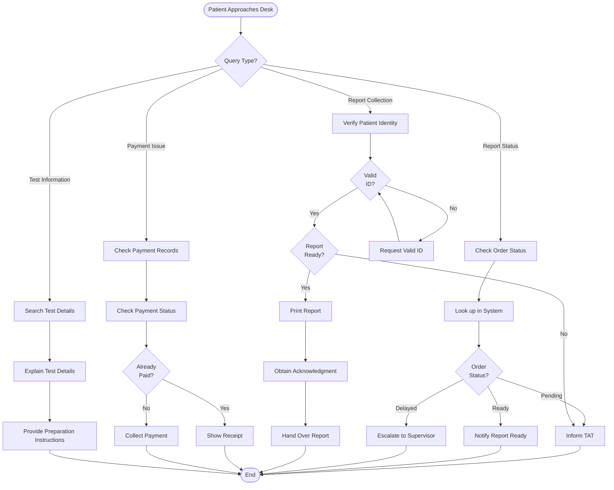

---

# 3. Phlebotomist / Sample Collector

## 3.1 Sample Collection Process

```mermaid
flowchart TD
    START([Receive Patient]) --> CHECK_ORDER[Verify Order]
    CHECK_ORDER --> VALID{Order<br/>Valid?}
    VALID -->|No| CONTACT_DESK[Contact Front Desk]
    VALID -->|Yes| VERIFY_PATIENT[Verify Patient Identity]

    VERIFY_PATIENT --> MATCH{Identity<br/>Matches?}
    MATCH -->|No| CONTACT_DESK
    MATCH -->|Yes| CHECK_PREP[Check Preparation Requirements]

    CHECK_PREP --> FASTING{Fasting<br/>Required?}
    FASTING -->|Yes| FASTED{Patient<br/>Fasted?}
    FASTED -->|No| INFORM_RESCHEDULE[Inform Need to Reschedule]
    INFORM_RESCHEDULE --> END_RESCHEDULE([End - Reschedule])
    FASTED -->|Yes| PROCEED_COLLECTION
    FASTING -->|No| PROCEED_COLLECTION[Proceed with Collection]

    PROCEED_COLLECTION --> BARCODE[Generate Sample Barcode]
    BARCODE --> PRINT_LABEL[Print Sample Label]
    PRINT_LABEL --> PREPARE[Prepare Collection Materials]

    PREPARE --> SELECT_SITE[Select Venipuncture Site]
    SELECT_SITE --> SANITIZE[Sanitize Site]
    SANITIZE --> COLLECT[Collect Blood Sample]

    COLLECT --> SUCCESS{Collection<br/>Successful?}
    SUCCESS -->|No| RETRY{Retry<br/>Possible?}
    RETRY -->|Yes| SELECT_SITE
    RETRY -->|No| INFORM_DIFFICULT[Inform Supervisor]
    INFORM_DIFFICULT --> END_DIFFICULT([End - Need Assistance])

    SUCCESS -->|Yes| LABEL_TUBE[Apply Label to Tube]
    LABEL_TUBE --> VISUAL_INSPECT[Visual Inspection]

    VISUAL_INSPECT --> QUALITY{Sample<br/>Quality OK?}
    QUALITY -->|No| REJECT_REASON{Rejection<br/>Reason?}
    REJECT_REASON -->|Hemolyzed| MARK_HEMOLYZED
    REJECT_REASON -->|Clotted| MARK_CLOTTED
    REJECT_REASON -->|Insufficient| MARK_INSUFFICIENT

    MARK_HEMOLYZED --> REJECT_SAMPLE[Mark Sample as Rejected]
    MARK_CLOTTED --> REJECT_SAMPLE
    MARK_INSUFFICIENT --> REJECT_SAMPLE

    REJECT_SAMPLE --> RECOLLECT{Recollect<br/>Now?}
    RECOLLECT -->|Yes| SELECT_SITE
    RECOLLECT -->|No| SCHEDULE_RECOLLECT[Schedule Recollection]
    SCHEDULE_RECOLLECT --> END_REJECT([End - Rejected])

    QUALITY -->|Yes| MIX_SAMPLE[Mix Sample (if anticoagulant)]
    MIX_SAMPLE --> RECORD_DETAILS[Record Collection Details]
    RECORD_DETAILS --> UPDATE_SYSTEM[Update System Status]
    UPDATE_SYSTEM --> TRANSPORT[Place in Transport Container]
    TRANSPORT --> THANK_PATIENT[Thank Patient & Apply Bandage]
    THANK_PATIENT --> SEND_TO_LAB[Send to Laboratory]
    SEND_TO_LAB --> END([End])
```

## 3.2 Home Visit Sample Collection

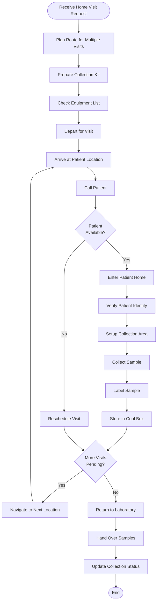

---

# 4. Lab Technician

## 4.1 Sample Receiving & Processing

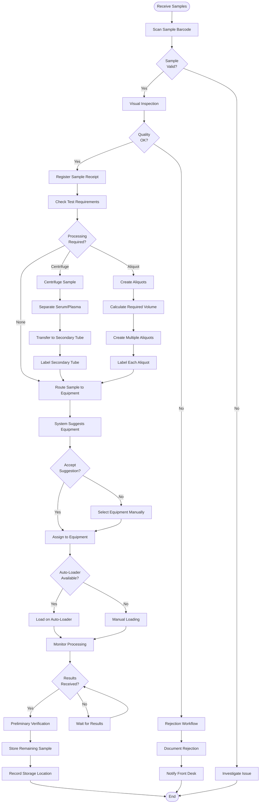

## 4.2 Manual Result Entry

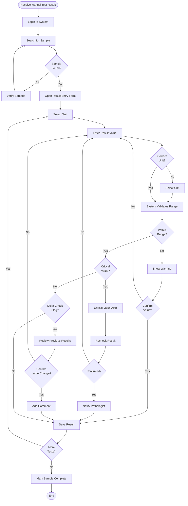

---

# 5. Pathologist

## 5.1 Result Review & Verification

```mermaid
flowchart TD
    START([Login to System]) --> DASHBOARD[View Pathologist Dashboard]
    DASHBOARD --> PENDING[View Pending Verifications]

    PENDING --> FILTER{Filter by?}
    FILTER -->|Critical| CRITICAL_LIST[Critical Values]
    FILTER -->|Abnormal| ABNORMAL_LIST[Abnormal Results]
    FILTER -->|All| ALL_LIST[All Pending]

    CRITICAL_LIST --> SELECT
    ABNORMAL_LIST --> SELECT
    ALL_LIST --> SELECT[Select Result to Review]

    SELECT --> VIEW[View Complete Result]
    VIEW --> CONTEXT[Review Patient Context]

    CONTEXT --> CHECK_HISTORY[Check Previous Results]
    CHECK_HISTORY --> DELTA_REVIEW{Significant<br/>Change?}
    DELTA_REVIEW -->|Yes| INVESTIGATE[Investigate Cause]
    INVESTIGATE --> VALID{Result<br/>Valid?}
    VALID -->|No| REQUEST_RETEST[Request Retest]
    REQUEST_RETEST --> END_RETEST([End - Awaiting Retest])

    DELTA_REVIEW -->|No| REFERENCE[Check Reference Range]
    VALID -->|Yes| REFERENCE

    REFERENCE --> INTERPRETATION[Clinical Interpretation]
    INTERPRETATION --> ABNORMAL{Abnormal<br/>Result?}
    ABNORMAL -->|Yes| ADD_COMMENT[Add Clinical Comment]
    ADD_COMMENT --> CRITICAL_CHECK
    ABNORMAL -->|No| CRITICAL_CHECK{Critical<br/>Value?}

    CRITICAL_CHECK -->|Yes| PHONE_CALL[Call Referring Physician]
    PHONE_CALL --> DOCUMENT_CALL[Document Communication]
    DOCUMENT_CALL --> APPROVE
    CRITICAL_CHECK -->|No| APPROVE[Approve Result]

    APPROVE --> DIGITAL_SIGN{Sign<br/>Required?}
    DIGITAL_SIGN -->|Yes| APPLY_SIGNATURE[Apply Digital Signature]
    APPLY_SIGNATURE --> VERIFY_COMPLETE
    DIGITAL_SIGN -->|No| VERIFY_COMPLETE[Mark as Verified]

    VERIFY_COMPLETE --> ALL_DONE{All Tests<br/>Complete?}
    ALL_DONE -->|Yes| TRIGGER_REPORT[Trigger Report Generation]
    ALL_DONE -->|No| NEXT[Next Result]

    TRIGGER_REPORT --> REVIEW_REPORT[Review Generated Report]
    REVIEW_REPORT --> REPORT_OK{Report<br/>OK?}
    REPORT_OK -->|No| EDIT_REPORT[Edit Report]
    EDIT_REPORT --> REVIEW_REPORT
    REPORT_OK -->|Yes| SIGN_REPORT[Sign Report]

    SIGN_REPORT --> AUTHORIZE_DELIVERY[Authorize Delivery]
    AUTHORIZE_DELIVERY --> END([End])

    NEXT --> SELECT
```

## 5.2 Handling Critical Values

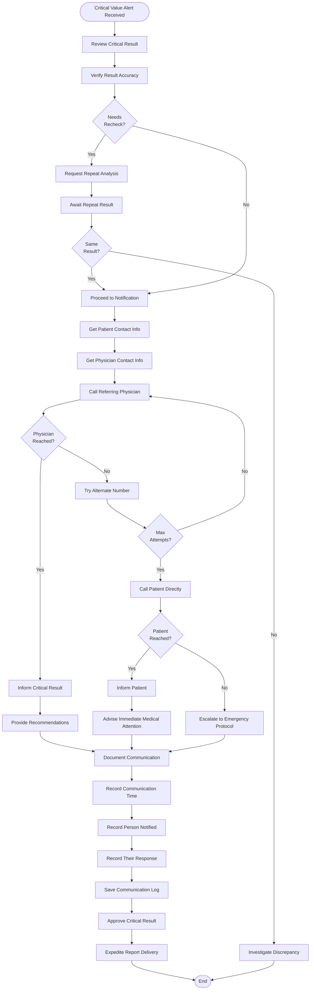

---

# 6. Lab Director / Manager

## 6.1 Daily Operations Monitoring

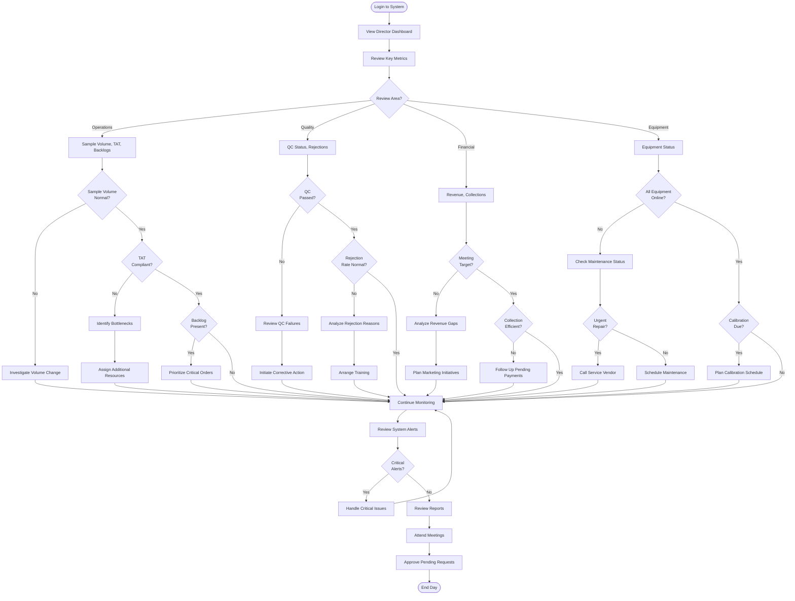

## 6.2 Performance Review & Decision Making

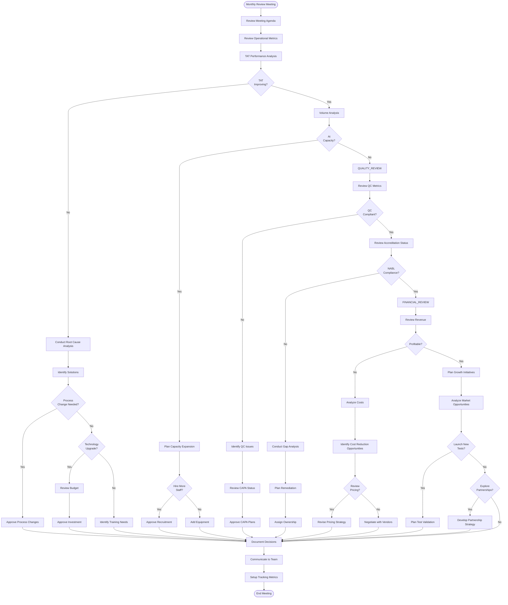

---

# 7. Quality Manager

## 7.1 Daily QC Review

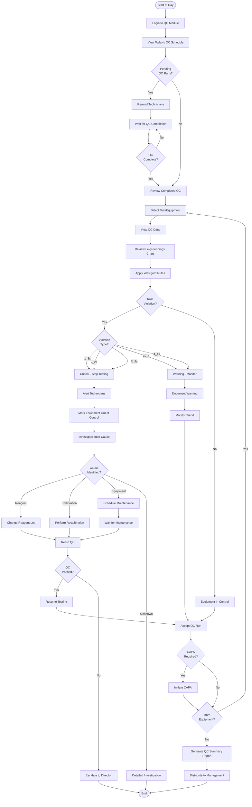

## 7.2 Audit Preparation & Conduct

```mermaid
flowchart TD
    START([Audit Scheduled]) --> AUDIT_TYPE{Audit<br/>Type?}
    AUDIT_TYPE -->|Internal| INTERNAL_AUDIT
    AUDIT_TYPE -->|NABL| NABL_AUDIT
    AUDIT_TYPE -->|Client| CLIENT_AUDIT

    INTERNAL_AUDIT --> PLAN[Create Audit Plan]
    NABL_AUDIT --> PLAN
    CLIENT_AUDIT --> PLAN

    PLAN --> CHECKLIST[Prepare Audit Checklist]
    CHECKLIST --> ASSIGN_AUDITOR[Assign Auditors]
    ASSIGN_AUDITOR --> NOTIFY_DEPT[Notify Departments]

    NOTIFY_DEPT --> PRE_AUDIT[Pre-Audit Document Review]
    PRE_AUDIT --> DOCUMENTS{Documents<br/>Complete?}
    DOCUMENTS -->|No| REQUEST_DOCS[Request Missing Documents]
    REQUEST_DOCS --> AWAIT_DOCS[Wait for Documents]
    AWAIT_DOCS --> PRE_AUDIT
    DOCUMENTS -->|Yes| OPENING_MEETING[Conduct Opening Meeting]

    OPENING_MEETING --> FACILITY_TOUR[Facility Tour]
    FACILITY_TOUR --> INTERVIEW[Interview Staff]

    INTERVIEW --> OBSERVE[Observe Processes]
    OBSERVE --> RECORDS[Review Records]
    RECORDS --> FINDINGS{Non-Conformances<br/>Found?}

    FINDINGS -->|Yes| CLASSIFY{Severity?}
    CLASSIFY -->|Critical| CRITICAL_NC[Document Critical NC]
    CLASSIFY -->|Major| MAJOR_NC[Document Major NC]
    CLASSIFY -->|Minor| MINOR_NC[Document Minor NC]
    CLASSIFY -->|Observation| OBS[Document Observation]

    CRITICAL_NC --> IMMEDIATE_ACTION[Require Immediate Action]
    IMMEDIATE_ACTION --> NEXT_AREA
    MAJOR_NC --> NEXT_AREA
    MINOR_NC --> NEXT_AREA
    OBS --> NEXT_AREA

    FINDINGS -->|No| NEXT_AREA{More Areas<br/>to Audit?}
    NEXT_AREA -->|Yes| FACILITY_TOUR
    NEXT_AREA -->|No| CLOSING_MEETING[Conduct Closing Meeting]

    CLOSING_MEETING --> PRESENT_FINDINGS[Present Findings]
    PRESENT_FINDINGS --> AUDIT_REPORT[Prepare Audit Report]

    AUDIT_REPORT --> DISTRIBUTE_REPORT[Distribute Report]
    DISTRIBUTE_REPORT --> CAPA_REQUIRED{CAPA<br/>Required?}

    CAPA_REQUIRED -->|Yes| CREATE_CAPA[Create CAPA]
    CREATE_CAPA --> ASSIGN_RESPONSIBLE[Assign Responsible Person]
    ASSIGN_RESPONSIBLE --> SET_DEADLINE[Set Completion Deadline]
    SET_DEADLINE --> TRACK_CAPA[Track CAPA Progress]

    TRACK_CAPA --> CAPA_COMPLETE{CAPA<br/>Completed?}
    CAPA_COMPLETE -->|No| REMIND[Send Reminder]
    REMIND --> TRACK_CAPA
    CAPA_COMPLETE -->|Yes| VERIFY_EFFECTIVENESS[Verify Effectiveness]

    VERIFY_EFFECTIVENESS --> EFFECTIVE{Effective?}
    EFFECTIVE -->|No| REVISE_CAPA[Revise CAPA]
    REVISE_CAPA --> TRACK_CAPA
    EFFECTIVE -->|Yes| CLOSE_FINDING[Close Finding]

    CLOSE_FINDING --> FOLLOW_UP_AUDIT[Schedule Follow-up Audit]
    CAPA_REQUIRED -->|No| FOLLOW_UP_AUDIT

    FOLLOW_UP_AUDIT --> END([End])
```

---

# 8. Billing Staff

## 8.1 Invoice Generation & Payment Processing

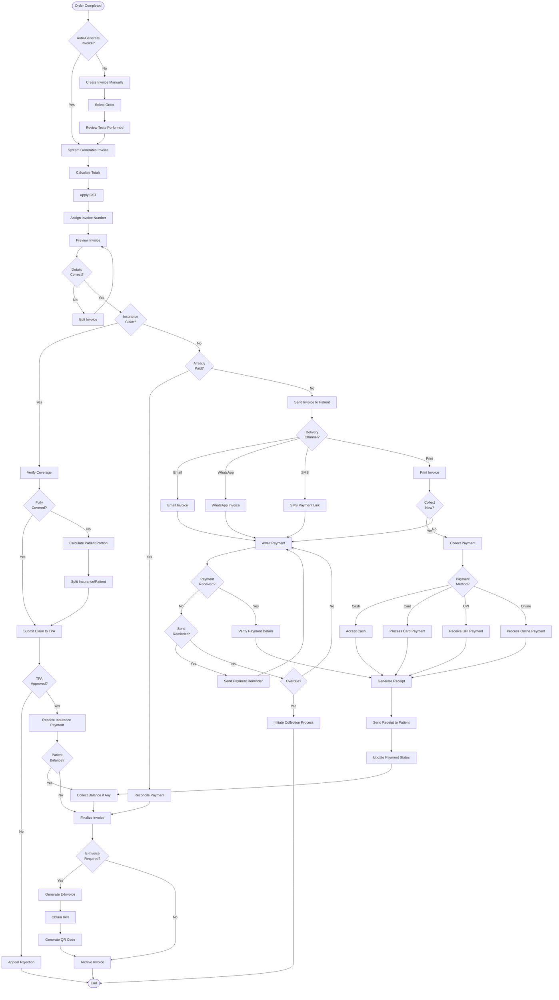

## 8.2 Credit Management & Collections

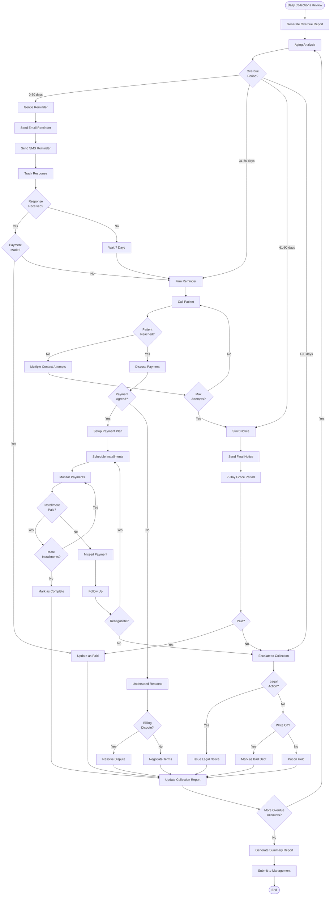

---

## Summary

This comprehensive documentation provides detailed user flow diagrams for all 8 major user personas in the LIS/LIMS system:

1. **Patient (Self-Service)**: WhatsApp registration, web booking, report access
2. **Front Desk Staff**: Patient check-in, order creation, query handling
3. **Phlebotomist**: Sample collection (clinic & home visit)
4. **Lab Technician**: Sample processing, result entry
5. **Pathologist**: Result review, critical value handling
6. **Lab Director**: Operations monitoring, strategic decision-making
7. **Quality Manager**: QC review, audit management
8. **Billing Staff**: Invoice generation, payment processing, collections

Each flow diagram shows:
- Decision points and branches
- Error handling and edge cases
- System interactions
- Integration touchpoints
- Compliance checkpoints
- User experience optimization

These flows support NABL ISO 15189:2022 compliance and are optimized for the Indian healthcare market with features like WhatsApp integration, UPI payments, and Aadhaar verification.

---

**Document Version:** 1.0
**Last Updated:** 2025-11-05
**Status:** Complete
