# Core Laboratory Workflows
## Complete Process Flows for LIS/LIMS

**Version**: 1.0.0
**Last Updated**: 2024-11-05

---

## Table of Contents

1. [Patient Registration Workflow](#1-patient-registration-workflow)
2. [Sample Collection Workflow](#2-sample-collection-workflow)
3. [Test Processing Workflow](#3-test-processing-workflow)
4. [Quality Control Workflow](#4-quality-control-workflow)
5. [Result Verification Workflow](#5-result-verification-workflow)
6. [Report Generation & Delivery Workflow](#6-report-generation--delivery-workflow)
7. [Billing & Payment Workflow](#7-billing--payment-workflow)
8. [NABL Compliance Workflow](#8-nabl-compliance-workflow)

---

## 1. Patient Registration Workflow

### 1.1 Complete Patient Registration Flow

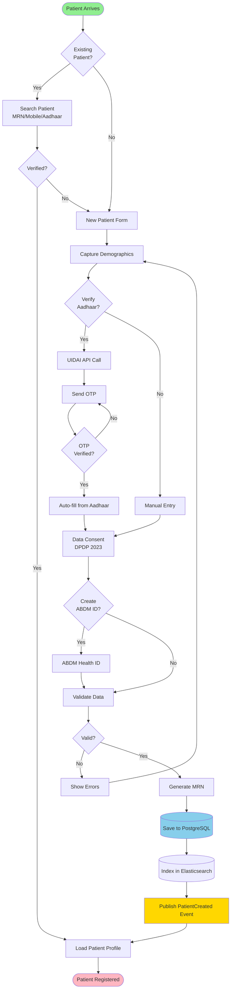

### 1.2 Data Validation Rules

| Field | Validation |
|-------|------------|
| **First Name** | Required, 2-50 characters, letters only |
| **Mobile** | Required, 10 digits, unique |
| **Email** | Optional, valid email format, unique |
| **Date of Birth** | Required, age 0-120 years |
| **Aadhaar** | Optional, 12 digits, Luhn algorithm |
| **MRN** | Auto-generated, format: ORG-YEAR-NNNNNN |

### 1.3 Consent Management

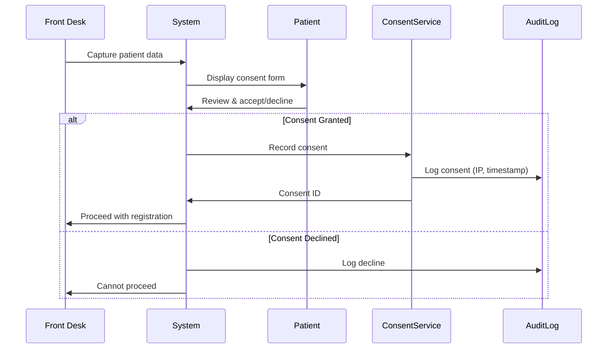

---

## 2. Sample Collection Workflow

### 2.1 Sample Collection & Labeling

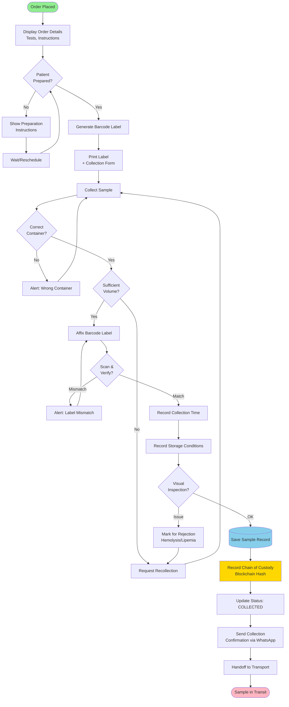

### 2.2 Barcode Generation Algorithm

```
Format: YYMMDD-NNNNNN-C

Components:
- YYMMDD: Collection date (6 digits)
- NNNNNN: Sequential number (6 digits)
- C: Checksum (1 digit, Modulo 10)

Example: 241105-000123-7
```

### 2.3 Sample Acceptance Criteria

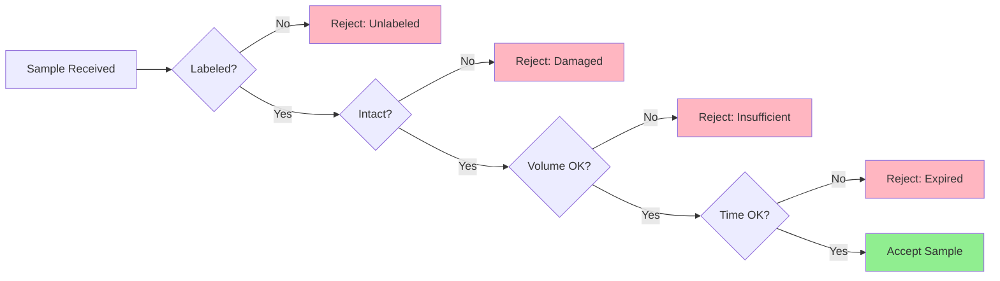

---

## 3. Test Processing Workflow

### 3.1 Complete Test Processing Flow

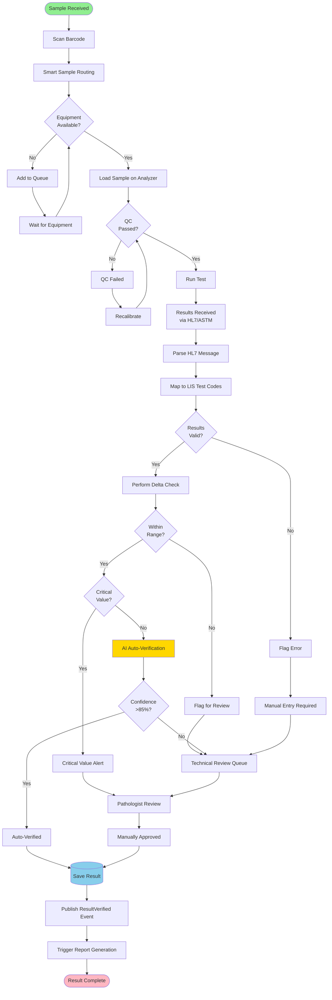

### 3.2 AI Auto-Verification Decision Tree

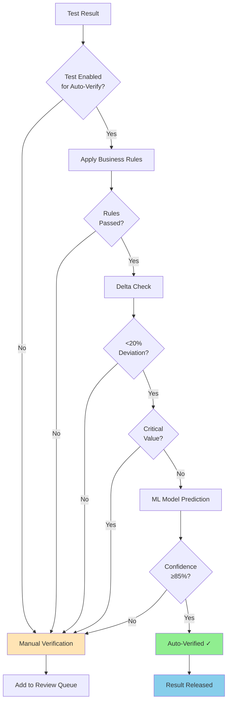

---

## 4. Quality Control Workflow

### 4.1 Internal Quality Control (IQC)

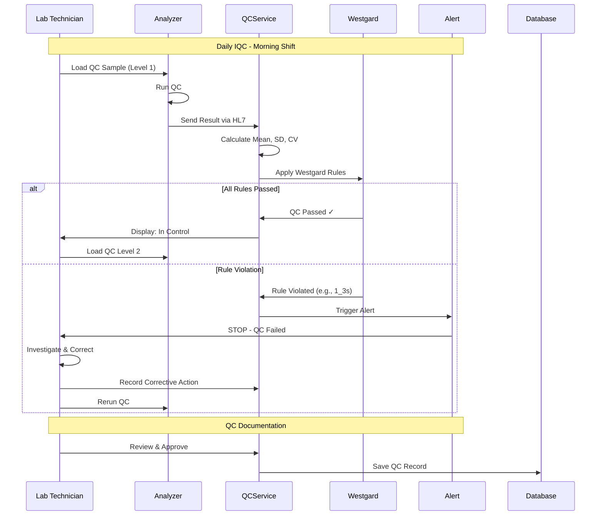

### 4.2 Westgard Rules Application

```mermaid
graph TD
    QC[QC Result] --> MEAN[Calculate vs Mean]
    MEAN --> SD[Calculate Z-Score]

    SD --> R1{1_3s<br/>|Z| > 3?}
    R1 -->|Yes| REJECT[REJECT Run]
    R1 -->|No| R2

    R2{2_2s<br/>2 consecutive<br/>> 2 SD?} -->|Yes| REJECT
    R2 -->|No| R3

    R3{R_4s<br/>Range > 4 SD?} -->|Yes| REJECT
    R3 -->|No| R4

    R4{4_1s<br/>4 consecutive<br/>> 1 SD?} -->|Yes| REJECT
    R4 -->|No| R5

    R5{10_x<br/>10 on same<br/>side?} -->|Yes| REJECT
    R5 -->|No| PASS[PASS - In Control]

    REJECT --> CAPA[Initiate CAPA]
    PASS --> CONTINUE[Continue Testing]

    style PASS fill:#90EE90
    style REJECT fill:#FFB6C1
    style CAPA fill:#FFD700
```

---

## 5. Result Verification Workflow

### 5.1 Multi-Level Verification

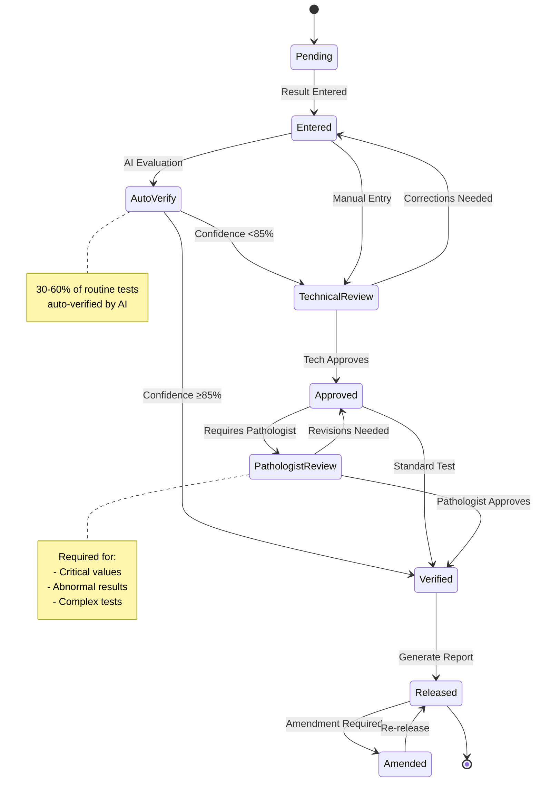

### 5.2 Critical Value Alert Workflow

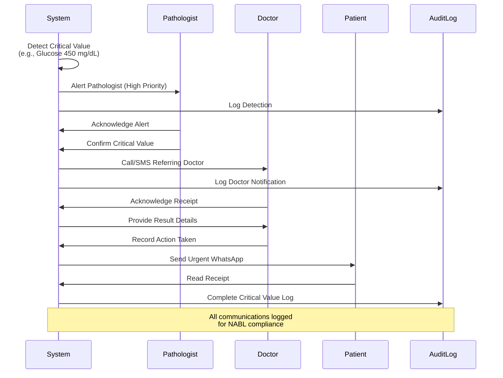

---

## 6. Report Generation & Delivery Workflow

### 6.1 Report Generation Pipeline

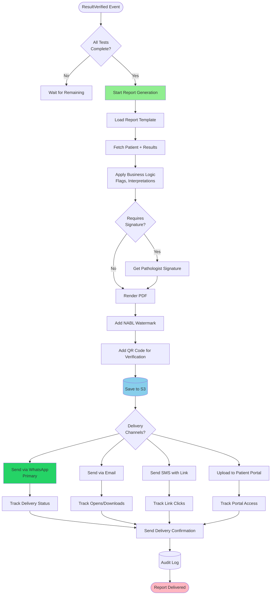

### 6.2 Multi-Channel Delivery Strategy

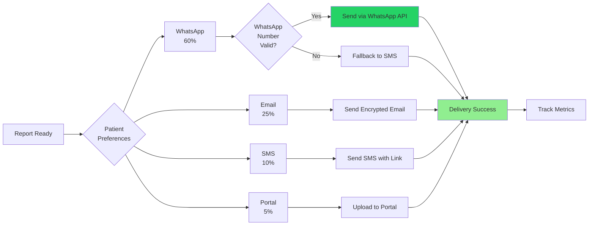

---

## 7. Billing & Payment Workflow

### 7.1 Invoice Generation & Payment

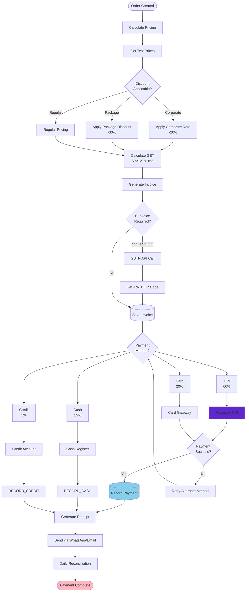

### 7.2 Insurance Claim Workflow

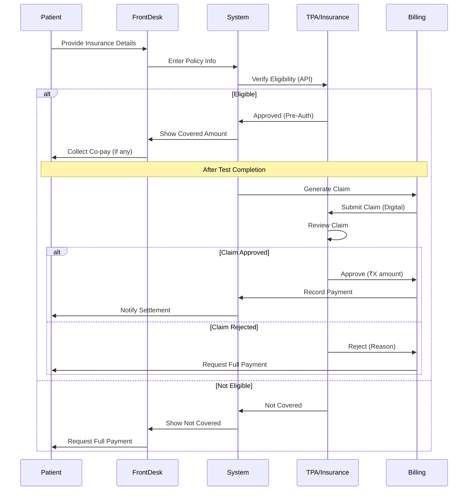

---

## 8. NABL Compliance Workflow

### 8.1 Daily Compliance Checklist

```mermaid
graph TD
    START([Shift Start]) --> QC_MORNING[Run Morning QC<br/>2 Levels]
    QC_MORNING --> QC_DOC[Document QC Results]
    QC_DOC --> EQUIPMENT[Check Equipment Logs<br/>Calibration, Maintenance]

    EQUIPMENT --> TEMP_LOG[Record Temperature<br/>Refrigerators, Incubators]
    TEMP_LOG --> REAGENT[Check Reagent Expiry<br/>Update Inventory]

    REAGENT --> SAMPLE_LOG[Review Sample Log<br/>Acceptance/Rejection]
    SAMPLE_LOG --> TAT_REVIEW[Monitor TAT<br/>Alert if Breaching]

    TAT_REVIEW --> CRITICAL_REVIEW[Review Critical Values<br/>Verify Communication]
    CRITICAL_REVIEW --> AMENDMENT{Any<br/>Amendments?}

    AMENDMENT -->|Yes| DOC_AMENDMENT[Document Amendment<br/>Reason + Approval]
    AMENDMENT -->|No| INCIDENT

    DOC_AMENDMENT --> INCIDENT{Any<br/>Incidents?}
    INCIDENT -->|Yes| CAPA[Initiate CAPA]
    INCIDENT -->|No| TRAINING

    CAPA --> TRAINING{Training<br/>Due?}
    TRAINING -->|Yes| SCHEDULE[Schedule Training]
    TRAINING -->|No| AUDIT

    SCHEDULE --> AUDIT{Audit<br/>Scheduled?}
    AUDIT -->|Yes| PREPARE[Prepare Audit Records]
    AUDIT -->|No| SIGN_OFF

    PREPARE --> SIGN_OFF[Sign Off Daily Log]
    SIGN_OFF --> END([Shift Complete])

    style START fill:#90EE90
    style END fill:#FFB6C1
    style CAPA fill:#FFD700
```

### 8.2 Document Control Workflow

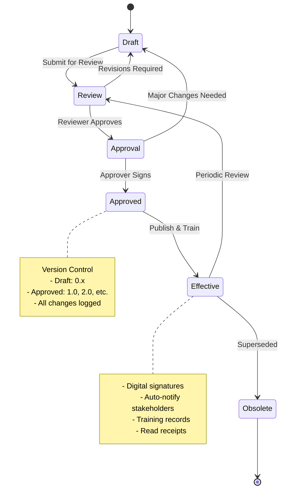

---

## Summary

This workflow documentation provides:

1. **8 Core Process Workflows**: Complete flows from start to finish
2. **Decision Points**: Clear logic for automated and manual decisions
3. **Integration Points**: Where external systems connect
4. **Compliance Steps**: NABL/regulatory requirements embedded
5. **Error Handling**: Rejection, retry, and escalation paths
6. **Audit Trails**: Logging and tracking at every step

### Key Features Highlighted:

- **AI Auto-Verification**: 30-60% automation of routine tests
- **WhatsApp-First**: Primary communication channel for India
- **Offline Capability**: Workflows designed for intermittent connectivity
- **Multi-Channel Delivery**: WhatsApp, Email, SMS, Portal
- **Real-Time Alerts**: Critical values, QC failures, TAT breaches
- **Complete Traceability**: Blockchain for chain of custody
- **NABL Compliance**: Built into every workflow
- **Smart Routing**: AI-based equipment assignment

---

**Next Steps**:
1. Review workflows with domain experts
2. Identify automation opportunities
3. Create user training materials
4. Build workflow monitoring dashboards
5. Setup alerting for SLA breaches

---

**Document Status**: ✅ Approved
**Next Review Date**: 2025-02-05
**Owned By**: Operations Team
